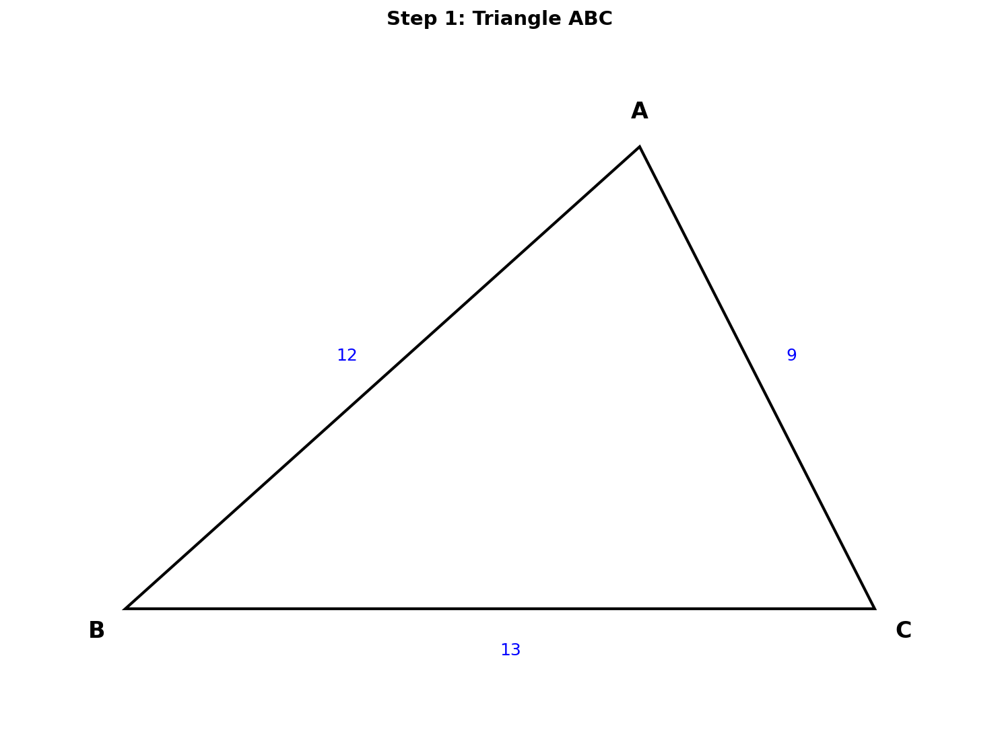
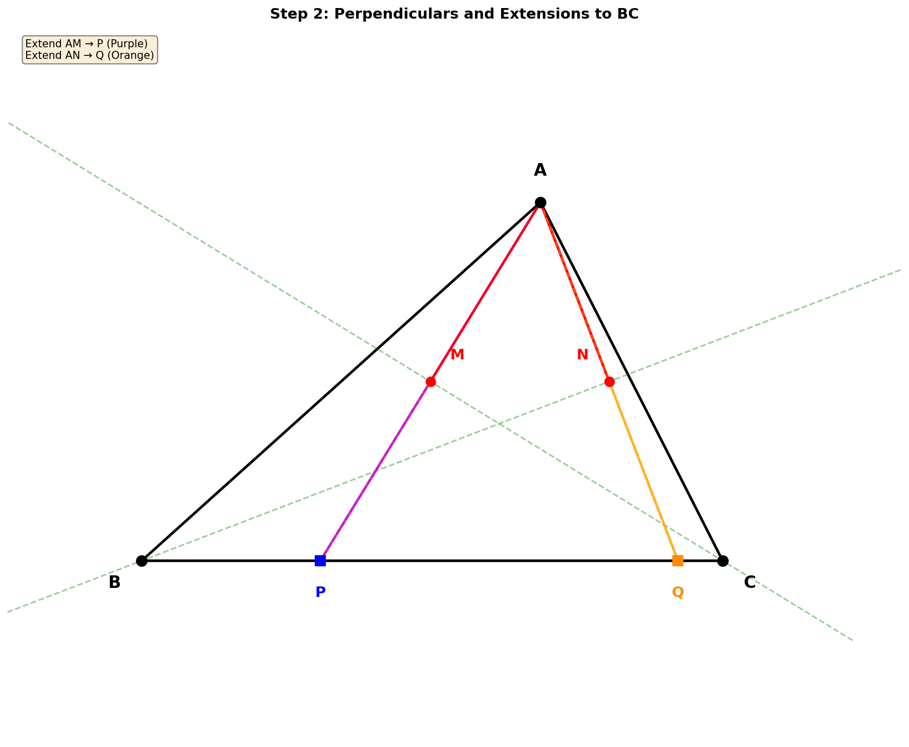
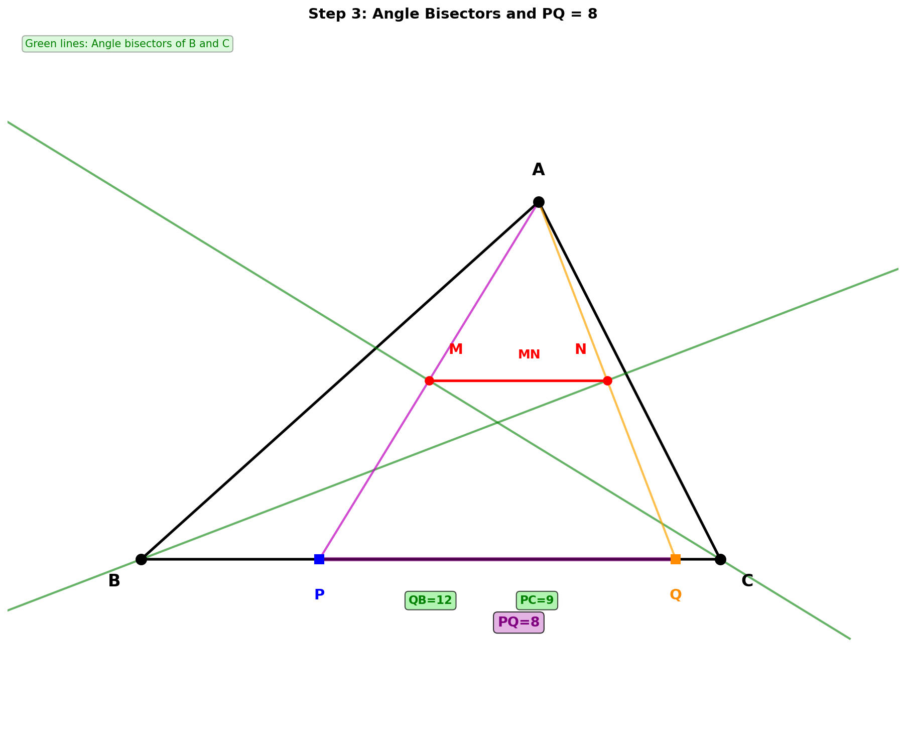
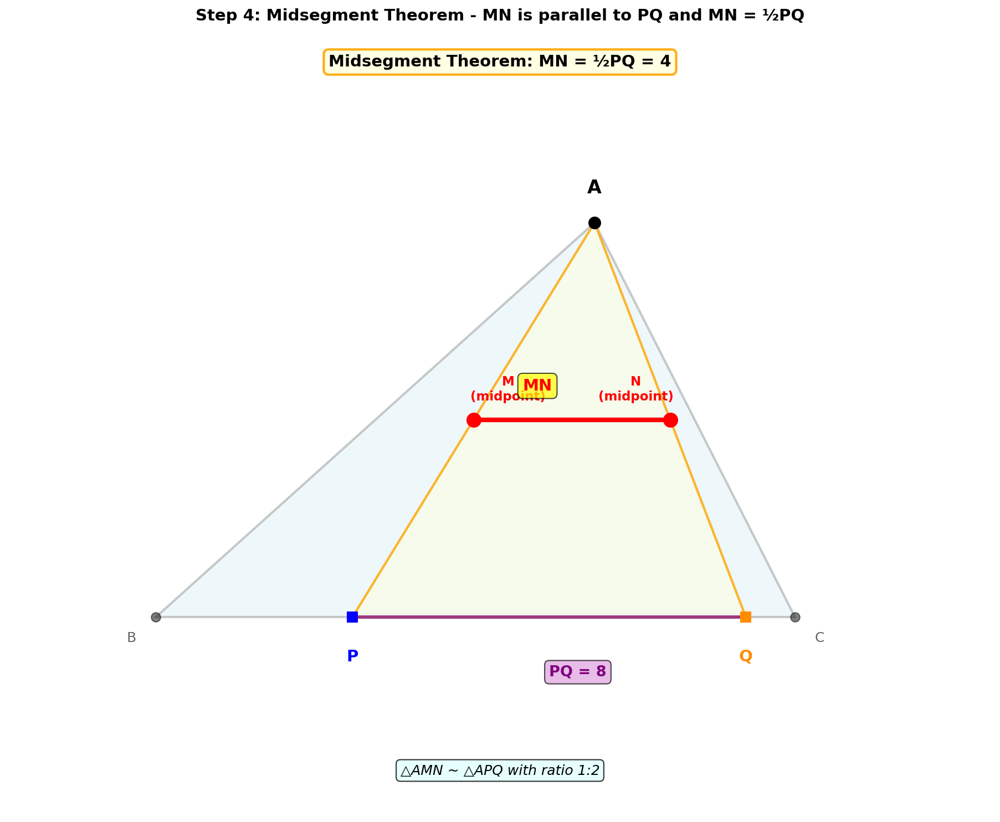
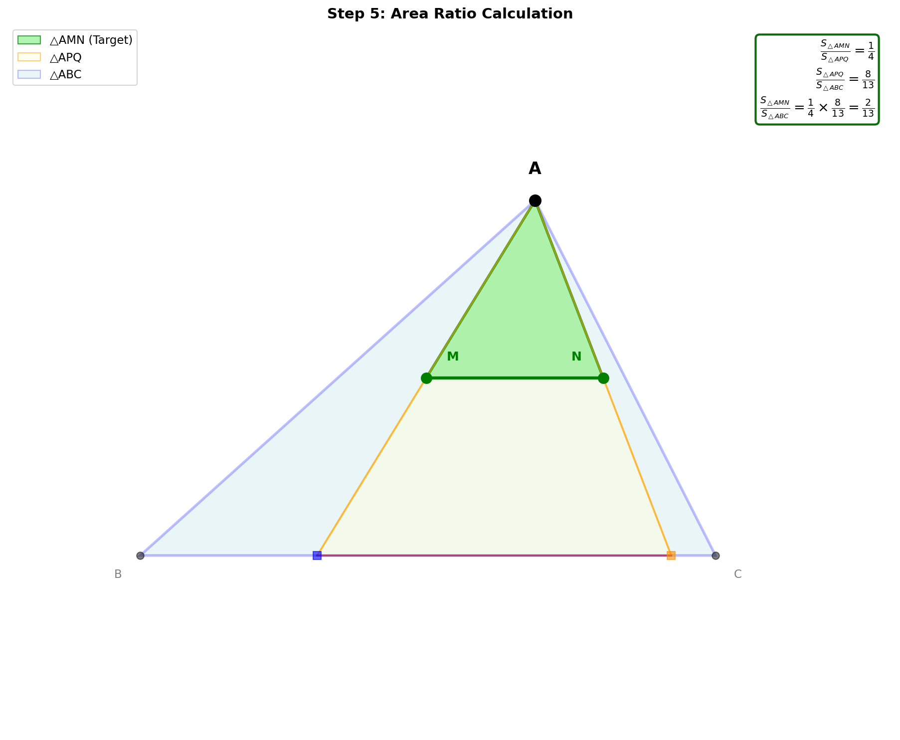
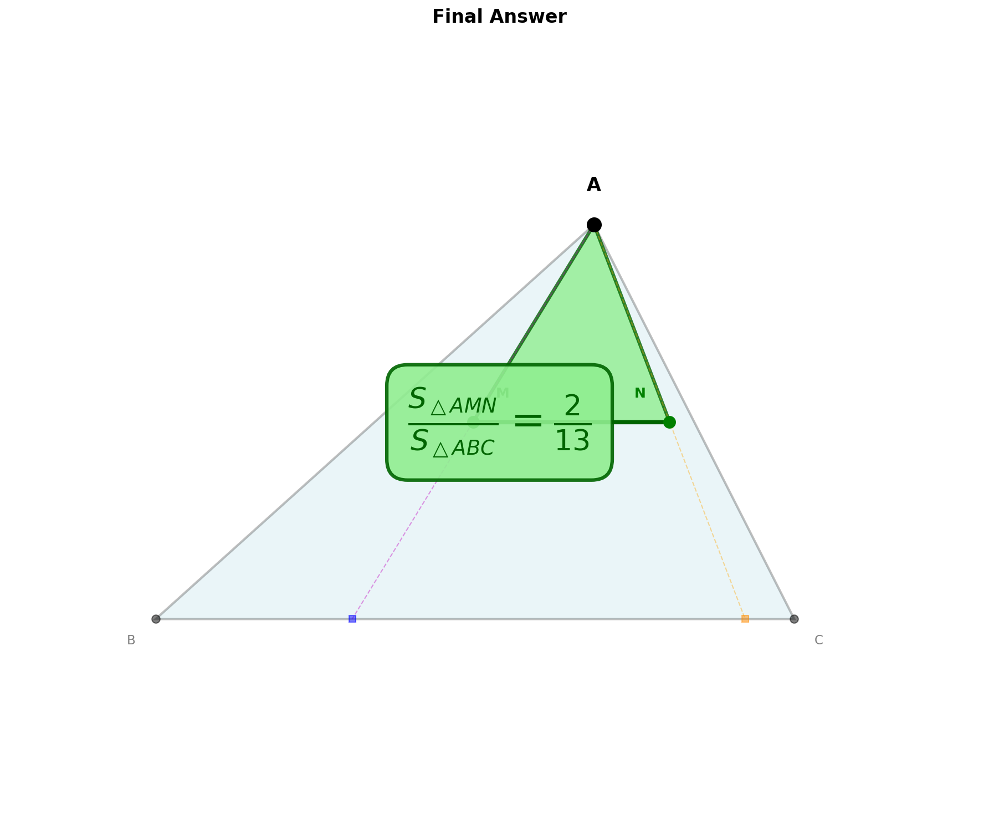

# 几何题解析

## 题目

在△ABC中，已知 AB = 12，AC = 9，BC = 13，过点A分别作∠C、∠B平分线的垂线，垂足分别为M、N，联结MN，求 **S△AMN / S△ABC** 的值。

---

## 解题思路

### 第一步：理解题目条件

我们先画出三角形ABC，标记已知的三边长度：
- AB = 12
- AC = 9  
- BC = 13

---

### 第二步：发现对称性（关键！）

这道题的关键在于**利用角平分线的对称性**。

当我们从点A向∠C的平分线作垂线，垂足为M时，可以延长AM交BC于点P。

由于CM是∠C的平分线，且AM⊥CM，根据**对称性原理**：
- △AMC ≅ △PMC（全等，ASA判定）
- 因此 **AC = PC = 9**
- **M是AP的中点**

同理，从点A向∠B的平分线作垂线，垂足为N，延长AN交BC于点Q：
- △ANB ≅ △QNB（全等）
- 因此 **AB = QB = 12**
- **N是AQ的中点**

---

### 第三步：确定P、Q在BC上的位置

现在我们来确定P和Q在BC边上的具体位置：

**对于点P：**
- PC = AC = 9
- BC = 13
- 所以 BP = BC - PC = 13 - 9 = **4**
- P在BC上，距离B点4个单位

**对于点Q：**
- QB = AB = 12
- BC = 13
- 所以 QC = BC - QB = 13 - 12 = **1**
- Q在BC上，距离C点1个单位

**PQ的长度：**
- PQ = BC - BP - QC = 13 - 4 - 1 = **8**

或者：PQ = QB - PB = 12 - 4 = **8** ✓

---

### 第四步：利用中位线定理

在△APQ中观察M和N的位置：
- M是AP的中点（由对称性得到）
- N是AQ的中点（由对称性得到）

根据**三角形中位线定理**：
- MN ∥ PQ
- MN = (1/2) × PQ = (1/2) × 8 = **4**

---

### 第五步：计算面积比

由于MN是△APQ的中位线，△AMN ∽ △APQ，相似比为 1:2

**相似三角形面积比**等于相似比的平方：

> S△AMN / S△APQ = (1/2)² = **1/4**

接下来求△APQ与△ABC的面积关系：

两个三角形有相同的高（从A到BC的垂线），所以面积比等于底边比：

> S△APQ / S△ABC = PQ / BC = 8/13

因此：

> S△AMN / S△ABC = (S△AMN / S△APQ) × (S△APQ / S△ABC) = (1/4) × (8/13) = **2/13**

---

## 最终答案

> **S△AMN / S△ABC = 2/13**

---

## 关键知识点总结

1. **角平分线的对称性**：当一点在角平分线上的垂线被延长时，形成等腰三角形
2. **全等三角形判定**：ASA（角边角）
3. **三角形中位线定理**：中位线平行于第三边且等于第三边的一半
4. **相似三角形面积比**：等于相似比的平方
5. **同高三角形面积比**：等于底边之比

---

## 完整解题思路梳理

1. **利用角平分线的对称性**：延长AM交BC于P，由对称性得△AMC ≅ △PMC，所以AC = PC = 9，M是AP中点
2. **同理得到Q点位置**：延长AN交BC于Q，得AB = QB = 12，N是AQ中点
3. **计算PQ长度**：BP = 4，QC = 1，所以PQ = 13 - 4 - 1 = 8
4. **应用中位线定理**：MN是△APQ的中位线，MN = (1/2)PQ = 4，△AMN ∽ △APQ，面积比1:4
5. **计算最终面积比**：S△AMN / S△ABC = (1/4) × (8/13) = 2/13

---

## 解题技巧总结

- **看到角平分线+垂线** → 想到对称性，考虑延长构造全等三角形
- **看到中点** → 想到中位线定理，可能有相似三角形
- **求面积比** → 考虑相似比或同高/同底的面积关系
- **复杂问题** → 分解为多个简单步骤，逐步推导
