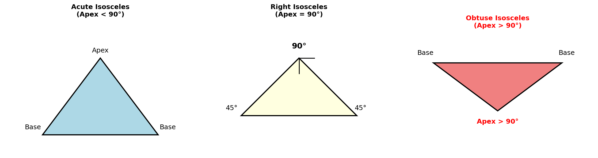
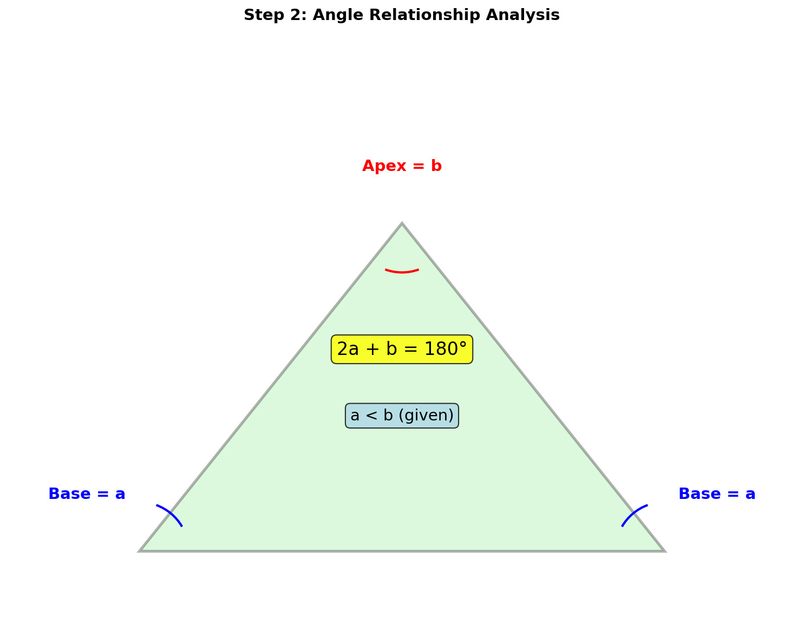
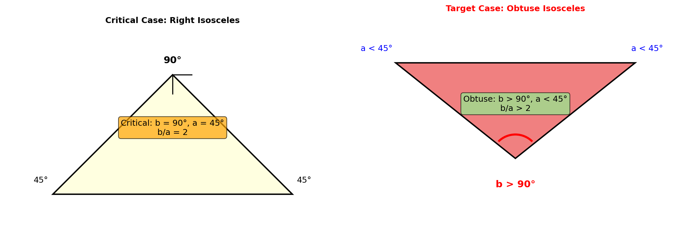
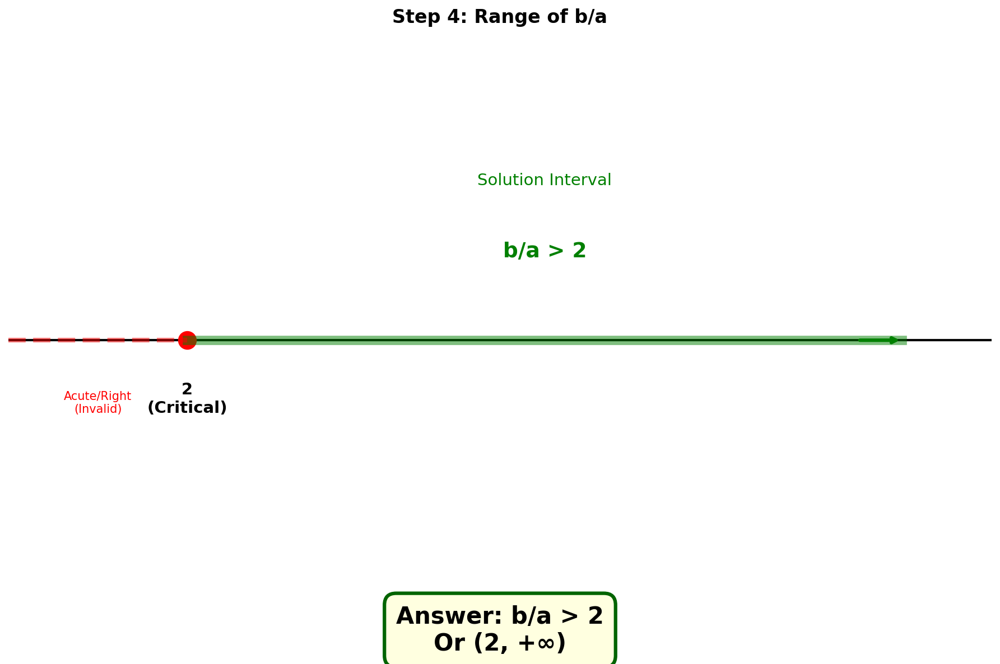

# 几何题解析

## 题目

等腰三角形的两个内角的度数之比为 a:b (a < b)，若这个三角形是钝角三角形，求 b/a 的取值范围。

---

## 解题思路

### 第一步：理解题意

等腰三角形有三种可能的角的组合：
- 两个底角相等，顶角不同
- 角度形式为 (a, a, b) 或 (a, b, b)

由于 a < b，我们需要分析哪种情况可能形成钝角三角形。

---

### 第二步：分析角度关系

设等腰三角形的三个角为：**底角 = a，底角 = a，顶角 = b**

根据三角形内角和定理：

> **2a + b = 180°**

已知条件：
- a < b（题目给定）
- 钝角三角形（有一个角 > 90°）

---

### 第三步：确定哪个角是钝角

由于 a < b，比较三个角的大小：
- 两个底角都是 a
- 顶角是 b
- 因为 a < b，所以 **b 是最大的角**

因此，如果三角形是钝角三角形，必然是 **b > 90°**

**推导过程：**

由 2a + b = 180° 和 b > 90°：
- 2a = 180° - b < 180° - 90° = 90°
- 所以 **a < 45°**

验证 a < b：
- b = 180° - 2a
- 因为 a < 45°，所以 2a < 90°
- b = 180° - 2a > 180° - 90° = 90° > a ✓

---

### 第四步：计算 b/a 的范围

由 2a + b = 180°，得：

> b = 180° - 2a

所以：

> b/a = (180° - 2a)/a = **180°/a - 2**

**分析取值范围：**

1. 当 a → 0⁺ 时（a 趋近于0）：
   - 180°/a → +∞
   - b/a → +∞

2. 当 a = 45° 时（临界情况）：
   - b = 180° - 2×45° = 90°
   - 此时是**直角三角形**，不是钝角三角形
   - b/a = 90°/45° = **2**

3. 当 a < 45° 时：
   - b > 90°，形成钝角三角形
   - b/a > 2

**验证：**

若 b/a = 3，则 b = 3a：
- 2a + 3a = 180°
- 5a = 180°
- a = 36°，b = 108° > 90° ✓（钝角三角形）

若 b/a = 2，则 b = 2a：
- 2a + 2a = 180°
- 4a = 180°
- a = 45°，b = 90°（直角三角形）✗

---

## 最终答案

> **b/a > 2**
> 
> 或写成区间形式：**(2, +∞)**

---

## 关键知识点总结

1. **等腰三角形性质**：两个底角相等
2. **三角形内角和**：三个内角之和等于 180°
3. **钝角三角形判定**：有一个内角大于 90°
4. **不等式求解**：通过代数变形求取值范围
5. **临界值分析**：通过边界情况确定取值范围的端点

---

## 完整解题思路梳理

1. **确定角度关系**：设底角为 a，顶角为 b，得 2a + b = 180°
2. **分析钝角位置**：由于 a < b，钝角只能是顶角 b
3. **建立不等式**：b > 90°，代入得 a < 45°
4. **计算比值**：b/a = 180°/a - 2
5. **确定范围**：当 a < 45° 时，b/a > 2

---

## 解题技巧总结

- **看到等腰三角形** → 立即想到两个角相等，设未知数表示
- **看到角度比** → 用一个变量表示另一个，减少未知数
- **看到取值范围** → 找临界情况（如直角是锐角和钝角的分界）
- **验证答案** → 取特殊值代入验证（如取 b/a = 3 验证）
