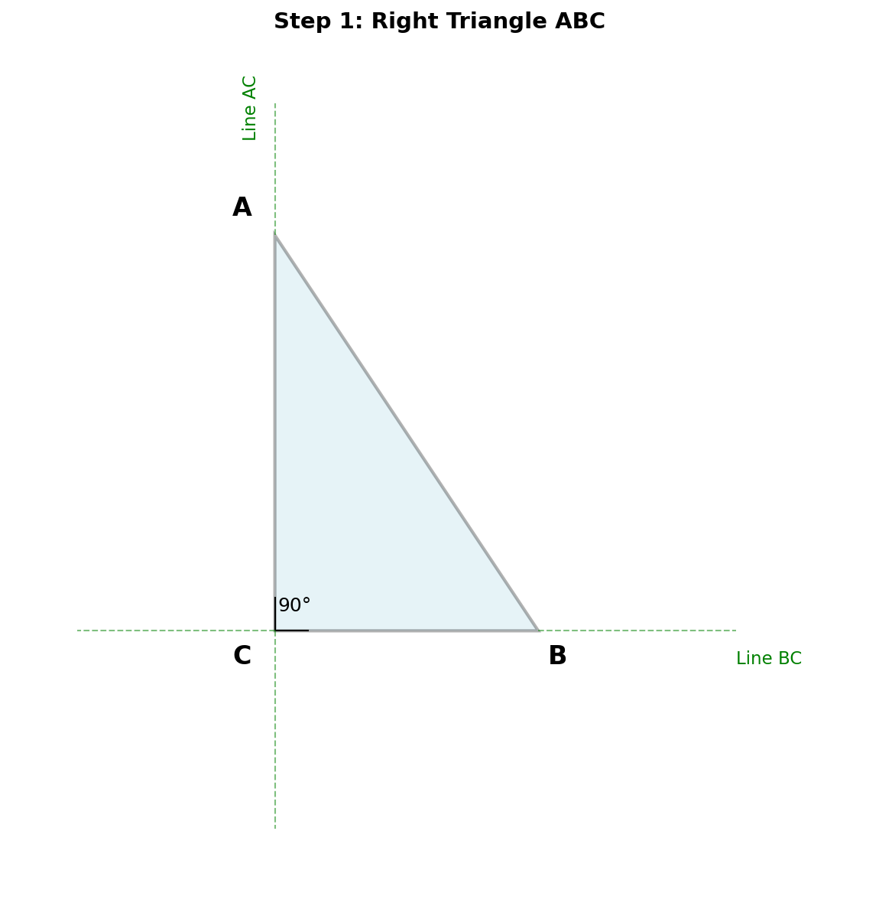
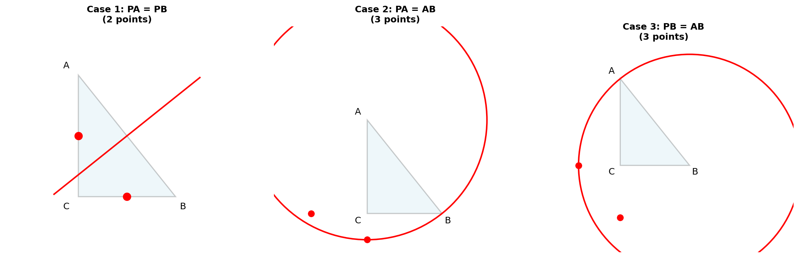
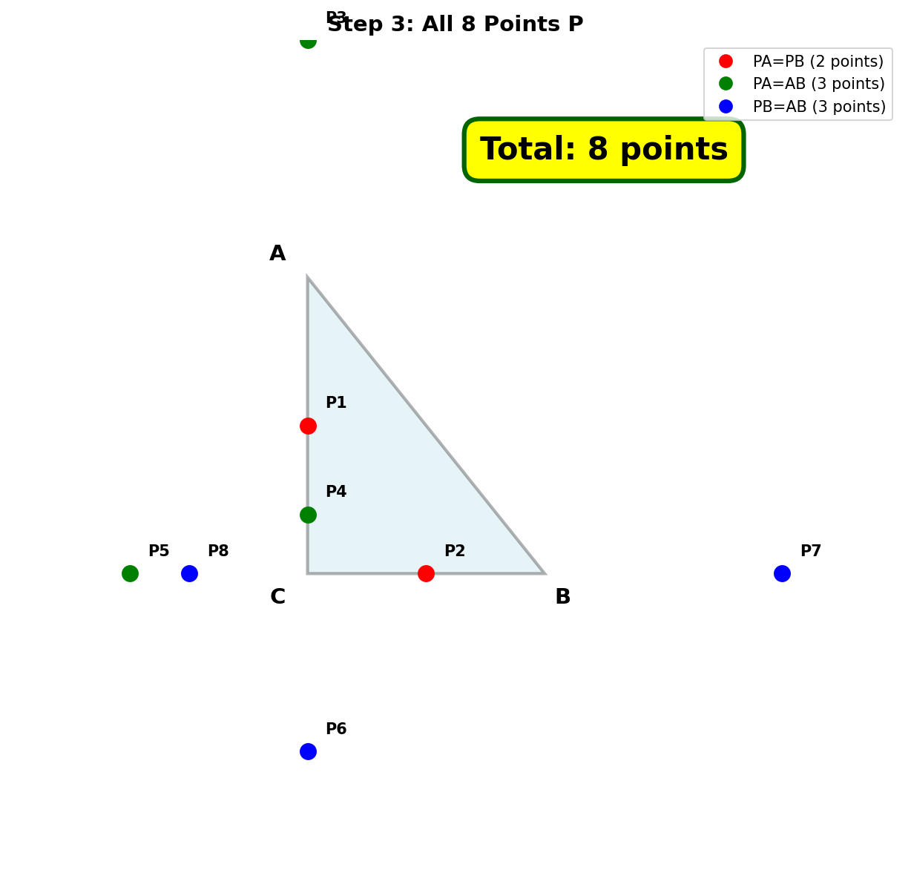

# 几何题解析

## 题目

如图所示，在 Rt△ABC 中，∠C=90°，∠A≠30°，∠A≠45°，在直线 BC 或 AC 上取一点 P，使得△PAB 是等腰三角形，则符合条件的点 P 有多少个？

---

## 解题思路

### 第一步：理解题意

- Rt△ABC，∠C = 90°
- P 在直线 BC 或直线 AC 上（可以在延长线上）
- △PAB 是等腰三角形

△PAB 是等腰三角形有三种情况：
1. PA = PB（P 在 AB 的垂直平分线上）
2. PA = AB（以 A 为圆心，AB 为半径）
3. PB = AB（以 B 为圆心，AB 为半径）

---

### 第二步：分类讨论

#### 情况1：PA = PB（P 在 AB 的垂直平分线上）

AB 的垂直平分线与直线 AC 和 BC 的交点：
- 与直线 AC 的交点：1个（在 AC 延长线上）
- 与直线 BC 的交点：1个（在 BC 延长线上）

**情况1总计：2个点**

#### 情况2：PA = AB（以 A 为圆心，AB 为半径画圆）

- 与直线 AC 的交点：2个（一个在 C 上方，一个在 C 下方）
- 与直线 BC 的交点：1个（在 C 左侧，B 点本身舍去）

**情况2总计：3个点**

#### 情况3：PB = AB（以 B 为圆心，AB 为半径画圆）

- 与直线 AC 的交点：1个（在 C 下方，A 点本身舍去）
- 与直线 BC 的交点：2个（一个在 C 右侧，一个在 C 左侧）

**情况3总计：3个点**

---

### 第三步：验证是否有重合

需要检查三种情况的点是否有重合：
- 如果有重合，说明该点同时满足两个条件
- 重合的条件是：PA = PB = AB，即△PAB 是等边三角形

当△PAB 是等边三角形时：
- 若 P 在 AC 上，则∠A = 60°
- 若 P 在 BC 上，则∠B = 60°，即∠A = 30°

题目条件：∠A ≠ 30°，所以第二种情况不发生。

如果∠A = 60°，则会有重合，但题目未排除此情况。在一般情况下（∠A ≠ 60°），8个点都不重合。

**总计：2 + 3 + 3 = 8个点**

---

## 最终答案

> **8个**

---

## 关键知识点总结

1. **等腰三角形的判定**：两边相等或两角相等
2. **垂直平分线性质**：垂直平分线上的点到线段两端距离相等
3. **圆的定义**：到定点距离等于定长的点的轨迹
4. **分类讨论思想**：不重不漏地列举所有情况
5. **直线与圆的交点**：最多2个交点

---

## 完整解题思路梳理

1. **确定分类标准**：△PAB 是等腰三角形有三种情况（PA=PB, PA=AB, PB=AB）
2. **情况1分析**：P 在 AB 垂直平分线上，与两直线各交于1点，共2点
3. **情况2分析**：以 A 为圆心 AB 为半径画圆，与 AC 交于2点，与 BC 交于1点，共3点
4. **情况3分析**：以 B 为圆心 AB 为半径画圆，与 AC 交于1点，与 BC 交于2点，共3点
5. **验证重合**：在一般情况（∠A ≠ 60°）下，8个点互不重合

---

## 解题技巧总结

- **看到等腰三角形** → 立即分类讨论三种情况
- **看到"直线"** → 注意可以在延长线上，不只是线段上
- **数形结合** → 画图帮助理解，用圆和垂直平分线找点
- **验证重合** → 考虑特殊角度是否会导致点重合
- **排除特殊情况** → 题目给出∠A ≠ 30° 和 ∠A ≠ 45° 是为了避免重合
