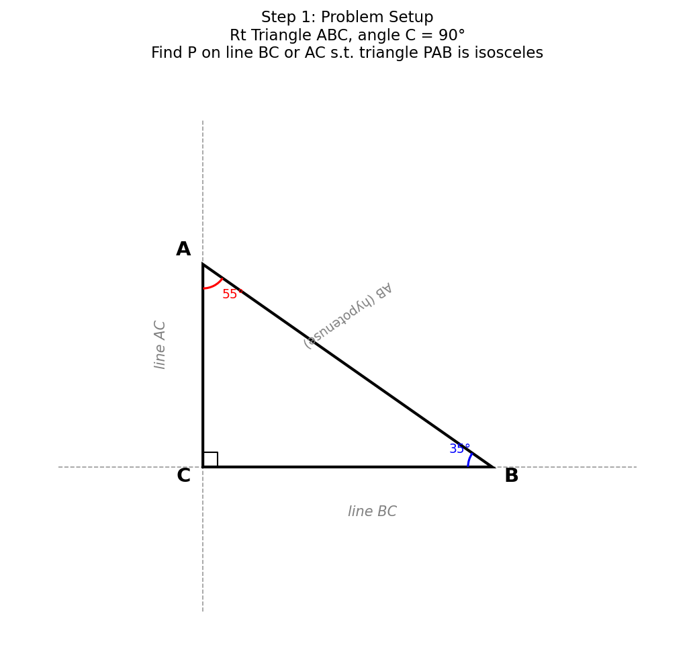
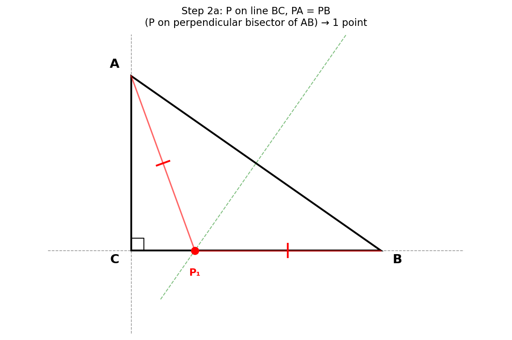
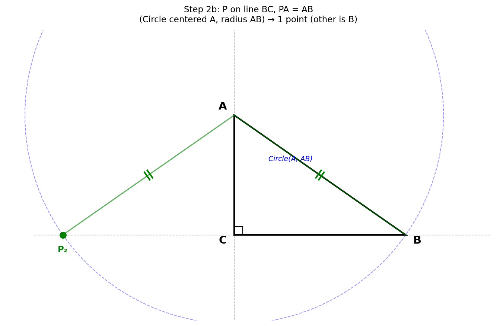
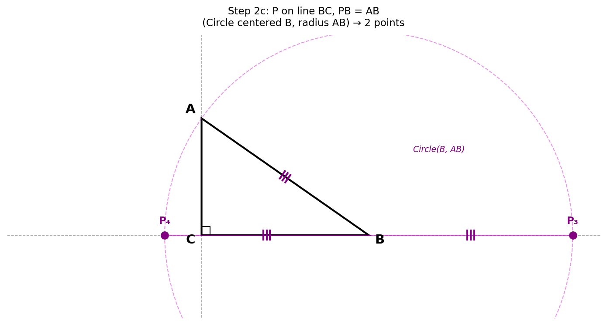
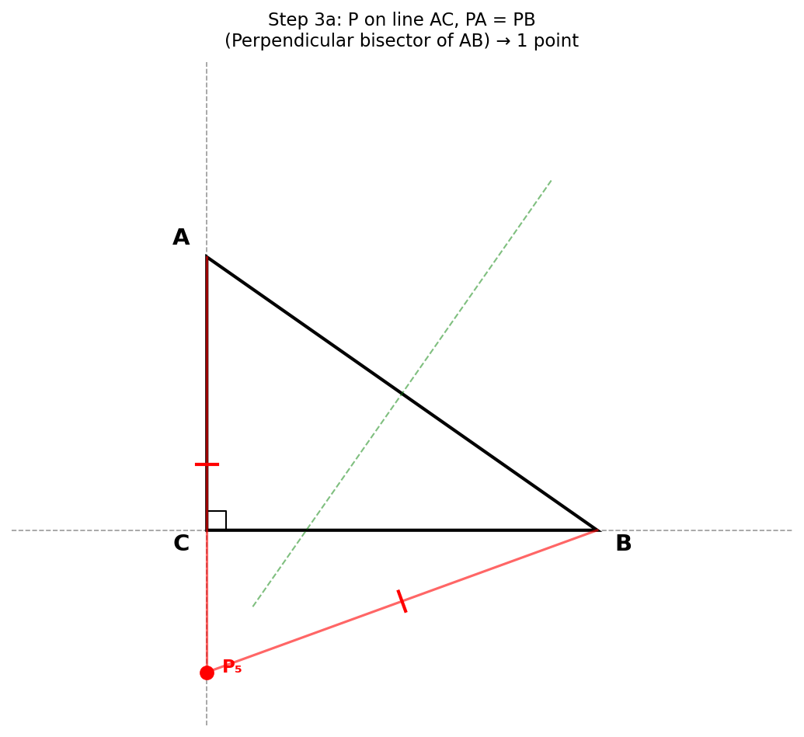
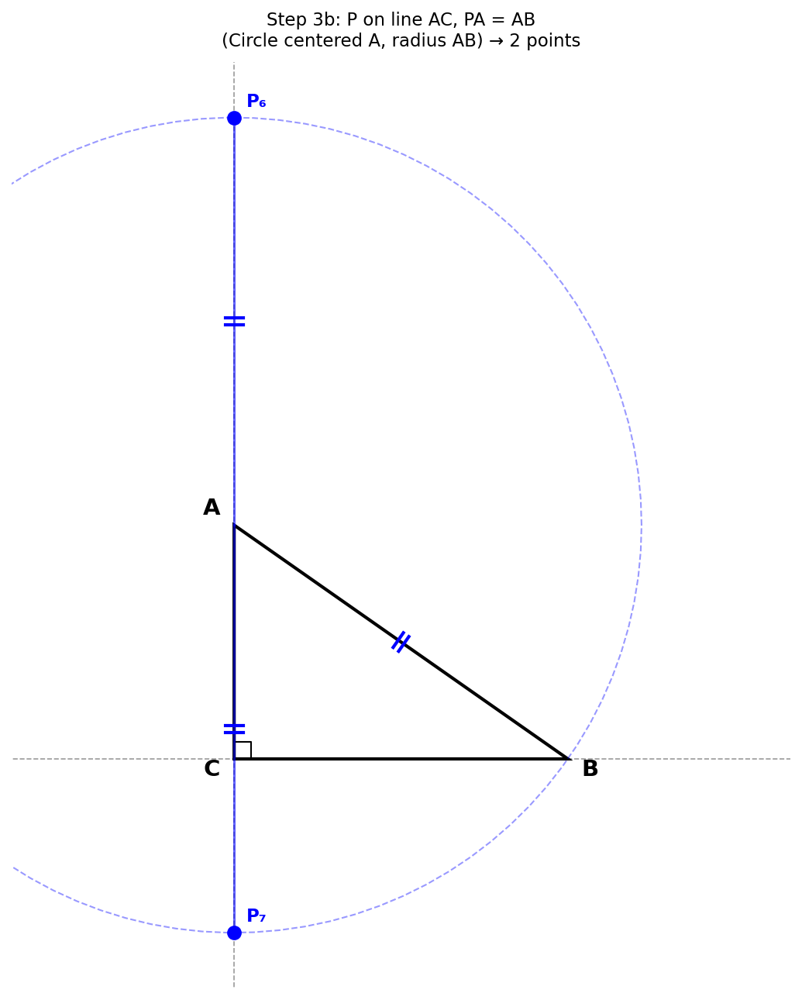
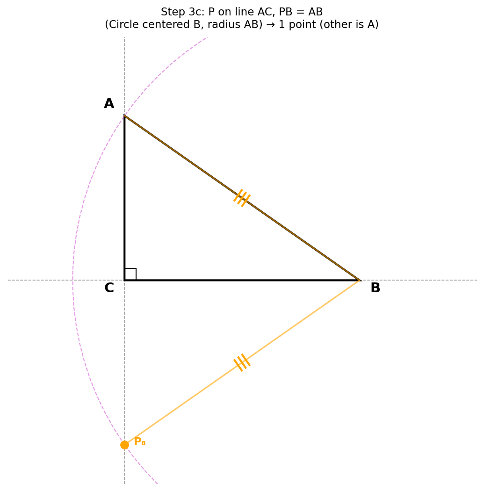
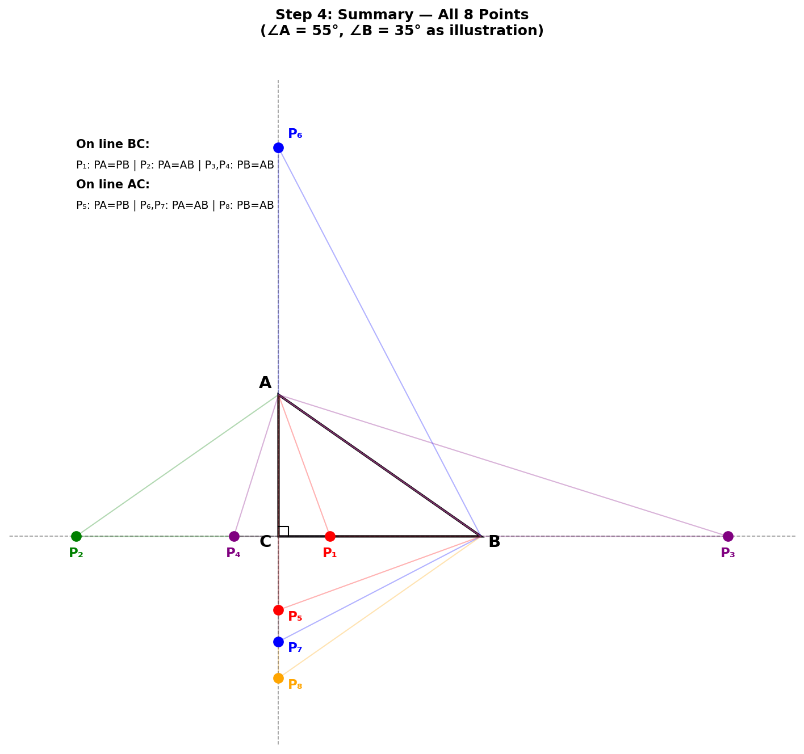

# 003 - 直角三角形中等腰三角形的构造

## 题目

如图所示，在Rt△ABC中，∠C = 90°，∠A ≠ 30°，∠A ≠ 45°，在直线BC或AC上取一点P，使得△PAB是等腰三角形，则符合条件的点P有多少个？

## 解题过程

### 第一步：分析题目条件

已知：
- 直角三角形ABC，∠C = 90°
- ∠A ≠ 30°，∠A ≠ 45°（这两个条件防止某些特殊退化情况）
- P在**直线**BC或**直线**AC上（注意是直线，不是线段！）
- △PAB为等腰三角形

关键理解：P可以在BC、AC的延长线上，不局限于线段内。

### 第二步：明确等腰条件

△PAB为等腰三角形，意味着三条边 PA、PB、AB 中有两条相等。共有三种情况：

1. **PA = PB**（P为顶点的等腰三角形）
2. **PA = AB**（A为顶点的等腰三角形）
3. **PB = AB**（B为顶点的等腰三角形）

对**每条直线**（直线BC和直线AC），分别讨论这三种情况。

### 第三步：P在直线BC上的情况

#### 情况一：PA = PB

P到A和B的距离相等，即P在线段AB的**垂直平分线**上。

AB的垂直平分线是一条确定的直线，它与直线BC必然有一个交点（因为垂直平分线不平行于BC）。

→ **1个点**

#### 情况二：PA = AB

以A为圆心，AB为半径作圆，该圆与直线BC的交点就是满足条件的P。

由于直线BC是过B的直线，而B在圆上（AB=半径），所以圆与直线BC有两个交点：
- 一个是B本身（排除，因为P=B时△PAB退化）
- 另一个是B关于圆心A在直线BC上的"对称点"

→ **1个点**

#### 情况三：PB = AB

以B为圆心，AB为半径作圆，该圆与直线BC的交点。

由于B在直线BC上（即圆心在直线上），圆与直线BC有两个交点：
- 在B的两侧各一个点，到B的距离都等于AB

两个交点都不等于A或B（因为A不在直线BC上），都有效。

→ **2个点**

**直线BC上共：1 + 1 + 2 = 4个点**

### 第四步：P在直线AC上的情况

#### 情况四：PA = PB

P在AB的垂直平分线上，同时在直线AC上。垂直平分线与直线AC有一个交点。

→ **1个点**

#### 情况五：PA = AB

以A为圆心，AB为半径作圆，与直线AC的交点。

A在直线AC上（即圆心在直线上），所以圆与直线AC有两个交点：
- 在A的两侧各一个，距A的距离都等于AB
- 两个交点都不等于B（因为B不在直线AC上），都有效

→ **2个点**

#### 情况六：PB = AB

以B为圆心，AB为半径作圆，与直线AC的交点。

圆经过A（BA=半径），所以A是一个交点（排除，P=A退化）。
另一个交点是有效的P。

→ **1个点**

**直线AC上共：1 + 2 + 1 = 4个点**

### 第五步：检查是否有重复

两条直线的公共点是C。需要检查P=C是否在某个情况中出现：
- P=C时：PA = AC = b，PB = BC = a
- PA = PB 需要 a = b，即∠A = 45°（已排除）

所以P=C不满足任何等腰条件，两条直线上的点没有重合。

### 第六步：理解特殊角度的排除

- **∠A = 30° 时**：在直线BC上，"PA=PB"的点和"PA=AB"的点重合，少一个点
- **∠A = 45° 时**：P=C同时满足两条直线上的"PA=PB"条件，出现双重计数

排除这两个特殊角度后，8个点互不重合。

## 最终答案

符合条件的点P共有 **8个**。

- 直线BC上4个：PA=PB(1个) + PA=AB(1个) + PB=AB(2个)
- 直线AC上4个：PA=PB(1个) + PA=AB(2个) + PB=AB(1个)

## 知识点归纳

1. **等腰三角形的判定**：两边相等即为等腰
2. **垂直平分线性质**：垂直平分线上的点到两端点距离相等
3. **圆与直线的位置关系**：圆心在直线上时，直线与圆相交于两点（为直径端点）
4. **分类讨论**：按等腰的"顶点"分三类
5. **排除退化**：P与A或B重合时三角形不存在
