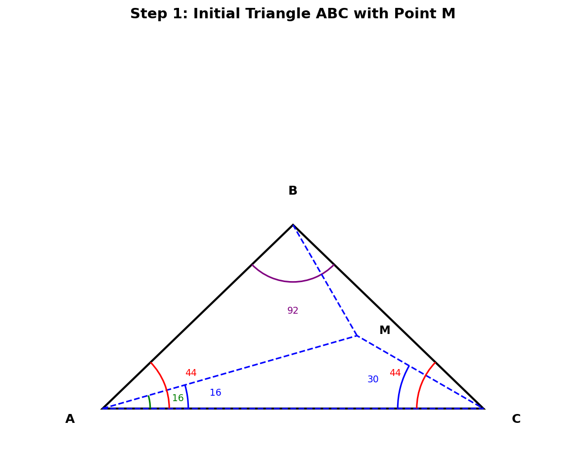
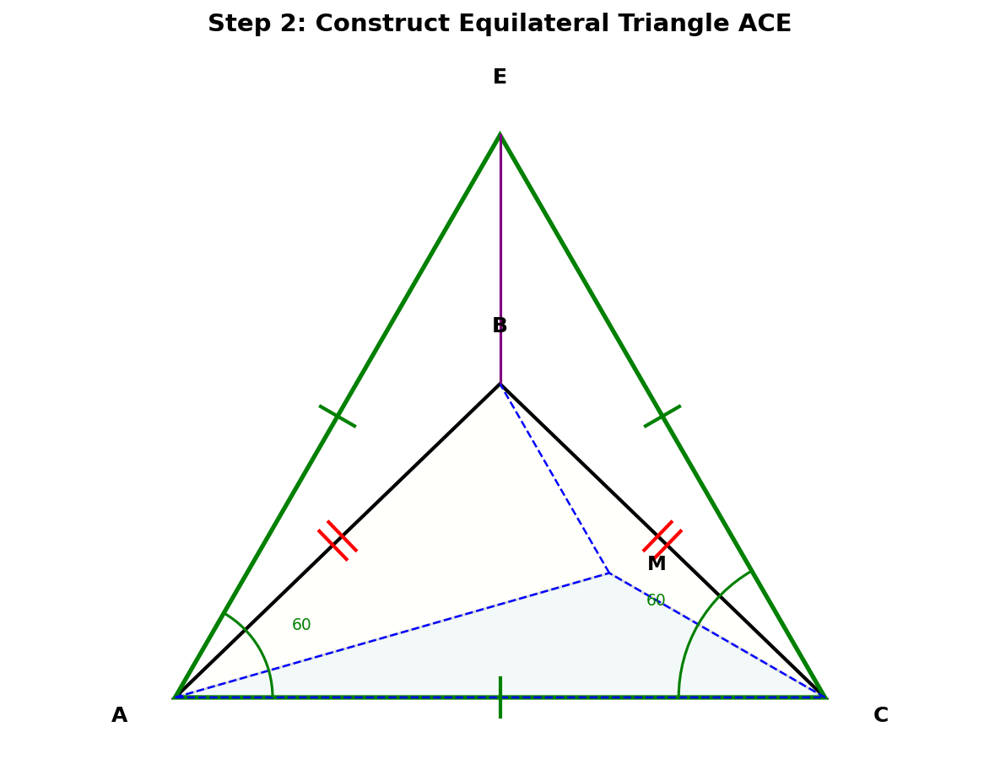
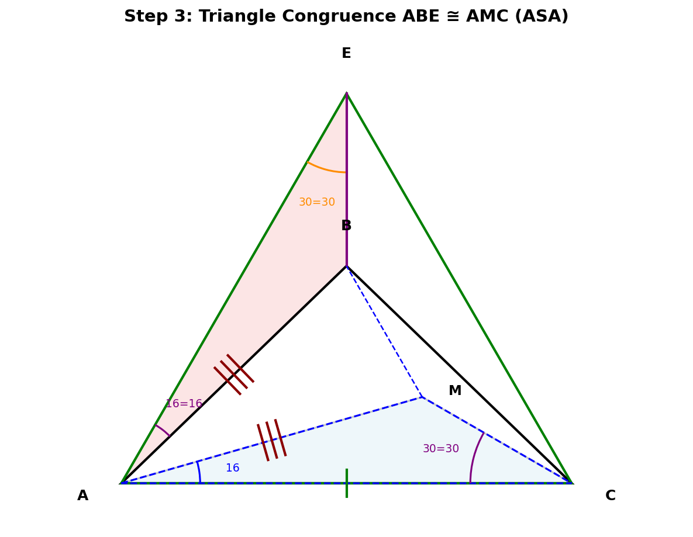
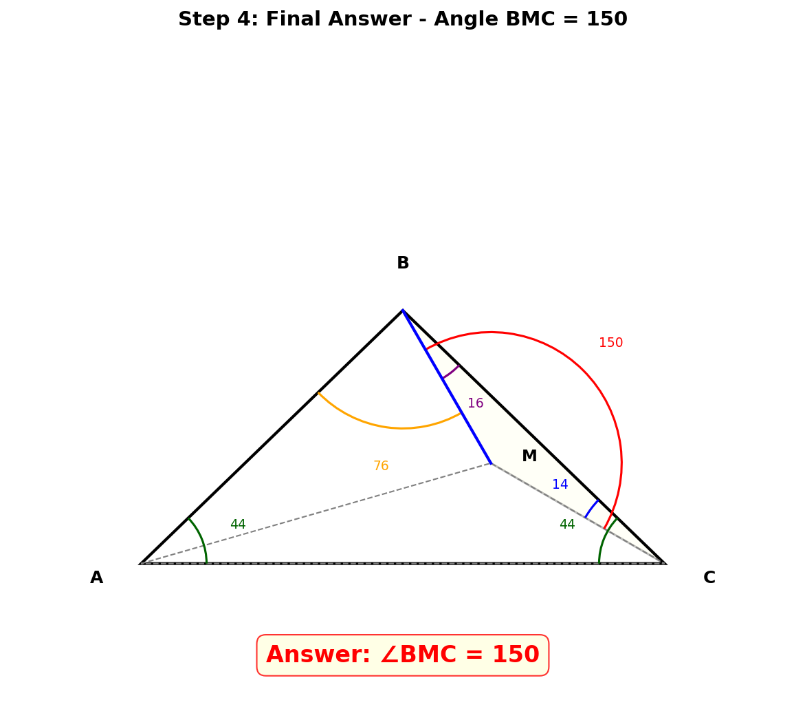

# 几何题解答：求角BMC的度数

## 题目

在 **△ABC** 中，**∠BAC = ∠BCA = 44°**，点 **M** 为△ABC内一点，且 **∠MCA = 30°**，**∠MAC = 16°**，求 **∠BMC** 的度数。

---

## 解题过程

### 第一步：分析已知条件

题目给了我们很多角度信息，让我们先把能算的都算出来！

- ∠BAC = ∠BCA = 44° → **AB = BC**（等腰三角形，等角对等边）
- ∠ABC = 180° - 44° - 44° = **92°**（三角形内角和180°）
- ∠BAM = ∠BAC - ∠MAC = 44° - 16° = **28°**
- ∠BCM = ∠BCA - ∠MCA = 44° - 30° = **14°**
- 在△AMC中：∠AMC = 180° - 16° - 30° = **134°**

**我们的目标**：要求∠BMC的度数。在△BMC中，我们已经知道**∠MCB = 14°**，只要能求出**∠MBC**，就能用内角和算出∠BMC了！

---

### 第二步：构造辅助线 - 等边三角形

题目给的角度都很特别，44°、16°、30°——这些数字暗示我们可以用构造法。

**关键构造**：以AC为边，在AC的上方（和B同侧）作**等边△ACE**，连接BE。

等边△ACE的性质：
- AE = CE = AC（三边相等）
- ∠EAC = ∠ECA = ∠AEC = **60°**
- ∠AEB = ∠CEB = 30°（对称性，BE平分∠AEC）

> 为什么想到作等边三角形？因为等边三角形有60°角，和题目中的44°、16°正好可以组合出很多有用的角度。比如 60° - 44° = 16°，正好等于∠MAC！

---

### 第三步：证明△ABE ≅ △CBE（SSS）

先观察△ABE和△CBE：

- **AB = CB**（△ABC是等腰三角形）
- **AE = CE**（△ACE是等边三角形）
- **BE = BE**（公共边）

三条边分别相等，所以：

> **△ABE ≅ △CBE（SSS）**

由全等可得：
- **∠AEB = ∠CEB = 60° ÷ 2 = 30°**

---

### 第四步：证明△ABE ≅ △AMC（ASA），得到AB = AM

这是我们解题中最精彩的一步！来看看△ABE和△AMC有多少共同点：

**① ∠EAB = ∠MAC？**
- ∠EAB = ∠EAC - ∠BAC = 60° - 44° = **16°**
- ∠MAC = **16°**（已知）
- ✓ ∠EAB = ∠MAC

**② AE = AC？**
- AE和AC都是等边△ACE的边
- ✓ AE = AC（等边三角形三边相等）

**③ ∠AEB = ∠MCA？**
- ∠AEB = **30°**（第三步已证）
- ∠MCA = **30°**（已知）
- ✓ ∠AEB = ∠MCA

两角及其夹边分别相等：

> **△ABE ≅ △AMC（ASA）**

由全等得关键结论：**AB = AM**

---

### 第五步：利用等腰三角形ABM求角

由第四步得 **AB = AM**，所以△ABM是等腰三角形！

在△ABM中：
- ∠BAM = **28°**（第一步已算）
- AB = AM → △ABM是等腰三角形，**∠ABM = ∠AMB**

所以：
- ∠ABM = ∠AMB = (180° - 28°) ÷ 2 = **76°**

于是：
- ∠MBC = ∠ABC - ∠ABM = 92° - 76° = **16°**

---

### 第六步：最终计算∠BMC

现在万事俱备！在△BMC中：
- ∠MBC = **16°**
- ∠MCB = **14°**
- ∠BMC = 180° - 16° - 14° = **150°**

或者换一种算法验证：
- ∠BMC = 360° - ∠BMA - ∠AMC
- ∠BMA = ∠AMB = 76°（第五步）
- ∠AMC = 134°（第一步）
- ∠BMC = 360° - 76° - 134° = **150°**

---

## 最终答案

> **∠BMC = 150°**

---

## 解题思路回顾

这道题的"灵魂"在于**构造等边三角形**，通过全等关系找到AB = AM这个隐藏的条件。

**解题脉络**：

1. **计算已知角** → 92°、28°、14°、134°
2. **构造等边△ACE** → 得到60°角
3. **证△ABE ≅ △CBE（SSS）** → 得∠AEB = 30°
4. **证△ABE ≅ △AMC（ASA）** → 得AB = AM ★关键一步
5. **等腰△ABM求角** → ∠ABM = ∠AMB = 76°
6. **计算∠BMC** → 150°

---

## 知识点归纳

| 知识点 | 应用 |
|--------|------|
| **三角形内角和180°** | 计算∠ABC、∠AMC等 |
| **等腰三角形性质** | 等角对等边，等边对等角 |
| **等边三角形性质** | 三边相等，三角都是60° |
| **全等三角形SSS** | 证明△ABE ≅ △CBE |
| **全等三角形ASA** | 证明△ABE ≅ △AMC |
| **构造辅助线** | 构造等边三角形 |
