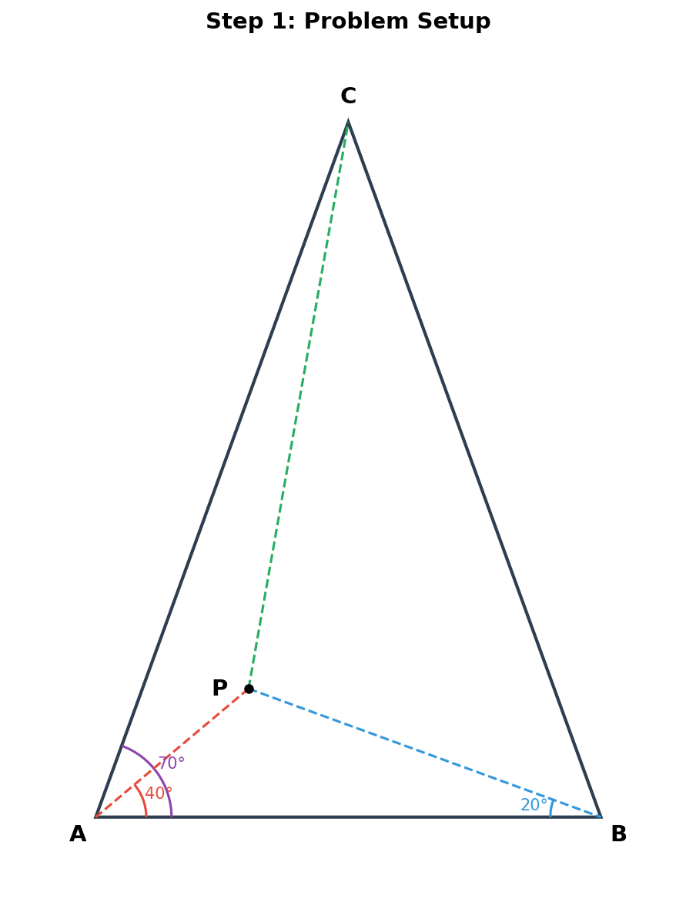
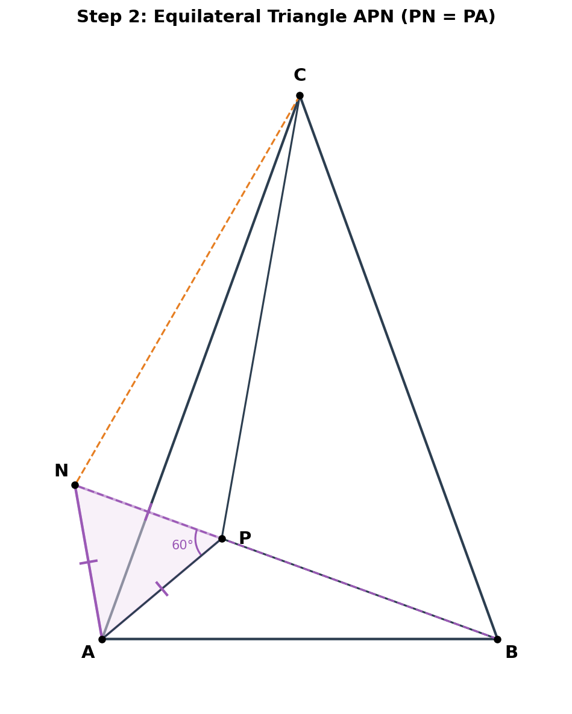
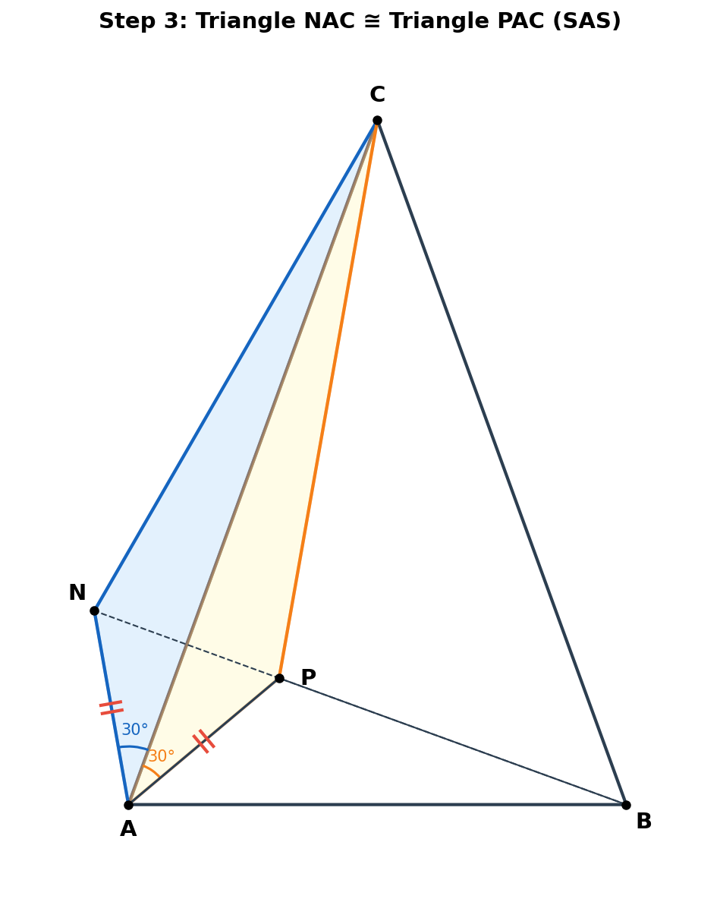
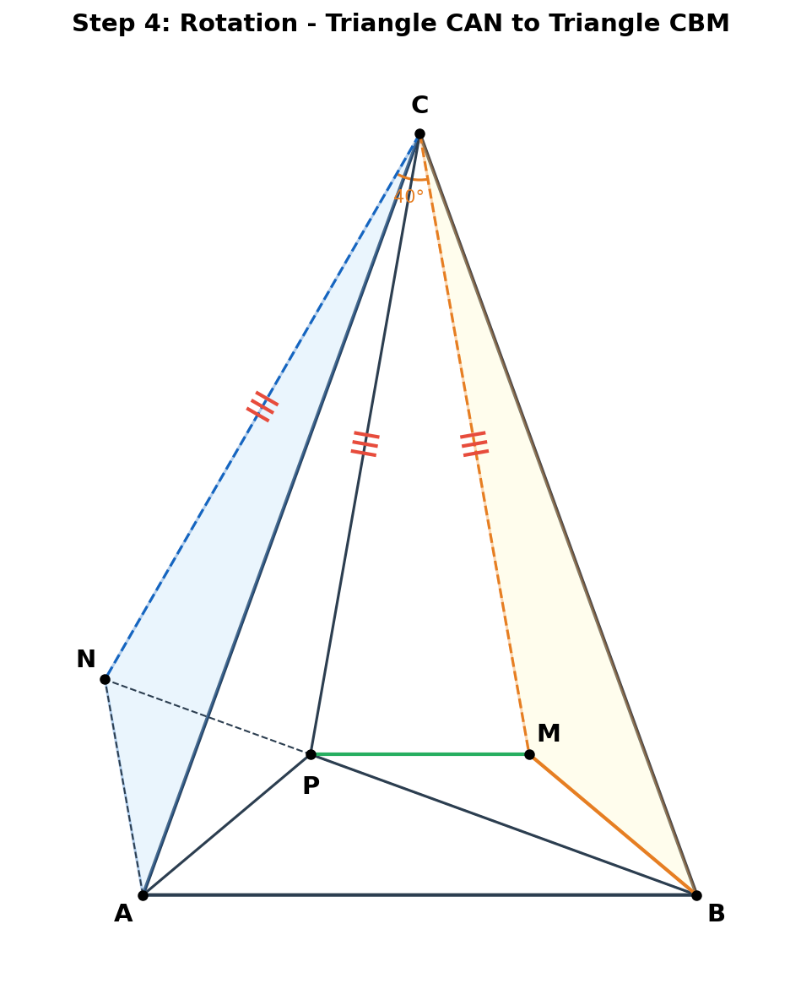
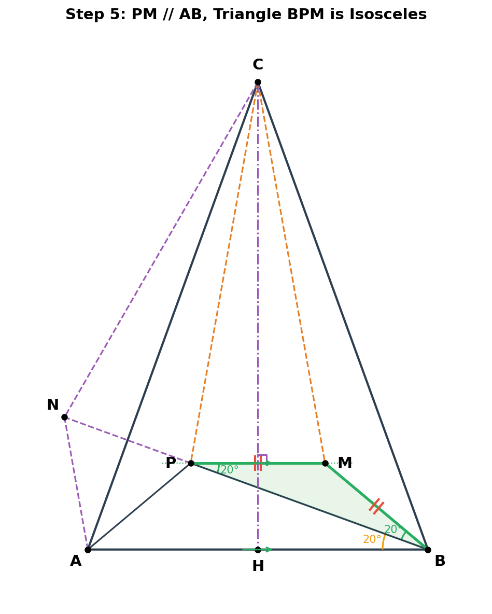
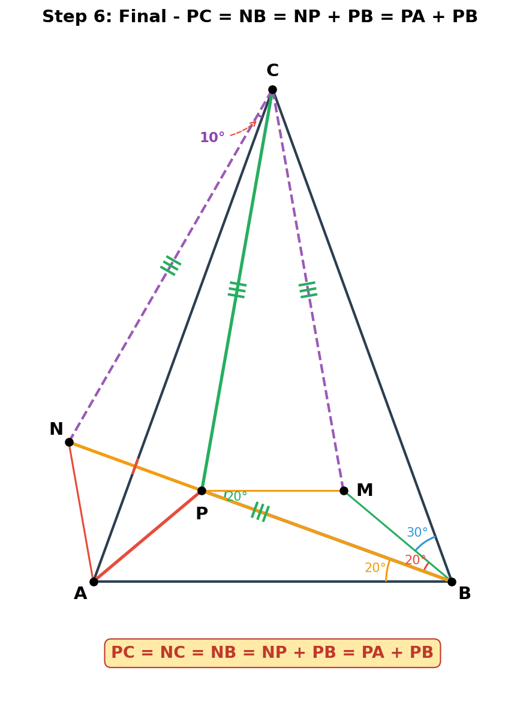

# 005 - 证明 PA + PB = PC

## 题目

在△ABC中，∠ABC = ∠BAC = 70°，点P为三角形内一点，∠PAB = 40°，∠PBA = 20°，求证：PA + PB = PC。

## 解题过程

### 第一步：分析已知条件，计算角度

因为 ∠ABC = ∠BAC = 70°，所以：

- **AC = BC**（等腰三角形，等角对等边）
- **∠ACB = 180° - 70° - 70° = 40°**

进一步计算：
- ∠PAC = ∠BAC - ∠PAB = 70° - 40° = **30°**
- ∠PBC = ∠ABC - ∠PBA = 70° - 20° = **50°**
- ∠APB = 180° - ∠PAB - ∠PBA = 180° - 40° - 20° = **120°**

### 第二步：辅助构造——延长BP取点N

如图所示，在BP延长线上取一点N，使 **PN = PA**，联结AN、CN。

因为 ∠APN = 180° - ∠APB = 180° - 120° = 60°，且 PN = PA，

所以 **△APN 是等边三角形**，AN = PA = PN。

### 第三步：证明 △NAC ≅ △PAC

- ∠NAP = 60°（等边三角形内角）
- ∠NAC = ∠NAP - ∠PAC = 60° - 30° = 30°
- 所以 **∠NAC = ∠PAC = 30°**

又因为：
- AN = AP（等边三角形）
- AC = AC（公共边）

由 **SAS**（边角边）得：**△NAC ≅ △PAC**

所以：
- **NC = PC**
- **∠NCA = ∠PCA**（即CA平分∠NCP）

### 第四步：旋转构造——将△CAN旋转到△CBM

将△CAN绕点C逆时针旋转∠ACB = 40°，使A对应B，N对应M。

则：
- **CM = CN = CP**（旋转不改变长度）
- **∠BCM = ∠ACN**（旋转对应角）

因为 ∠ACP = ∠ACN（第三步结论），∠ACN = ∠BCM（旋转），所以：
- **∠ACP = ∠BCM**

又因为 CA = CB（等腰三角形），CP = CM，∠ACP = ∠BCM，

由 **SAS** 得：**△CAP ≅ △CBM**

所以 **BM = AP = PN**。

### 第五步：证明 PM // AB

过点C作CH ⊥ AB于H。因为△ABC是等腰三角形（CA = CB），所以CH是AB的垂直平分线，且 ∠ACH = ∠BCH = 20°。

由于 ∠ACP = ∠BCM，所以：
- ∠PCH = ∠ACH - ∠ACP
- ∠MCH = ∠BCH - ∠BCM

因为 ∠ACH = ∠BCH 且 ∠ACP = ∠BCM，所以 **∠PCH = ∠MCH**。

即CH平分∠PCM。又因为CP = CM（已证），所以△PCM是等腰三角形，角平分线也是底边PM的垂直平分线。

因此 **CH ⊥ PM**。又因为 CH ⊥ AB，所以 **PM // AB**。

### 第六步：证明 △BPM 是等腰三角形

由旋转 △CAN → △CBM，对应角 ∠NAC = ∠MBC = 30°。

- ∠MBA = ∠ABC - ∠MBC = 70° - 30° = 40°
- ∠MBP = ∠MBA - ∠PBA = 40° - 20° = **20°**

因为 PM // AB，所以 ∠MPB = ∠PBA = **20°**（内错角）。

∠MBP = ∠MPB = 20°，所以 **PM = BM**。

### 第七步：最终结论

综合前面的结果：
- PM = BM = AP = PN

又因为 CP = CN = CM 且 PN = PM，由 **SSS** 得 △NCP ≅ △MCP，所以 ∠NCP = ∠MCP。

由第三步知 ∠NCA = ∠PCA（CA平分∠NCP），所以：

> ∠NCA = (1/2)∠NCP = (1/2) × (1/2)∠NCM = (1/4)∠NCM = (1/4) × 40° = **10°**

因此：
- ∠NCB = ∠NCA + ∠ACB = 10° + 40° = **50°**

又因为N在BP延长线上，所以 ∠NBC = ∠PBC = **50°**。

在△NBC中，∠NCB = ∠NBC = 50°，所以 **NB = NC**。

最终：

> **PC = NC = NB = NP + PB = PA + PB**

证毕。■

## 知识点总结

1. **等腰三角形性质**：等角对等边，顶角平分线即底边垂直平分线
2. **等边三角形构造**：利用60°角和等边条件构造等边三角形
3. **SAS全等**：两边及其夹角对应相等
4. **SSS全等**：三边对应相等
5. **旋转变换**：绕定点旋转保持边长和角度不变
6. **平行线性质**：内错角相等
