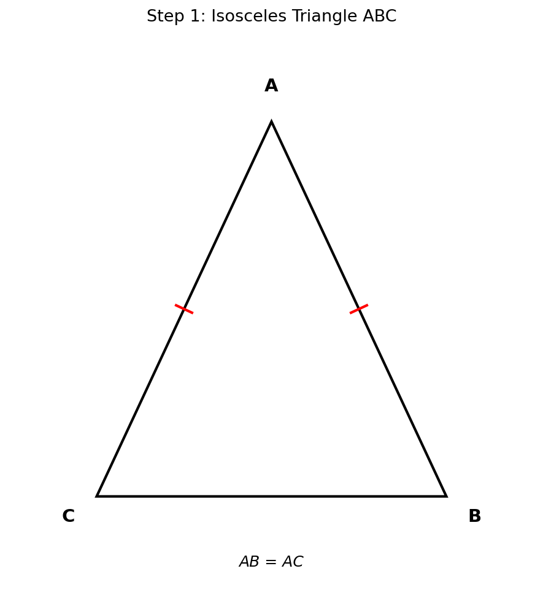
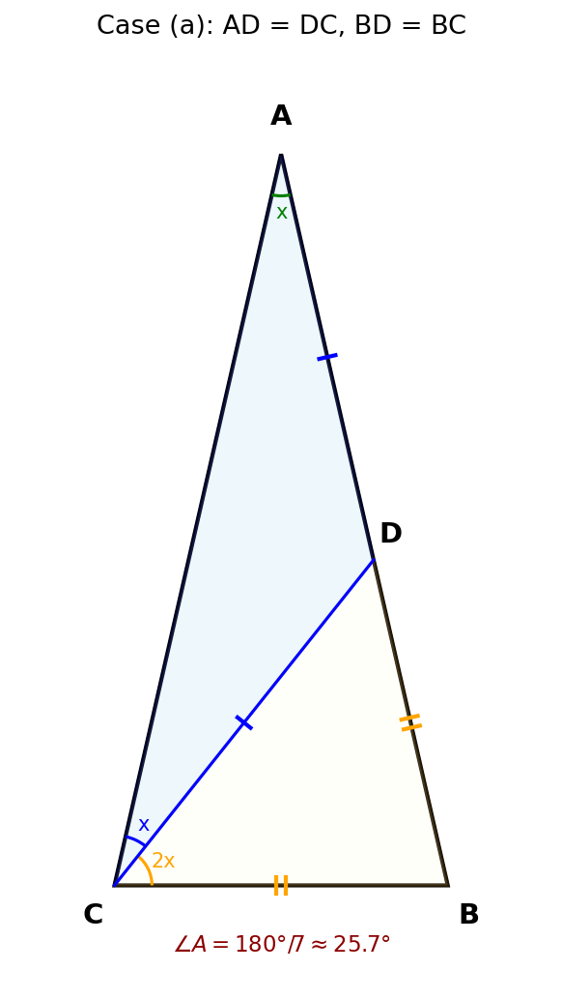
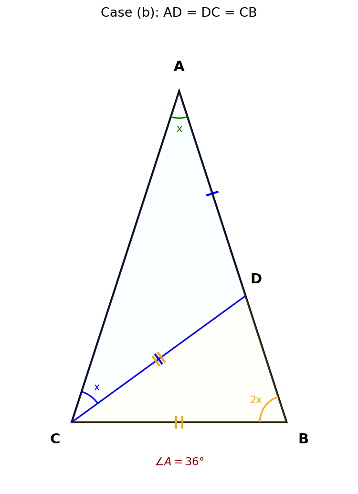

# 006 - 等腰三角形被直线分成两个等腰三角形

## 题目

在等腰△ABC中，AB = AC。若过点C的一条直线恰好将△ABC分为两个小的等腰三角形，求∠A的度数。

## 解题过程

### 第一步：分析题目条件

已知：等腰△ABC，AB = AC，过点C的一条直线将△ABC分为两个小的等腰三角形。

过点C作一条直线，与AB交于点D，将△ABC分为△ACD和△BCD两个等腰三角形。

设 ∠A = x。

由于 AB = AC，所以 ∠B = ∠ACB = (180° - x) / 2。

### 第二步：情况一 — AD = DC，BD = BC

如图(a)所示，△ACD中 AD = DC，△BCD中 BD = BC。

**分析△ACD：**

在△ACD中，AD = DC，所以底角相等：
- ∠A = ∠DCA = x

∠ADC = 180° - 2x（三角形内角和）

**分析△BCD：**

由于D在AB上，∠CDB = 180° - ∠ADC = 180° - (180° - 2x) = 2x

在△BCD中，BD = BC，所以底角相等：
- ∠BDC = ∠BCD = 2x

**建立方程：**

∠ACB = ∠DCA + ∠BCD = x + 2x = 3x

由于 AB = AC，所以 ∠B = ∠ACB = 3x

在△ABC中，∠A + ∠B + ∠ACB = 180°：

x + 3x + 3x = 180°

**7x = 180°**

**x = 180°/7 ≈ 25.7°**

### 第三步：情况二 — AD = DC，DC = CB

如图(b)所示，△ACD中 AD = DC，△BCD中 DC = CB。

**分析△ACD：**

在△ACD中，AD = DC，所以底角相等：
- ∠A = ∠DCA = x

∠ADC = 180° - 2x（三角形内角和）

**分析△BCD：**

∠CDB = 180° - ∠ADC = 2x

在△BCD中，DC = CB，所以底角相等：
- ∠CDB = ∠B = 2x（等腰三角形底角相等，DC和CB为腰）

**建立方程：**

∠BCD = 180° - ∠CDB - ∠B = 180° - 2x - 2x = 180° - 4x

∠ACB = ∠DCA + ∠BCD = x + (180° - 4x) = 180° - 3x

由于 AB = AC，所以 ∠B = ∠ACB：

2x = 180° - 3x

**5x = 180°**

**x = 36°**

### 第四步：最终答案

> **∠A = 180°/7 ≈ 25.7° 或 ∠A = 36°**

## 知识点总结

1. **等腰三角形性质**：等腰三角形两底角相等
2. **三角形内角和**：三角形三个内角之和为180°
3. **邻补角**：一条直线上相邻两角互补（和为180°）
4. **分类讨论**：根据等腰三角形中相等边的不同组合进行分类
