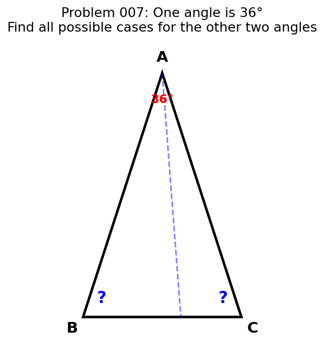
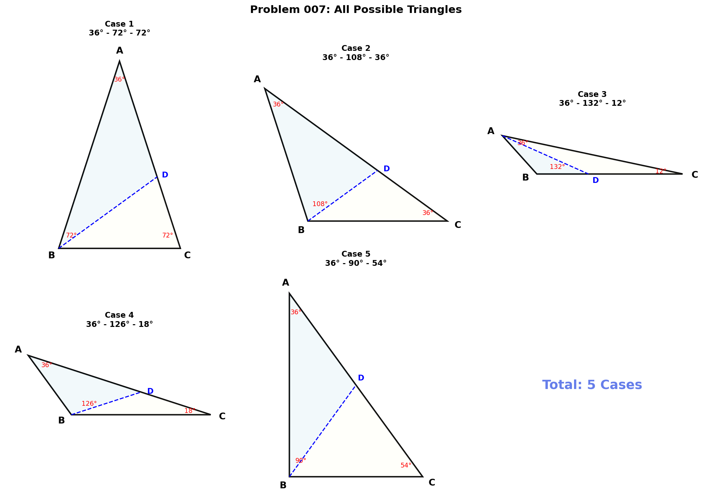
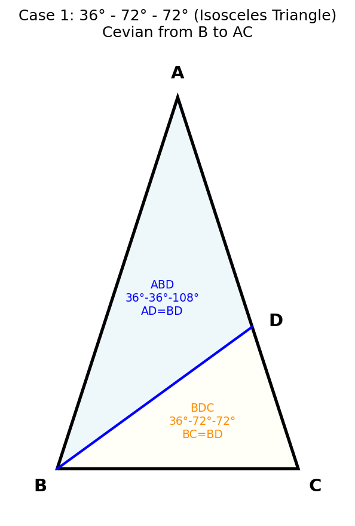
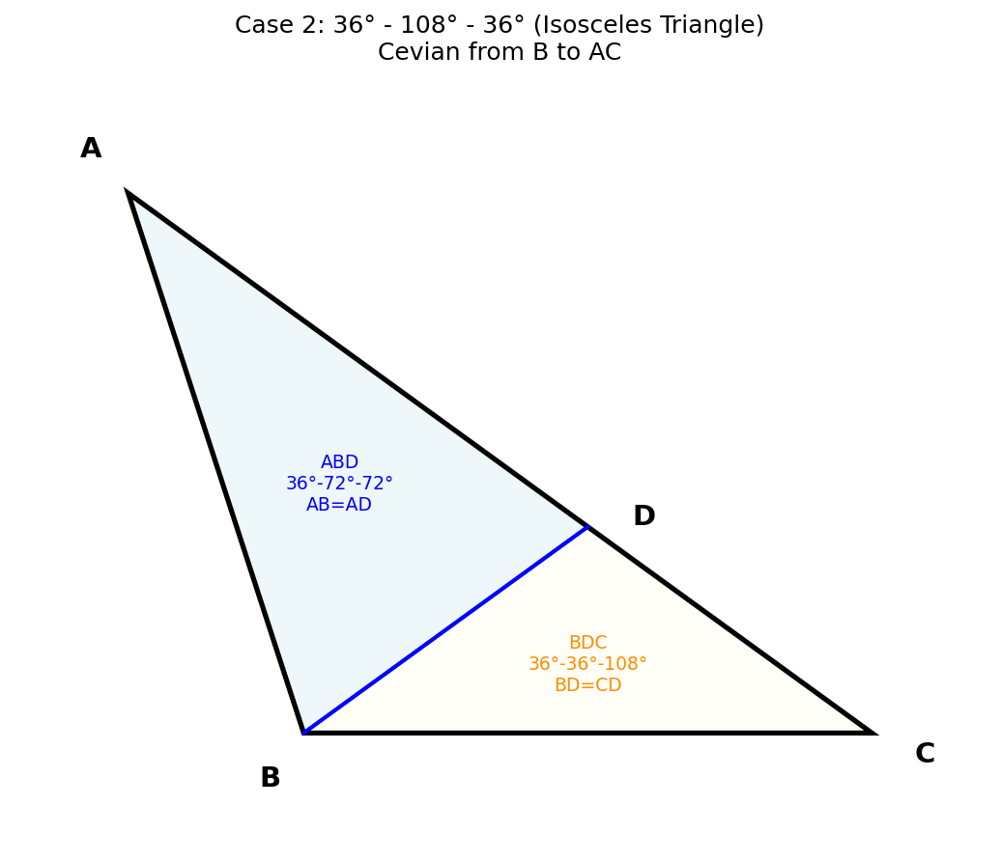
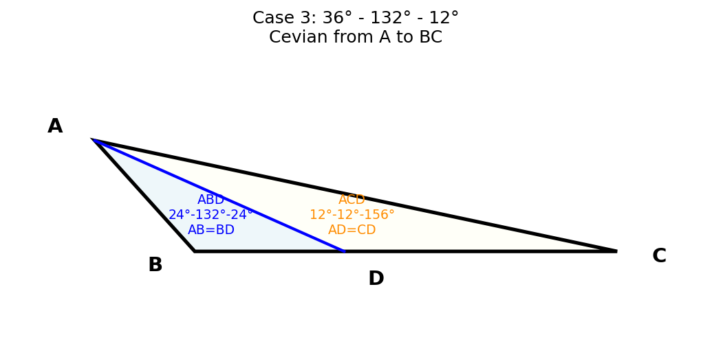
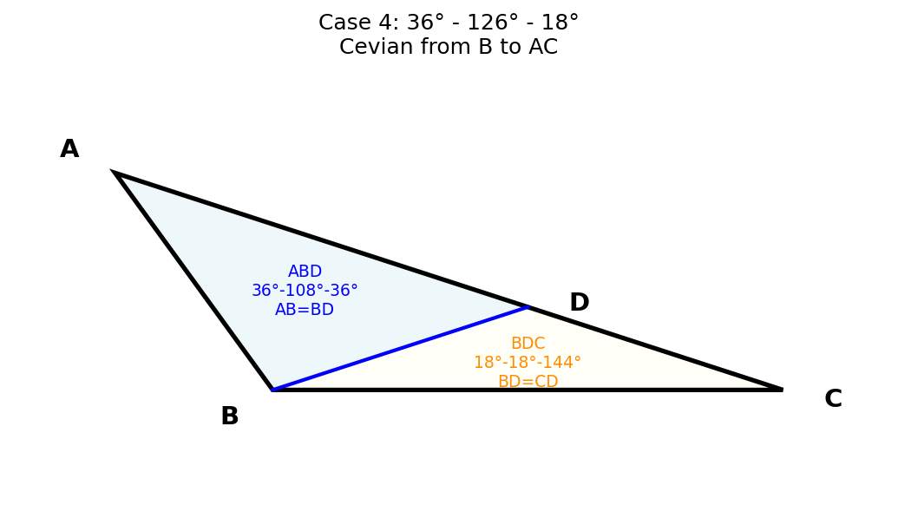
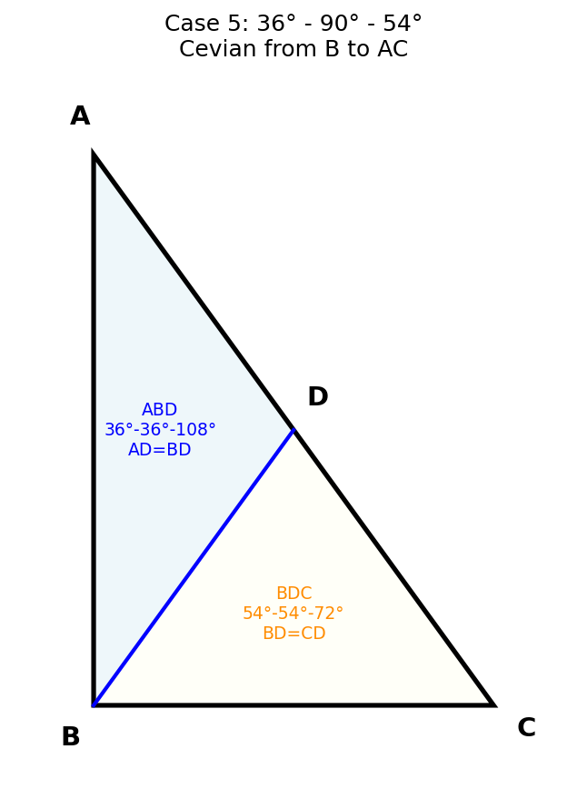

# 007 - 将三角形分成两个等腰三角形（一个内角为36°）

## 题目

将一个三角形分成两个等腰三角形，若原三角形的一个内角是36°，则原三角形的另两个内角有多少种可能的情况？写出各种可能的情况。

## 解题过程

### 第一步：分析题目条件

已知：一个三角形有一个内角为36°，通过一条线段将其分为两个等腰三角形。

设三角形三个内角为 36°、x、y，其中 x + y = 144°。

分割线必须是三角形的一条**角平分线**方向的线段（即从某个顶点到对边的线段，也叫做"cevian"）。

### 第二步：确定分析框架

设三角形为△ABC，分割线（cevian）从某个顶点出发到对边上的点D，将三角形分为两个小三角形，两个小三角形都必须是等腰三角形。

需要讨论三种情况：
1. cevian从36°角的顶点出发
2. cevian从另外两个顶点之一出发

对于每种情况，列出小三角形所有可能的等腰条件，然后联立方程求解。

### 第三步：情况一 — cevian从36°角顶点出发

设 ∠A = 36°，cevian AD（D在BC上），将△ABC分为△ABD和△ACD。

设 ∠BAD = γ，∠CAD = 36° - γ。

在△ABD中：∠B + ∠ADB = 180° - γ
在△ACD中：∠C + ∠ADC = 144° + γ

通过分类讨论△ABD和△ACD的等腰条件，并联立方程：

**有效组合**：AB = BD（∠BAD = ∠BDA = γ）且 AD = CD（∠CAD = ∠ACD）

即：∠B = 180° - 2γ，∠C = 36° - γ

由 ∠B + ∠C = 144°：
(180° - 2γ) + (36° - γ) = 144°
216° - 3γ = 144°
γ = 24°

所以 ∠B = 132°，∠C = 12°。

**结果：36°、132°、12°**

### 第四步：情况二 — cevian从非36°角顶点出发（到包含36°角的对边）

设 ∠A = 36°，∠B = x，∠C = 144° - x。cevian从B出发到D（D在AC上）。

∠ABD = δ，∠DBC = x - δ。

在△ABD中：∠A = 36°，∠ABD = δ，∠ADB = 144° - δ
在△BCD中：∠C = 144° - x，∠DBC = x - δ，∠BDC = 36° + δ

逐一组合两个三角形的等腰条件：

**组合 c+d（AD=BD 且 BC=BD）**：
- δ = 36°（∠A = ∠ABD → AD = BD）
- ∠C = ∠BDC → 144° - x = 36° + 36° = 72° → x = 72°

**结果：36°、72°、72°**

**组合 a+f（AB=BD 且 BD=CD）**：
- δ = 72°（∠ABD = ∠ADB = 72°）
- ∠DBC = ∠BCD → x - 72° = 144° - x → x = 108°

**结果：36°、108°、36°**

**组合 c+e（AD=BD 且 BC=CD）**：
- δ = 36°（∠A = ∠ABD）
- ∠B = ∠BDC → x = 36° + 36° = 72° → x = 72°

（与上面重复：36°、72°、72°）

**组合 c+f（AD=BD 且 BD=CD）**：
- δ = 36°
- ∠DBC = ∠BCD → x - 36° = 144° - x → x = 90°

**结果：36°、90°、54°**

**组合 b+f（AB=AD 且 BD=CD）**：
- δ = 108°（∠A = ∠ADB = 36°... 对应 AB=BD，即 36° = 144° - δ → δ = 108°）
- ∠DBC = ∠BCD → x - 108° = 144° - x → x = 126°

**结果：36°、126°、18°**

### 第五步：验证所有结果

#### 情况1：36° - 72° - 72°

cevian从B到AC上的D点：
- △ABD：∠A=36°, ∠ABD=36°, ∠ADB=108° → AD = BD ✓（等腰）
- △BDC：∠DBC=36°, ∠C=72°, ∠BDC=72° → BC = BD ✓（等腰）

#### 情况2：36° - 108° - 36°

cevian从B到AC上的D点：
- △ABD：∠A=36°, ∠ABD=72°, ∠ADB=72° → AB = AD ✓（等腰）
- △BDC：∠DBC=36°, ∠C=36°, ∠BDC=108° → BD = CD ✓（等腰）

#### 情况3：36° - 132° - 12°

cevian从A到BC上的D点：
- △ABD：∠BAD=24°, ∠B=132°, ∠ADB=24° → AB = BD ✓（等腰）
- △ACD：∠CAD=12°, ∠C=12°, ∠ADC=156° → AD = CD ✓（等腰）

#### 情况4：36° - 126° - 18°

cevian从B到AC上的D点：
- △ABD：∠A=36°, ∠ABD=108°, ∠ADB=36° → AB = BD ✓（等腰）
- △BDC：∠DBC=18°, ∠C=18°, ∠BDC=144° → BD = CD ✓（等腰）

#### 情况5：36° - 90° - 54°

cevian从B到AC上的D点：
- △ABD：∠A=36°, ∠ABD=36°, ∠ADB=108° → AD = BD ✓（等腰）
- △BDC：∠DBC=54°, ∠C=54°, ∠BDC=72° → BD = CD ✓（等腰）

### 第六步：总结答案

## 最终答案

原三角形的另两个内角共有 **5种** 可能的情况：

| 序号 | 三个内角 | 三角形类型 |
|------|----------|-----------|
| 1 | 36°、72°、72° | 等腰三角形 |
| 2 | 36°、108°、36° | 等腰三角形 |
| 3 | 36°、132°、12° | 一般三角形（钝角） |
| 4 | 36°、126°、18° | 一般三角形（钝角） |
| 5 | 36°、90°、54° | 直角三角形 |

## 知识点归纳

1. **等腰三角形性质**：等腰三角形的两底角相等
2. **三角形内角和**：三角形三个内角之和为180°
3. **系统化分类讨论**：从不同顶点出发的cevian分别讨论
4. **方程思想**：通过等腰条件建立角度方程
5. **穷举与验证**：组合所有可能情况，逐一验证有效性
