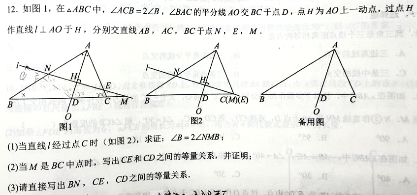
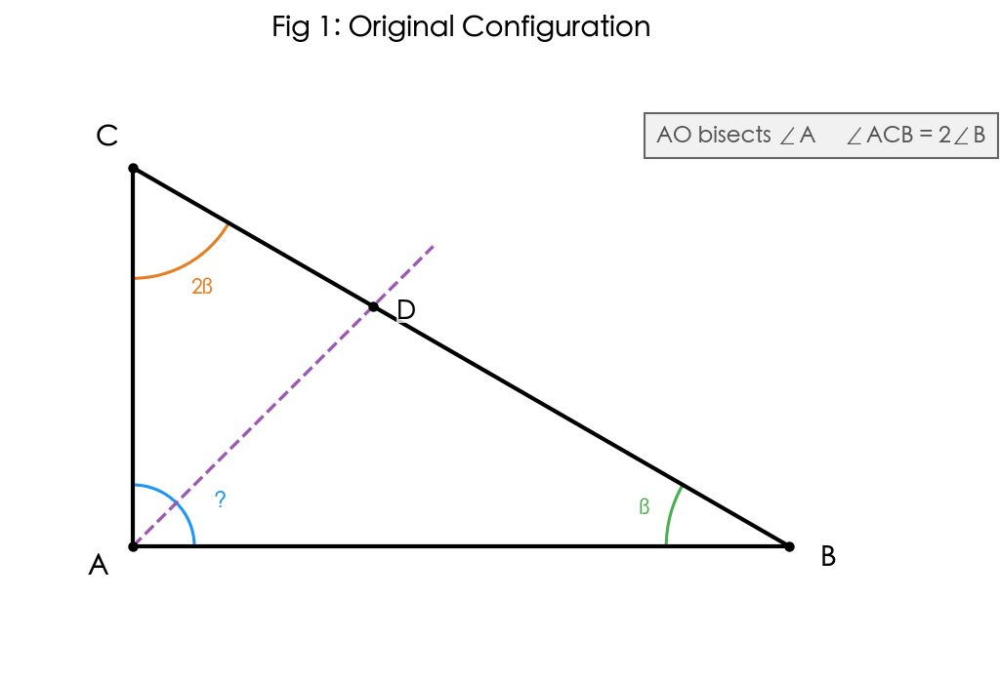
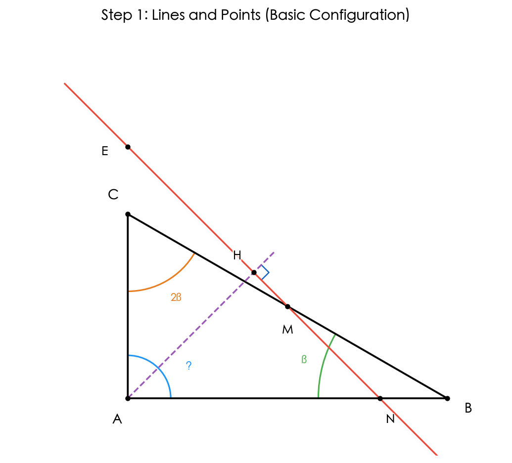
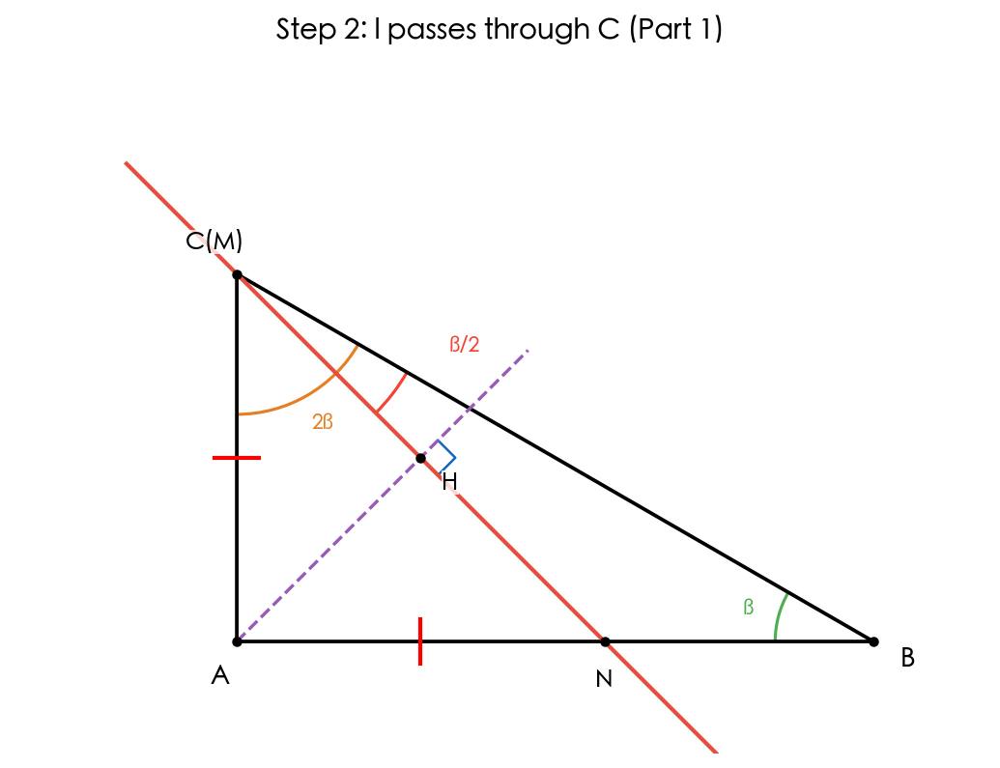
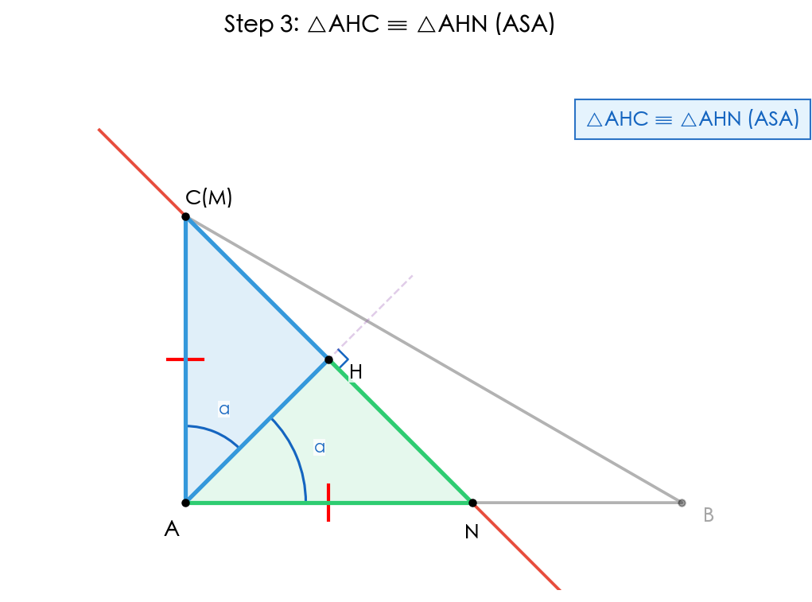
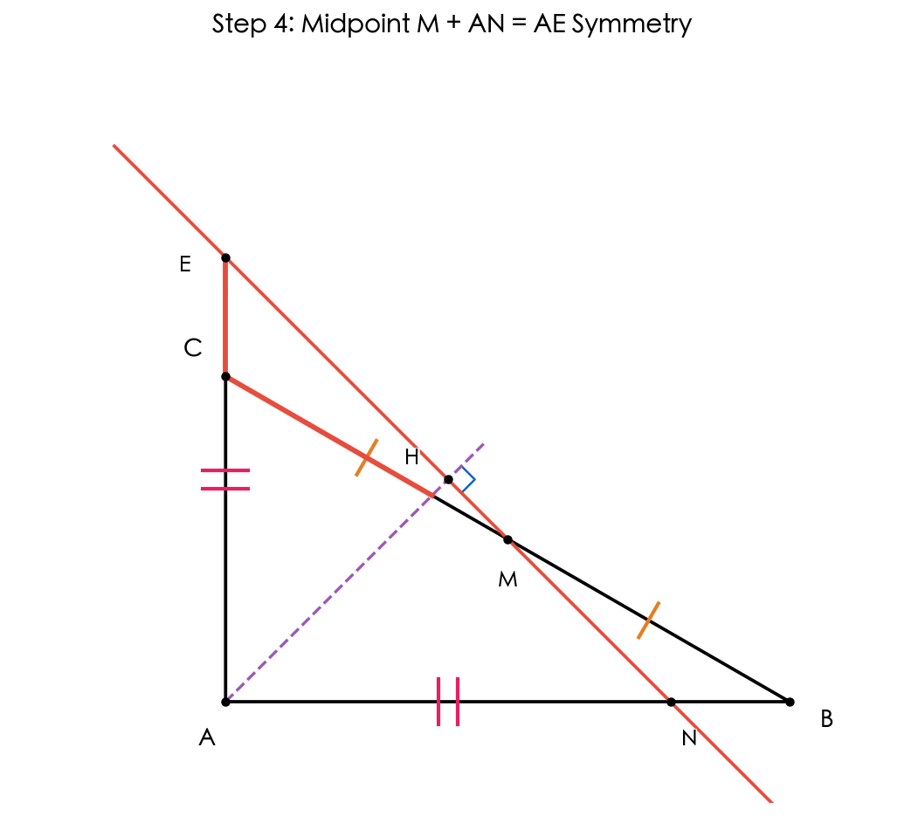
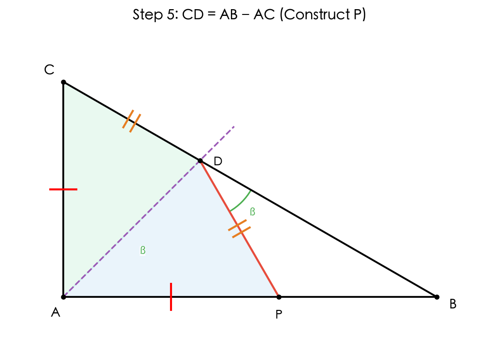
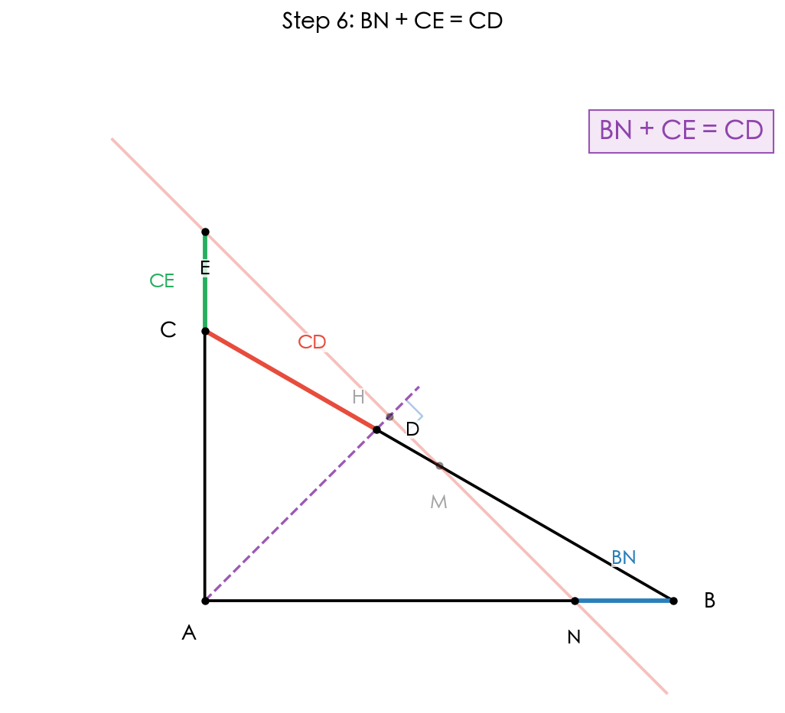

# 题目 010：三角形中的角平分线与垂线

> 如图1，在△ABC中，∠ACB=2∠B，∠BAC的平分线AO交BC于点D，点H为AO上一动点，过点H作直线l⊥AO于H，分别交直线AB，AC，BC于点N，E，M。
>
> (1) 当直线l经过点C时（如图2），求证：∠B=2∠NMB；
>
> (2) 当M是BC中点时，写出CE和CD之间的等量关系，并证明；
>
> (3) 请直接写出BN，CE，CD之间的等量关系。

> 重新绘制的问题图形：三角形 ABC，AO 为角平分线（虚线），交 BC 于 D。

## 解题思路

本题的核心是利用角平分线的对称性质和全等三角形。关键突破口：

- 直线 l ⊥ AO 且 AO 平分 ∠A，说明 l 关于 AO 对称 → AN = AE（通过全等三角形证明）
- ∠C = 2∠B 是构造等量关系的关键条件，通过在 AB 上取点 P 使 AP = AC 可导出 CD = AB - AC
- 当 M 为 BC 中点时，利用平行线分线段性质导出 AN = (AB+AC)/2

全程使用七年级几何方法（全等三角形、等腰三角形性质、角平分线定理），不涉及三角函数。

## 解题步骤

### 步骤 1：分析基本图形

设 ∠B = β，则 ∠ACB = 2β。

在 △ABC 中：∠BAC = 180° - ∠B - ∠ACB = 180° - 3β。

AO 平分 ∠BAC，所以：
- ∠BAO = ∠CAO = (180° - 3β)/2 = 90° - (3/2)β

直线 l ⊥ AO 于 H，交 AB 于 N，交 AC 于 E，交 BC 于 M。

### 步骤 2：(1) 当 l 经过 C 时，证明 ∠B = 2∠NMB

当直线 l 经过点 C 时，C 在 l 上，同时 C 在 BC 上，所以 l 与 BC 的交点 M = C，即 M 与 C 重合。因此 ∠NMB = ∠NCB。

**证明 △AHC ≅ △AHN（ASA）：**

在 △AHC 和 △AHN 中：
- AH = AH（公共边）
- ∠AHC = ∠AHN = 90°（l ⊥ AO 于 H，C、N 均在 l 上）
- ∠CAH = ∠NAH（AO 平分 ∠BAC）

所以 △AHC ≅ △AHN（ASA）。

**得到结论：** AN = AC，∠ACH = ∠ANH。

在 △ACN 中，AN = AC，所以 △ACN 是等腰三角形。因此 ∠ACN = ∠ANC。

在等腰 △ACN 中：∠CAN = ∠BAC = 180° - 3β。

由内角和：2∠ACN + (180° - 3β) = 180°，解得 ∠ACN = (3/2)β。

所以 ∠NCB = ∠ACB - ∠ACN = 2β - (3/2)β = (1/2)β = β/2。

因为 M = C，所以 ∠NMB = ∠NCB = β/2 = ∠B / 2。

**因此 ∠B = 2∠NMB。** 证毕。

### 步骤 3：(2) 当 M 是 BC 中点时，求 CE 和 CD 的关系

**预备结论 1：对于任意位置 H，有 AN = AE。**

因为 AO 是 ∠BAC 的平分线，且 l ⊥ AO。由于 AB 和 AC 关于 AO 对称，而 l 是垂直于 AO 的直线，所以 l 与 AB 和 AC 的交点 N 和 E 关于 AO 对称。

具体地：在 △AHN 和 △AHE 中：
- AH = AH（公共边）
- ∠AHN = ∠AHE = 90°（l ⊥ AO）
- ∠HAN = ∠HAE（AO 平分 ∠BAC）

所以 △AHN ≅ △AHE（ASA），故 AN = AE。

**预备结论 2：当 M 为 BC 中点时，AN = AE = (AB + AC)/2。**

证明：分别过 B、M、C 向 AO 作垂线，垂足分别为 B'、H、C'。

因为 BB' ∥ l ∥ CC'（都垂直于 AO），且 M 是 BC 的中点，所以 H 是 B'C' 的中点（平行线截线段成比例）。

又因为 AB 和 AC 关于 AO 对称，B' 和 C' 分别是 B 和 C 在 AO 上的投影。

在直角三角形中：AB' 是 AB 沿 AO 方向的投影，所以 AB'/AB = AH/AN（△ABB' ∽ △AHN，因为 ∠BAO = ∠NAO 且 ∠AB'B = ∠AHN = 90°）。

同理 AC'/AC = AH/AE = AH/AN（△ACC' ∽ △AHE）。

所以 AB' = AB · AH/AN，AC' = AC · AH/AN。

因为 H 是 B'C' 的中点：AH = (AB' + AC')/2 = (AB + AC) · AH/(2AN)。

两边约去 AH（AH > 0）：1 = (AB + AC)/(2AN)，所以 **AN = (AB + AC)/2**。

**预备结论 3：CD = AB - AC（由 ∠ACB = 2∠B 导出）。**

在 AB 上取点 P，使得 AP = AC。

在 △APD 和 △ACD 中：
- AP = AC（作图）
- ∠PAD = ∠CAD（AO 平分 ∠BAC）
- AD = AD（公共边）

所以 △APD ≅ △ACD（SAS）。因此 PD = CD，∠APD = ∠ACD = 2β。

在 △BPD 中：
- ∠PBD = ∠ABC = β（P 在 AB 上）
- ∠BPD = 180° - ∠APD = 180° - 2β
- 由内角和：∠BDP = 180° - β - (180° - 2β) = β

所以 ∠BDP = ∠PBD = β，△BPD 是等腰三角形，因此 BP = PD = CD。

因为 P 在 AB 上且 AP = AC：BP = AB - AP = AB - AC。

**所以 CD = AB - AC。**

**计算 CE：**

E 在 AC 上（或 AC 的延长线上），CE = |AC - AE| = |AC - AN|。

由预备结论 2：AN = (AB + AC)/2 > AC（因为 AB > AC，∠C > ∠B）。

所以 E 在 AC 的延长线上（在 C 的外侧）：CE = AN - AC = (AB + AC)/2 - AC = (AB - AC)/2。

又由预备结论 3：CD = AB - AC。

**因此 CD = 2(AB - AC)/2 = 2CE，即 CD = 2CE。** 证毕。

### 步骤 4：(3) 直接写出 BN，CE，CD 之间的等量关系

对于 M 在 BC 上（即直线 l 与 BC 的交点在线段 BC 上）的任意位置：

N 在 AB 上，BN = AB - AN。
E 在 AC 的延长线上，CE = AN - AC。

所以：
BN + CE = (AB - AN) + (AN - AC) = AB - AC = CD。

**因此 BN + CE = CD。**

特别地，当 M 是 BC 中点时：由 AN = (AB + AC)/2 可推出 BN = CE = CD/2。

## 最终答案

> **(1) ∠B = 2∠NMB**
>
> **(2) CD = 2CE**
>
> **(3) BN + CE = CD**

## 知识点归纳

- 全等三角形的判定（ASA、SAS）
- 等腰三角形的性质与判定
- 角平分线的性质
- 平行线截线段成比例（中点性质）
- 三角形内角和定理
- 角平分线定理

## 解题技巧

1. **利用对称性**：由于 l ⊥ AO 且 AO 平分 ∠A，l 关于 AO 对称，得到 AN = AE。这是整道题的第一个关键突破口。

2. **构造辅助点**：在 AB 上取 AP = AC，利用全等三角形 △APD ≅ △ACD 得到 PD = CD，再通过角度计算推出 △BPD 也是等腰三角形，最终导出 CD = AB - AC。这是利用 ∠C = 2∠B 这一条件的巧妙方法。

3. **投影法求中点关系**：通过向 AO 作垂线，利用 M 是 BC 中点和平行线性质得到 H 是 B'C' 的中点，结合相似三角形导出 AN = (AB + AC)/2。

4. **化繁为简**：第(3)问看起来复杂，但有了 CD = AB - AC 和对称性 AN = AE，直接展开 BN + CE = (AB - AN) + (AN - AC) = AB - AC = CD，非常简洁。
