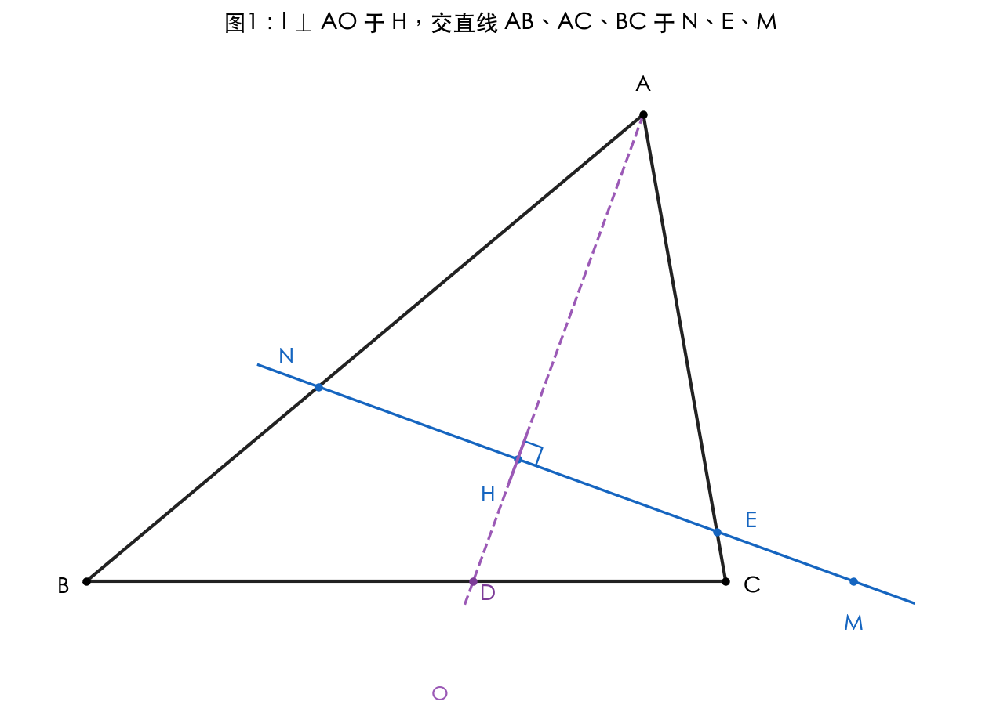
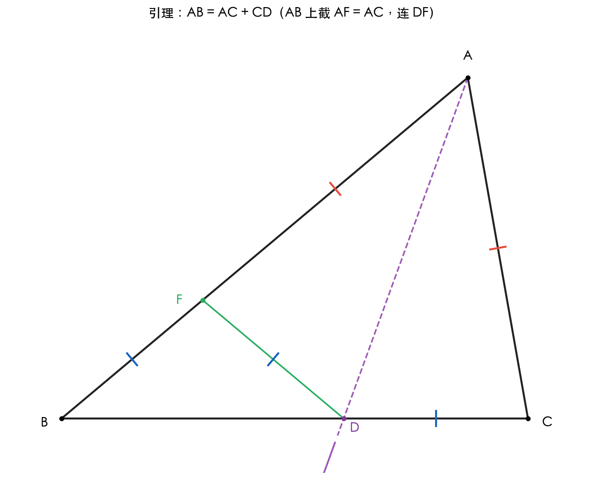
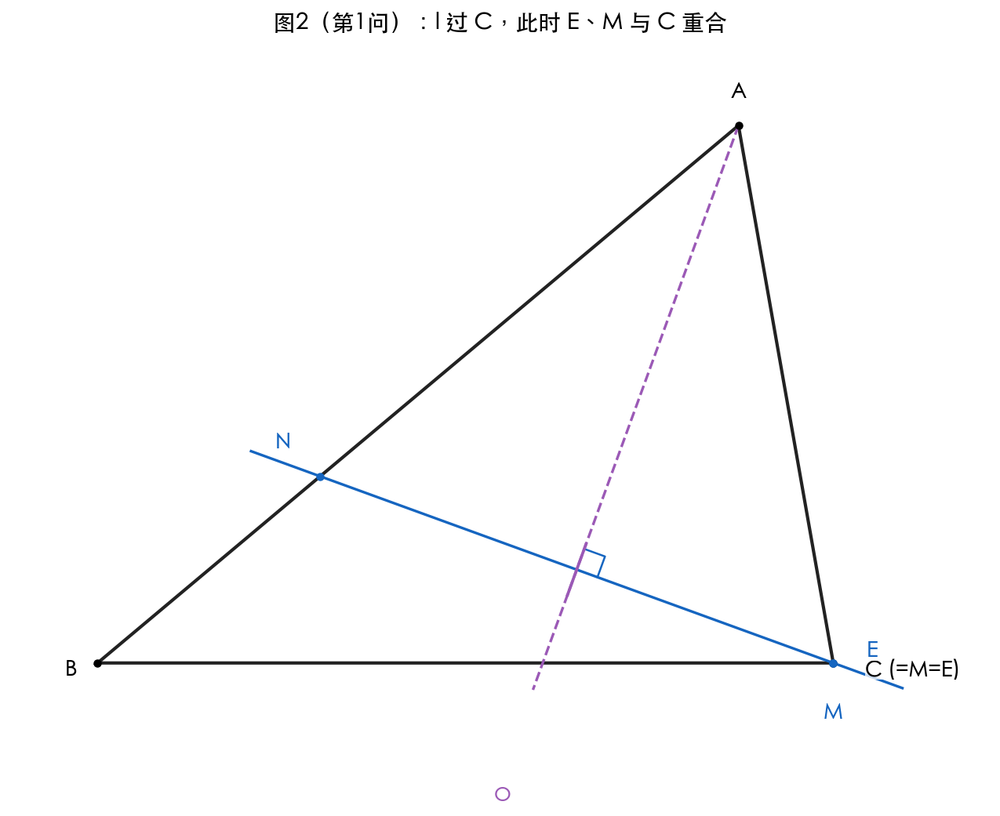
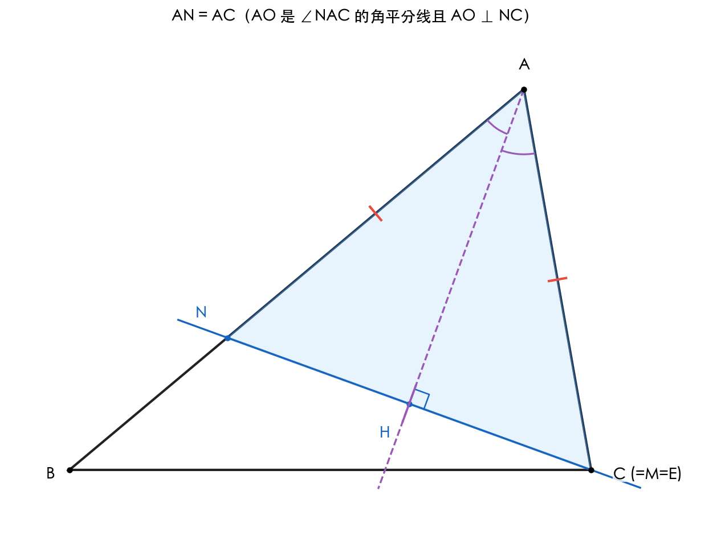
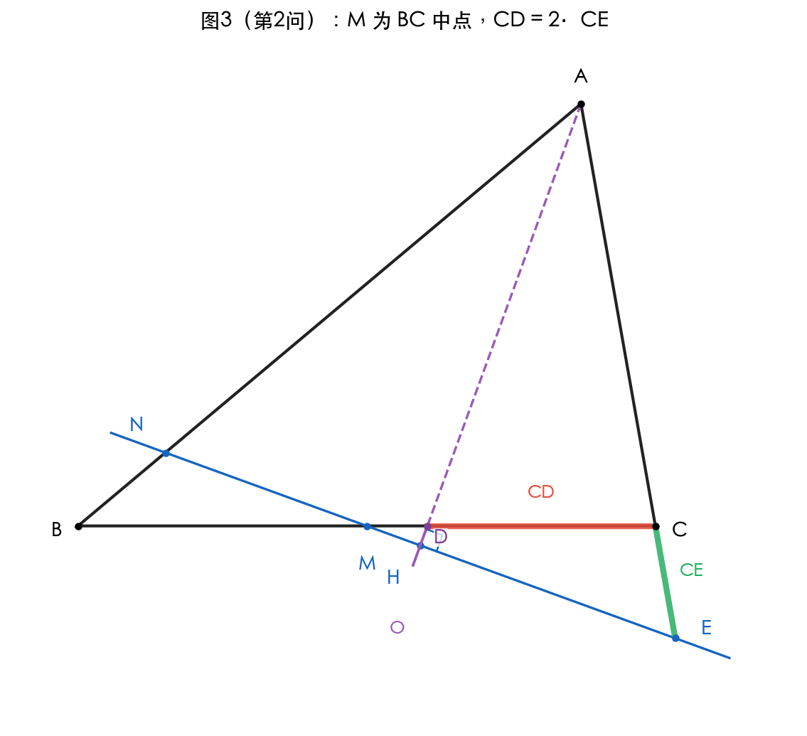
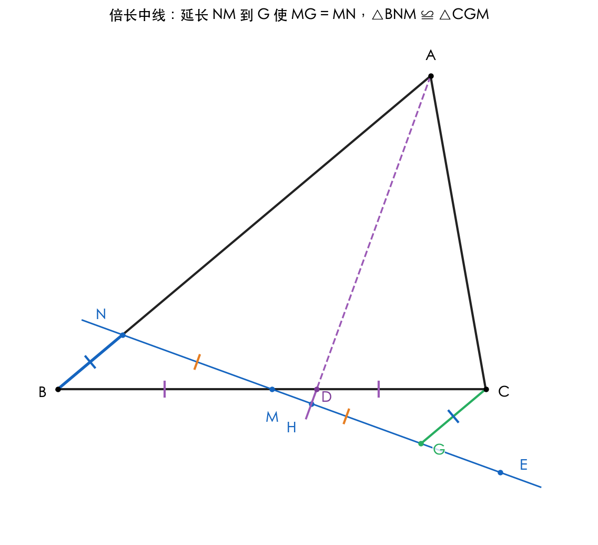
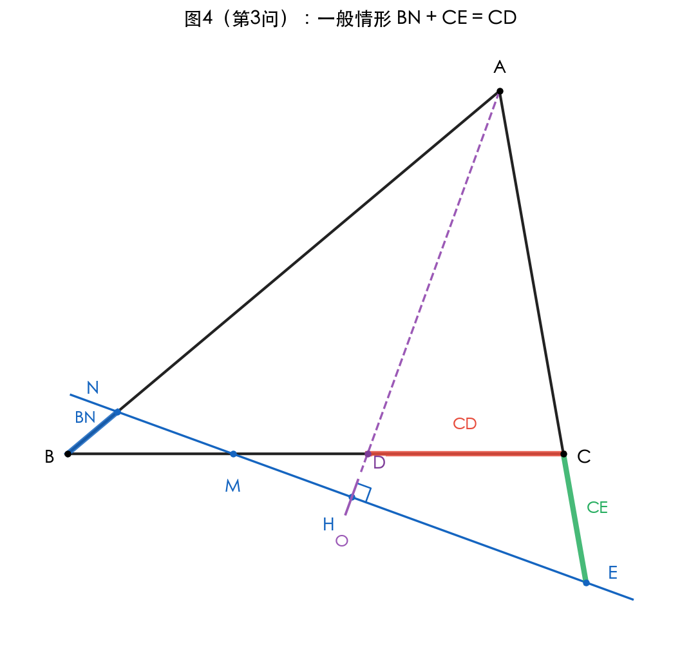
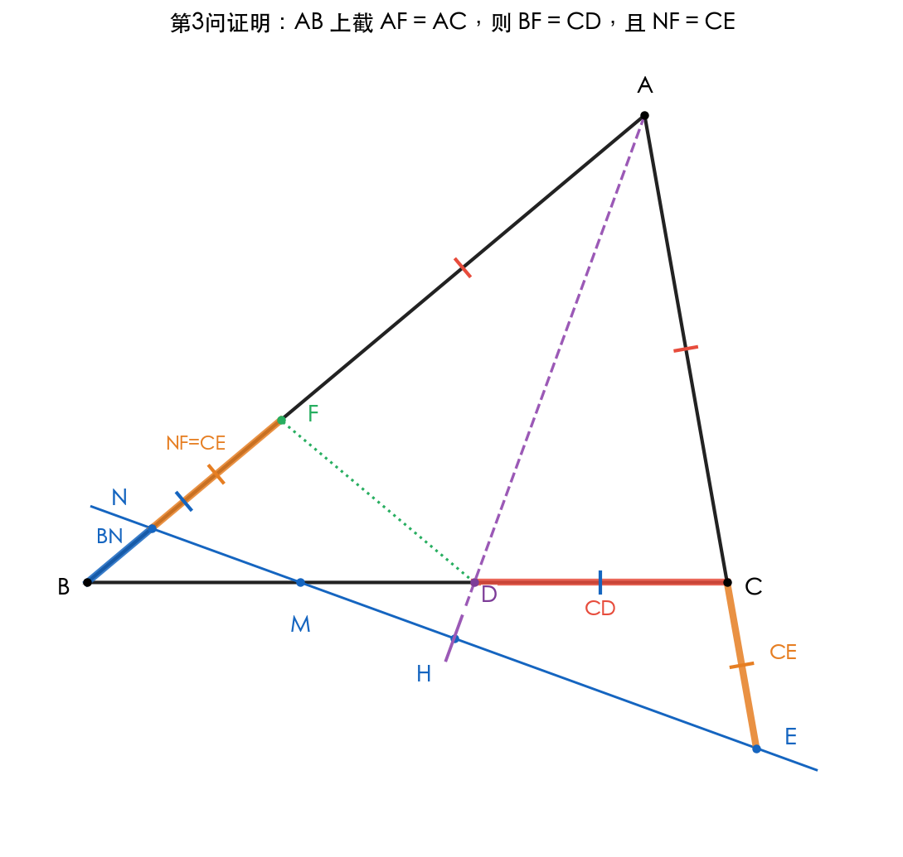

# 题目 011：l ⊥ AO 与三角形 ABC 的等量关系

## 题目

如图1，在 △ABC 中，∠ACB = 2∠B，∠BAC 的平分线 AO 交 BC 于点 D。点 H 为 AO 上一动点，过点 H 作直线 l ⊥ AO 于 H，分别交直线 AB、AC、BC 于 N、E、M。

(1) 当直线 l 经过点 C 时（如图2），求证：∠B = 2∠NMB；

(2) 当 M 是 BC 中点时，写出 CE 和 CD 之间的等量关系，并证明；

(3) 请直接写出 BN、CE、CD 之间的等量关系。

---

## 解题思路

整道题围绕一个对称模型：

> **AO 平分 ∠BAC + l ⊥ AO** ⇒ N、E 关于直线 AO 对称 ⇒ **AN = AE**。

再配合一条经典模型：

> **∠ACB = 2∠B + AD 平分 ∠BAC** ⇒ **AB = AC + CD**（七年级"截长补短"全等模型）。

把两条线索拼起来，三个分问就可以一气呵成。

---

## 关键引理：AB = AC + CD

设 ∠B = β，则 ∠ACB = 2β，∠BAC = 180° − 3β，∠BAD = ∠CAD = (180° − 3β)/2。

**证明**：在 AB 上截取 AF = AC，连 DF（见辅助图）。

- 在 △AFD 与 △ACD 中：AF = AC，∠FAD = ∠CAD（角平分线），AD 公共。
- ∴ △AFD ≌ △ACD（SAS），从而 **DF = DC**，∠AFD = ∠ACD = 2β。
- ∠AFD 是 △BFD 在 F 处的外角，由外角定理：∠AFD = ∠B + ∠BDF。
- 即 2β = β + ∠BDF，得 ∠BDF = β = ∠B。
- ∴ △BDF 是等腰三角形，**BF = DF**。
- 综合：BF = DF = DC，于是 AB = AF + FB = **AC + CD**。 ∎

---

## 关键引理：AN = AE（对称模型）

因 AO 平分 ∠BAC（所以 ∠NAH = ∠EAH），且 NE ⊥ AO 于 H：

- 在 △ANH 与 △AEH 中：∠NAH = ∠EAH，AH 公共，∠AHN = ∠AHE = 90°。
- ∴ △ANH ≌ △AEH（ASA），故 **AN = AE**。 ∎

> 这条结论对**直线** l 与 **直线** AB、AC 的交点都成立，与 N、E 落在线段内还是延长线上无关。

---

## 第 (1) 问：当 l 过 C 时，证 ∠B = 2∠NMB

当 l 过 C 时，l 与直线 AC 的交点 E 就是 C 本身，l 与直线 BC 的交点 M 也是 C：
即 **E = M = C**。

由"AN = AE"且 E = C，立刻得到：

> **AN = AC**（△ANC 为等腰三角形，AO 是底边 NC 的中垂线）

**∠ANC 与 ∠ACN 相等**，记为 α。在 △ANC 中：

α + α + ∠NAC = 180°，而 ∠NAC = ∠BAC = 180° − 3β。

解得 α = (180° − (180° − 3β))/2 = **3β/2**，即 ∠ANC = 3β/2。

**计算 ∠NMB（即 ∠NCB）**：

由图2，N 在线段 AB 上（位于 A、B 之间），所以 ∠ANC 与 ∠BNC 互为邻补角：

∠BNC = 180° − 3β/2。

在 △BNC 中由内角和：

> ∠NCB = 180° − ∠B − ∠BNC = 180° − β − (180° − 3β/2) = β/2

由于 M = C，∠NMB = ∠NCB = β/2 = (1/2)·∠B。

> **∴ ∠B = 2∠NMB**。 ∎

---

## 第 (2) 问：当 M 是 BC 中点时，CE 与 CD 的等量关系

> **结论：CD = 2·CE**（等价地写作 CE = (1/2)·CD）。

**思路**：先证 BN = CE，再结合一般性结论 BN + CE = CD（见第 (3) 问）即得 CD = 2·CE。

### 证明 BN = CE（M 为中点时）

**倍长中线**：延长 NM 到点 G，使 MG = MN，连 CG。

- 在 △BNM 与 △CGM 中：BM = CM（M 是中点），∠BMN = ∠CMG（对顶角），NM = GM（构造）。
- ∴ △BNM ≌ △CGM（SAS），从而 **CG = BN**，∠CGM = ∠BNM，∠GCM = ∠NBM = β。

**注意 G、E 都在直线 l 上**（G 是 NM 沿 l 的延长点，E 也在 l 上），故 ∠CGE 与 ∠CGM 是同一条直线 l 上的两个邻补角或同一角。

**计算关键角**：

设 AO 与 BC 在 D 处的夹角 ∠ADB = θ。在 △ABD 中：

θ = 180° − ∠B − ∠BAD = 180° − β − (180° − 3β)/2 = **90° + β/2**

由 l ⊥ AO，所以 l 与 BC 在 M 处的夹角 = 90° − (180° − θ) = θ − 90° = **β/2**

即 ∠NMB = ∠EMC = β/2。

在 △BNM 中：∠BNM = 180° − β − β/2 = 180° − 3β/2。

由全等：∠CGM = 180° − 3β/2，所以在直线 l 上有 ∠CGE = 180° − ∠CGM = 3β/2。

**计算 ∠CEG**：在 △CEM 中（C, E, M），∠ECM = 180° − ∠ACB = 180° − 2β（因 E 在射线 CA 反向延长线上），∠EMC = β/2。

> ∠CEM = 180° − ∠ECM − ∠EMC = 180° − (180° − 2β) − β/2 = 2β − β/2 = **3β/2**

由于 G、M 在 E 的同一侧（沿直线 l），∠CEG = ∠CEM = 3β/2。

故 **∠CGE = ∠CEG = 3β/2**，△CGE 是等腰三角形：

> **CG = CE**，进而 **BN = CG = CE**

### 由 BN = CE 推出 CD = 2·CE

由第 (3) 问的恒等式 **BN + CE = CD**（见下），将 BN = CE 代入：

> CE + CE = CD ⇒ **CD = 2·CE** ∎

---

## 第 (3) 问：BN、CE、CD 的等量关系

> **结论：BN + CE = CD**（一般情形恒成立）

**证明（截长补短 + 对称）**：

在 AB 上截取 **AF = AC**，连接 DF（虚线）。

**第一步：BF = CD**

在 △AFD 与 △ACD 中：
- AF = AC（构造）
- ∠FAD = ∠CAD（AO 平分 ∠BAC）
- AD 公共

∴ △AFD ≌ △ACD（SAS），故 DF = DC，∠AFD = ∠ACD = 2β。

由外角定理：∠AFD = ∠B + ∠FDB，即 2β = β + ∠FDB ⇒ ∠FDB = β = ∠B。

∴ △BDF 等腰，BF = DF = DC，即 **BF = CD**。

**第二步：NF = CE**

由对称模型 **AN = AE**（AO 平分 ∠BAC，l ⊥ AO，故 N、E 关于 AO 对称）。

观察图中位置：F 在 AB 上且在 N 与 A 之间（因 AF = AC < AE = AN，所以 AF < AN），E 在 CA 的延长线上。于是：

- NF = AN − AF = AE − AC = CE

即 **NF = CE**。

**第三步：拼接**

由图中 N、F 都在线段 AB 上，且顺序为 B—N—F—A：

> BN + NF = BF

代入第一、二步的结果：

> **BN + CE = CD** ∎

> 这种证法的好处是把 BN、CE、CD 三段关系**集中到一条直线 AB 上的拼接** BN + NF = BF，比用代数式两边相加更直观，也不依赖事先证明的引理 AB = AC + CD（本证法已包含等价的截长补短结构）。

> **退化检验**：
> - 当 l 经过 C 时（第 (1) 问），E = M = C，于是 CE = 0，恒等式退化为 BN = CD。可验证此时 N 即为 F（因 AN = AE = AC = AF），与第 (1) 问中 △ANC 等腰、N 在 AB 上的位置一致。
> - 当 M 是 BC 中点时（第 (2) 问），由对称论证 BN = CE，恒等式给出 2·CE = CD，与第 (2) 问结论一致。

---

## 最终答案

| 问 | 关系 |
|---|---|
| (1) | **∠B = 2∠NMB** |
| (2) | **CD = 2·CE**（即 CE = CD/2） |
| (3) | **BN + CE = CD** |

---

## 知识点归纳

1. **角平分线 + 垂直 → 等腰三角形**：若一直线与某角的平分线垂直，则它与角两边的交点关于平分线对称。
2. **截长补短**：在 ∠C = 2∠B 与角平分线 AD 的图形中，AB = AC + CD 是经典结论。
3. **倍长中线**：处理"中点 + 不在三角形内"的边长关系时的标准辅助线。
4. **三角形外角定理**：外角等于不相邻两内角之和。
5. **等腰三角形判定**：两底角相等 ⇒ 两腰相等。

---

## 解题技巧

1. **找对称**：看到"角平分线 + 垂线"立刻锁定 AN = AE。
2. **找经典模型**：看到"∠C = 2∠B + 角平分线"立刻锁定 AB = AC + CD。
3. **由特殊到一般**：第 (1) 问其实是 (3) 在特殊位置（E、M 与 C 重合）的退化；第 (2) 问是 (3) 加上"M 中点"对称约束；第 (3) 问是恒等式。先证恒等式再回看特殊情形最自然。
4. **倍长中线**用于把"中点条件"转化为全等。
