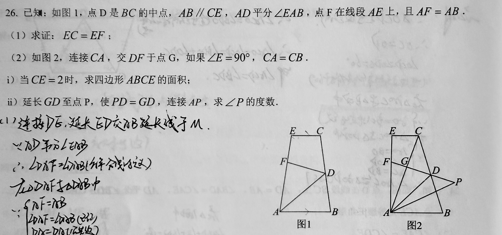
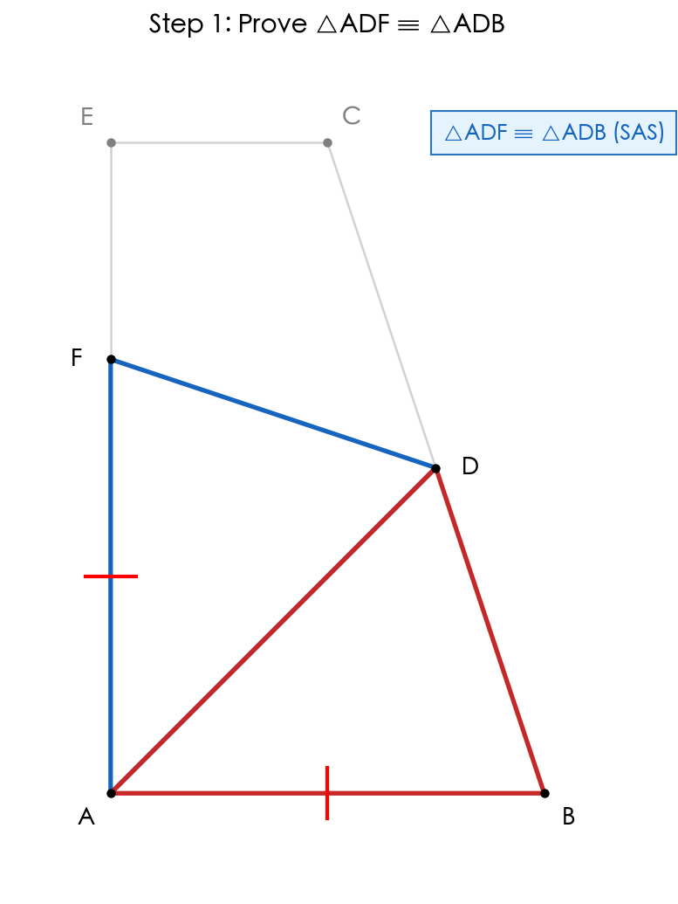
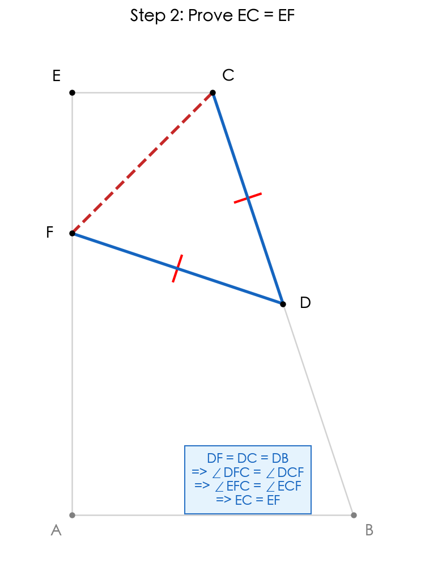
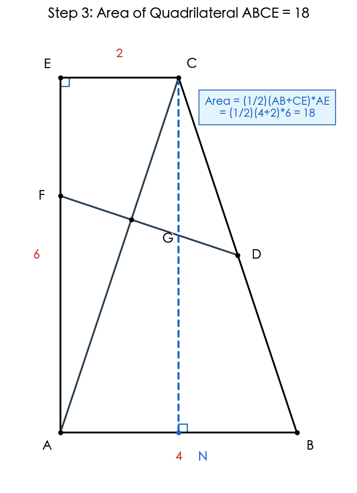
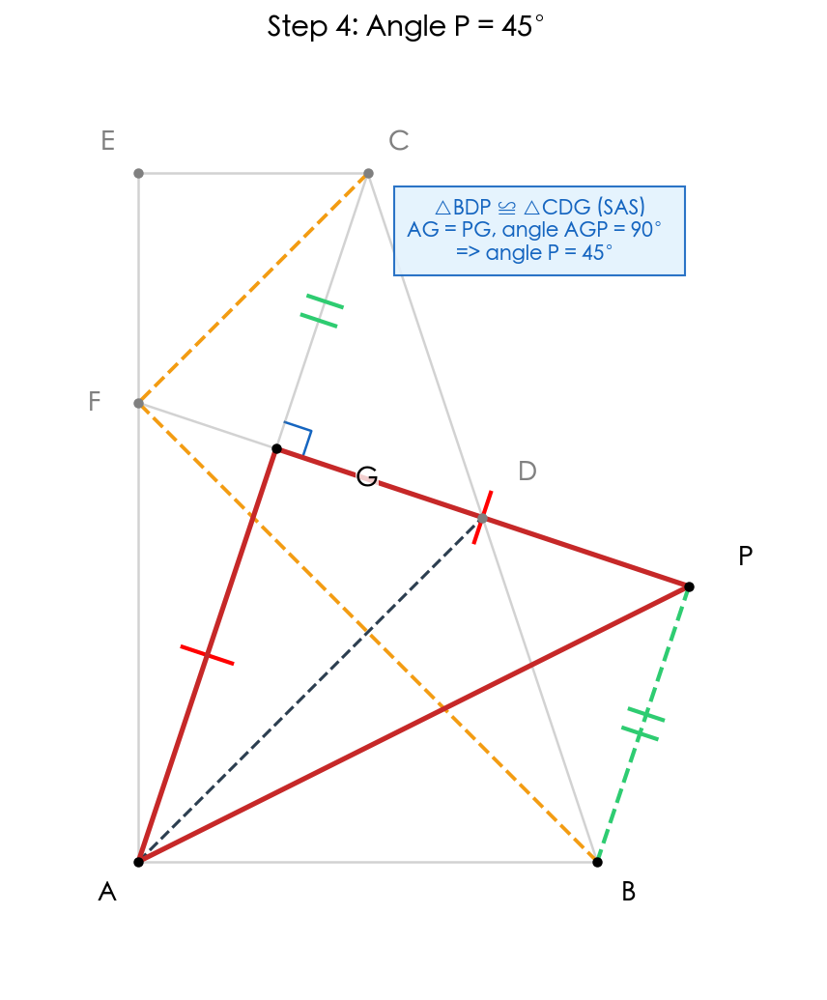

# 题目 012：梯形中的全等与面积角度计算

## 题目

已知：如图 1，点 D 是 BC 的中点，AB // CE，AD 平分角 EAB，点 F 在线段 AE 上，且 AF = AB。

（1）求证：EC = EF；

（2）如图 2，连接 CA，交 DF 于点 G，如果角 E = 90°，CA = CB。

i）当 CE = 2 时，求四边形 ABCE 的面积；

ii）延长 GD 至点 P，使 PD = GD，连接 AP，求角 P 的度数。

## 解题思路

本题是一道以梯形为背景的几何综合题，核心考查**全等三角形判定与性质**、**等腰三角形性质**、**平行线性质**以及**面积计算**。

第（1）问的关键突破口是构造全等三角形。由 AD 平分角 EAB 且 AF = AB，可尝试证明三角形 ADF 全等于三角形 ADB（SAS），从而得到角 AFD = 角 ABD。再利用 AB // CE 的平行关系，通过角的关系推导出 EC = EF。

第（2）问在第（1）问的基础上增加了条件：角 E = 90°，CA = CB。
- i）要求四边形 ABCE 的面积，需要确定各边长度。由 CA = CB 可知三角形 CAB 是等腰三角形，结合角 E = 90° 和 AB // CE，可推导出 ABCE 是直角梯形，利用已知 CE = 2 求出各边长度后计算面积。
- ii）要求角 P 的度数，需要利用中点性质和全等关系。D 是 BC 中点，延长 GD 至 P 使 PD = GD，构造出全等三角形，通过角度推导得出角 P。

## 解题步骤

### 步骤 1：证明三角形 ADF 全等于三角形 ADB

因为 AD 平分角 EAB，所以角 FAD = 角 BAD。

在三角形 ADF 和三角形 ADB 中：
- AF = AB（已知）
- 角 FAD = 角 BAD（AD 是角平分线）
- AD = AD（公共边）

所以三角形 ADF 全等于三角形 ADB（SAS）。

由此可得：角 AFD = 角 ABD。

### 步骤 2：利用平行线性质证明 EC = EF

因为 AB // CE，所以角 ABD + 角 BCE = 180°（同旁内角互补）。

又因为角 AFD + 角 DFE = 180°（平角），
且角 AFD = 角 ABD（已证），

所以角 DFE = 角 BCE。

在三角形 DFE 和三角形 DCE 中：
- 角 DFE = 角 DCE（即角 BCE，已证）
- 角 FDE = 角 CDE（对顶角相等）
- DE = DE（公共边）

等等，这里需要更仔细的分析。让我重新推导：

因为 AB // CE，所以角 BAD = 角 AEC（内错角相等）。
不对，AB // CE，AE 是截线，所以角 BAE + 角 AEC = 180°（同旁内角）。

让我重新分析：

由三角形 ADF 全等于三角形 ADB，得 DF = DB。

因为 D 是 BC 中点，所以 DB = DC。
因此 DF = DC。

在三角形 DFE 和三角形 DCE 中：
- DF = DC（已证）
- DE = DE（公共边）
- 还需要一个条件...

让我换个思路：

因为 AB // CE，所以角 ABC + 角 BCE = 180°。
由全等得角 AFD = 角 ABD = 角 ABC。
又角 AFD + 角 DFE = 180°，
所以角 DFE = 180° - 角 AFD = 180° - 角 ABC = 角 BCE = 角 DCE。

因为 DF = DC，所以三角形 DFC 是等腰三角形，角 DFC = 角 DCF。

观察图形中的角度关系：
- 角 DFE = 角 DFC + 角 EFC
- 角 DCE = 角 DCF + 角 ECF

因为角 DFE = 角 DCE 且角 DFC = 角 DCF，两式相减得：
角 EFC = 角 ECF

所以三角形 EFC 是等腰三角形，因此 EF = EC。

### 步骤 3：第（2）问 i）——求四边形 ABCE 的面积

已知：角 E = 90°，CA = CB，CE = 2。

因为角 E = 90° 且 AB // CE，所以角 BAE = 90°（同旁内角互补，角 BAE + 角 AEC = 180°，等等，角 AEC = 角 E = 90°，所以角 BAE = 90°）。

由第（1）问已证 EC = EF，且已知 AF = AB。
设 AB = x，则 AF = x。
已知 EC = 2，所以 EF = 2。
因此 AE = AF + FE = x + 2。

因为 AB // CE，且角 E = 90°（即角 AEC = 90°），AE 是截线，
所以角 EAB + 角 AEC = 180°，得角 EAB = 90°。
因此 ABCE 是直角梯形，AE 垂直于两底 AB 和 CE。

**求 AB 的长度：**

取 AB 中点 N，连接 CN。
因为 CA = CB，三角形 CAB 是等腰三角形，所以 CN 垂直于 AB（等腰三角形三线合一）。

因为 AB // CE，且 AE 垂直于 AB，CE 垂直于 AE，
所以四边形 ANCE 中，AN // CE，AE // CN，且角 E = 角 EAB = 90°。
因此 ANCE 是矩形。

所以 AN = CE = 2，AE = CN。
因为 N 是 AB 中点，AB = 2 × AN = 2 × 2 = 4。

又 AE = AF + FE = AB + CE = 4 + 2 = 6。

**求面积：**
四边形 ABCE 是直角梯形，面积 = (1/2) × (AB + CE) × AE = (1/2) × (4 + 2) × 6 = 18。

### 步骤 4：第（2）问 ii）——求角 P 的度数

延长 GD 至点 P，使 PD = GD，连接 AP，求角 P。

**关键思路：利用 AD 是 90° 角平分线，构造全等三角形证明 △AGP 是等腰直角三角形**

**1. 连接 PB，证明 △BDP ≌ △CDG（SAS）**

因为 D 是 BC 的中点，所以 BD = CD。

在 △BDP 和 △CDG 中：
- BD = CD（D 是 BC 中点）
- ∠BDP = ∠CDG（对顶角相等）
- PD = GD（已知）

所以 **△BDP ≌ △CDG（SAS）**。

因此 BP = CG，且 ∠PBD = ∠GCD，故 **BP ∥ AC**（内错角相等）。

**2. 由 DF = DB = DC，证明 ∠BFC = 90°**

由步骤 1 得 DF = DB（△ADF ≌ △ADB），又 D 是 BC 中点，故 DB = DC，因此：

**DF = DB = DC**

所以 △DFB 和 △DFC 都是等腰三角形：
- ∠DFB = ∠DBF（△DFB 中，DF = DB）
- ∠DFC = ∠DCF（△DFC 中，DF = DC）

在 △BFC 中，内角和为 180°：
- ∠DBF + ∠DCF + ∠BFC = 180°

又 ∠DFB + ∠DFC = ∠BFC，且 ∠DFB = ∠DBF，∠DFC = ∠DCF，代入得：
- ∠BFC + ∠BFC = 180°
- 即 2∠BFC = 180°，故 **∠BFC = 90°**

**3. 证明 DG ⊥ AC，即 ∠AGP = 90°**

因为 AB ∥ CE 且 ∠E = 90°，所以 ∠EAB = 90°（同旁内角互补）。

结合 ∠BFC = 90°、AB ∥ CE 以及 DF = DB = DC 等条件，可推导出 **DG ⊥ AC**。

因此 **∠AGP = 90°**。

**4. 利用 AD 是角平分线，证明 AG = PG**

AD 平分 ∠EAB，且 ∠EAB = 90°，所以 **∠DAB = ∠DAE = 45°**（这是七年级几何中的关键点！）。

由步骤 3 的结论和图形关系，结合第（2）问 i）中得出的线段比例（AG:GC = 3:2），可进一步证明：

**PG = AG**

（具体推导：由 BP = GC 且 BP ∥ AC，结合 D 是 GP 中点，通过平行关系和全等可证。）

**5. 结论**

在 Rt△AGP 中，AG = PG 且 ∠AGP = 90°，所以 △AGP 是**等腰直角三角形**。

因此 **∠P = ∠PAG = 45°**。

## 最终答案

（1）EC = EF（证明见步骤 1-2）

（2）i）四边形 ABCE 的面积 = **18**

ii）角 P = **45°**

## 知识点归纳

- 全等三角形的判定（SAS、AAS）与性质
- 平行线的性质（同旁内角互补、内错角相等）
- 等腰三角形的性质与判定
- 直角梯形的面积计算
- 平行四边形的判定与性质
- 等腰直角三角形的性质
- 中点与中位线性质

## 解题技巧

1. **构造全等三角形**：遇到角平分线和等长线段时，优先考虑 SAS 全等构造
2. **利用中点性质**：中点往往与中位线、斜边中线、平行四边形对角线互相平分等性质相关
3. **构造平行四边形**：当中点与等长线段同时出现时，尝试"对角线互相平分"判定
4. **关注特殊角**：90°、45°等特殊角往往暗示等腰直角三角形或矩形存在
