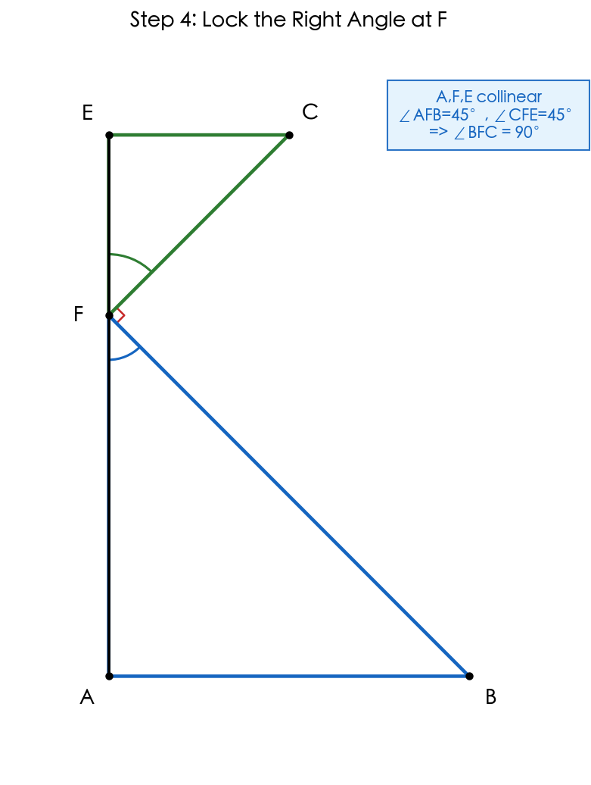
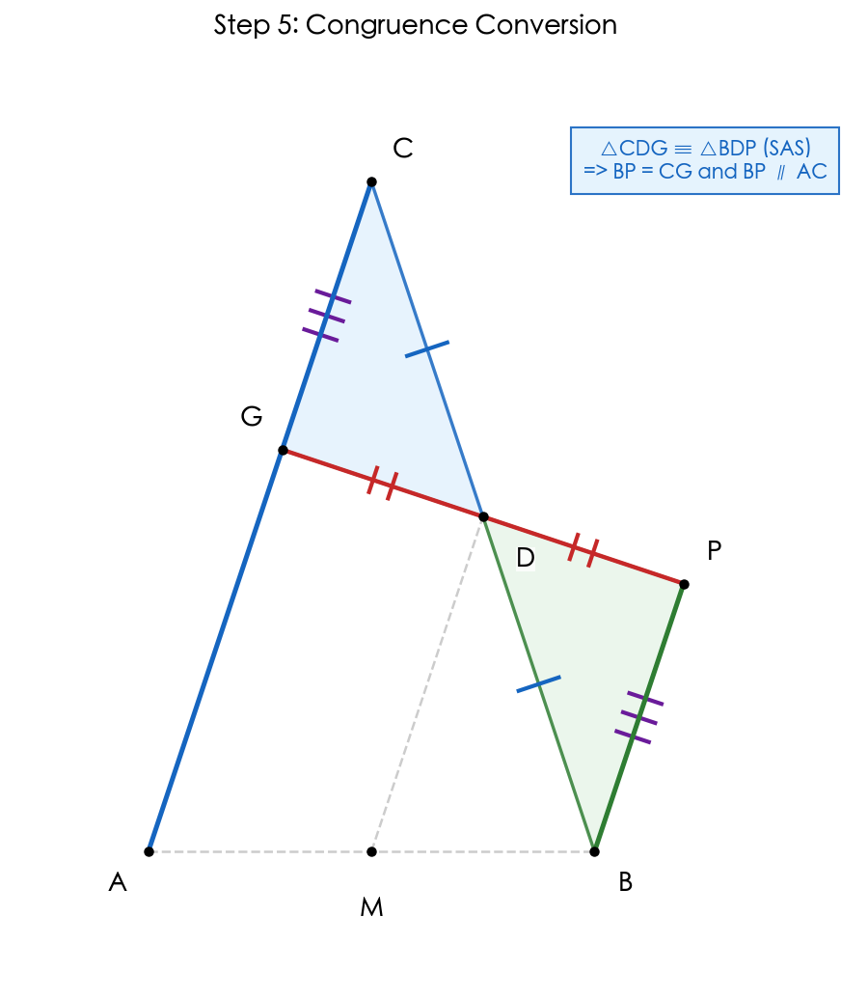
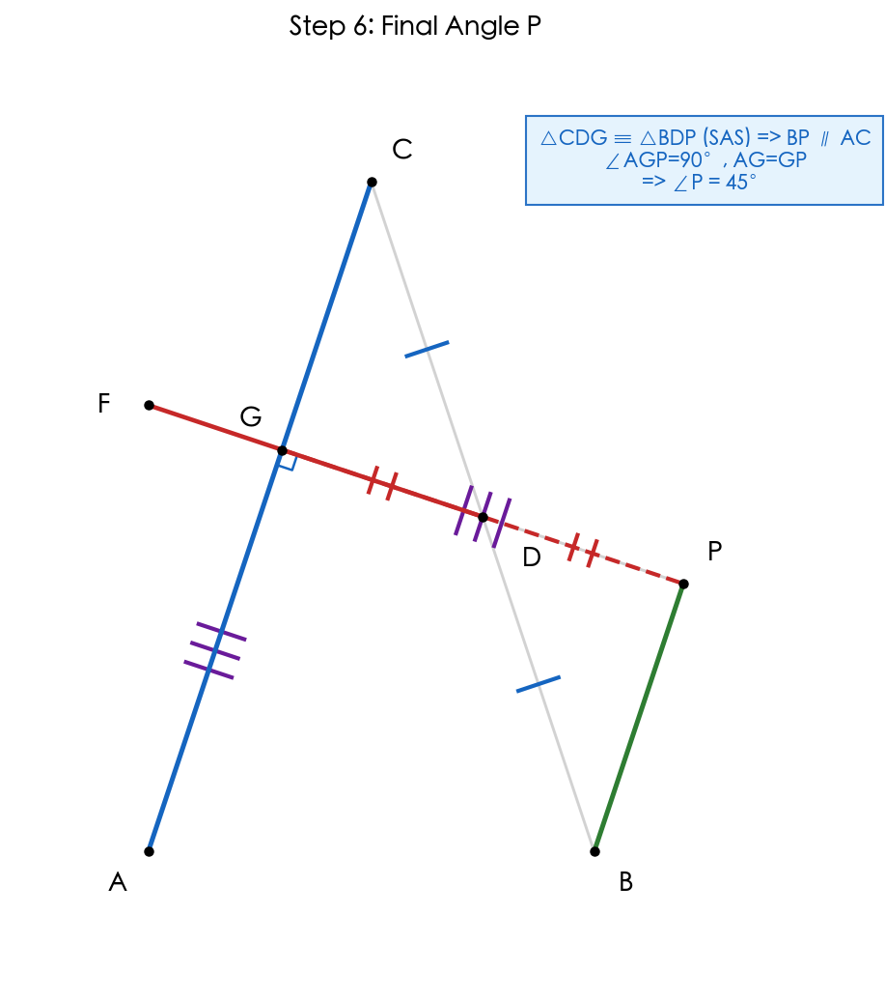
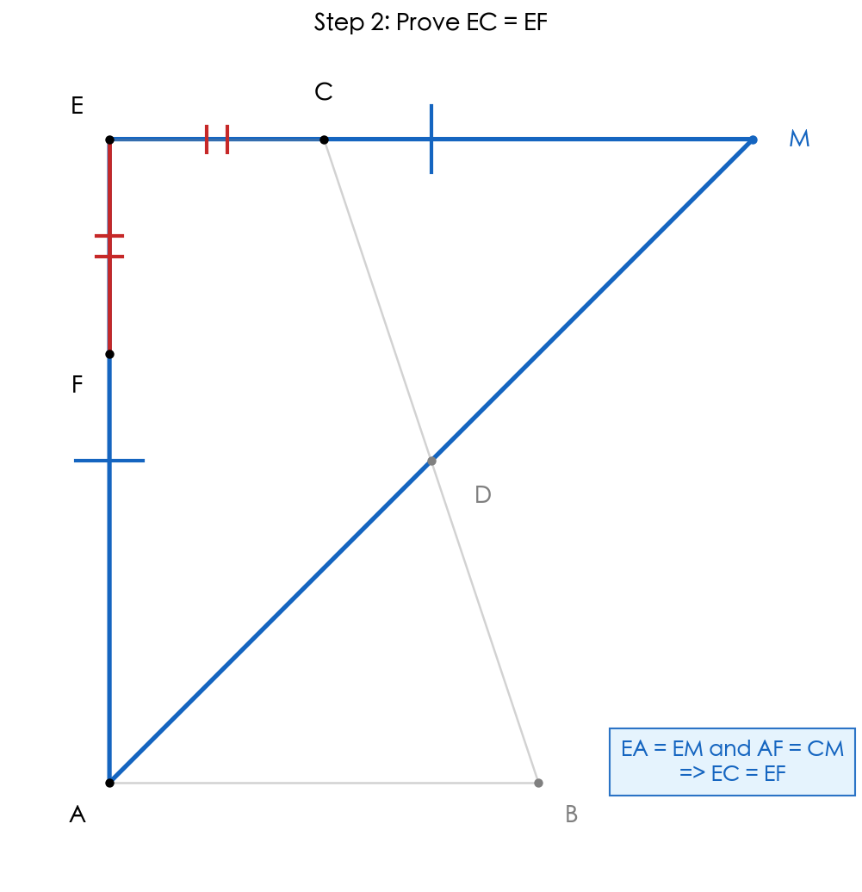
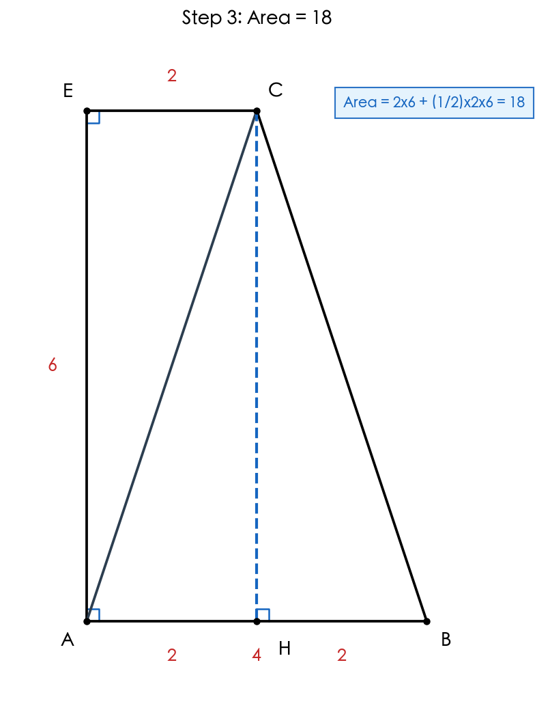
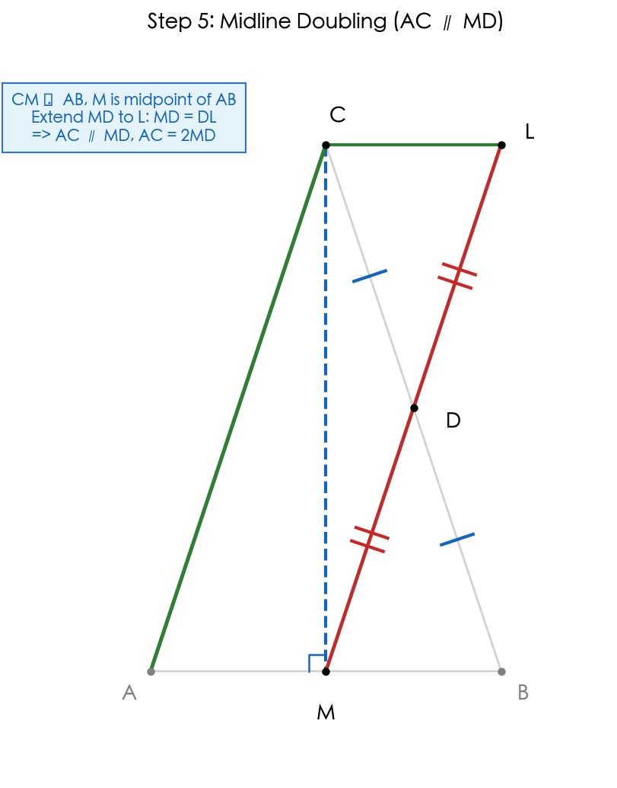
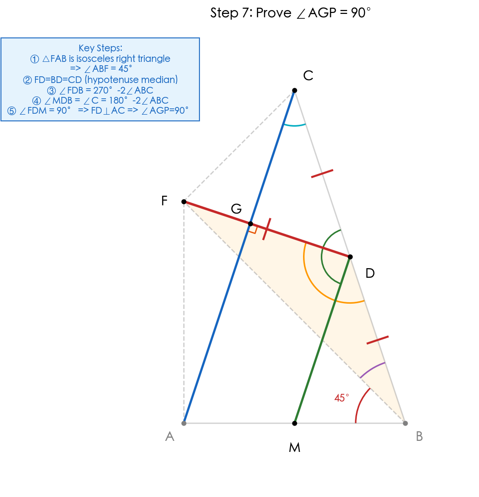
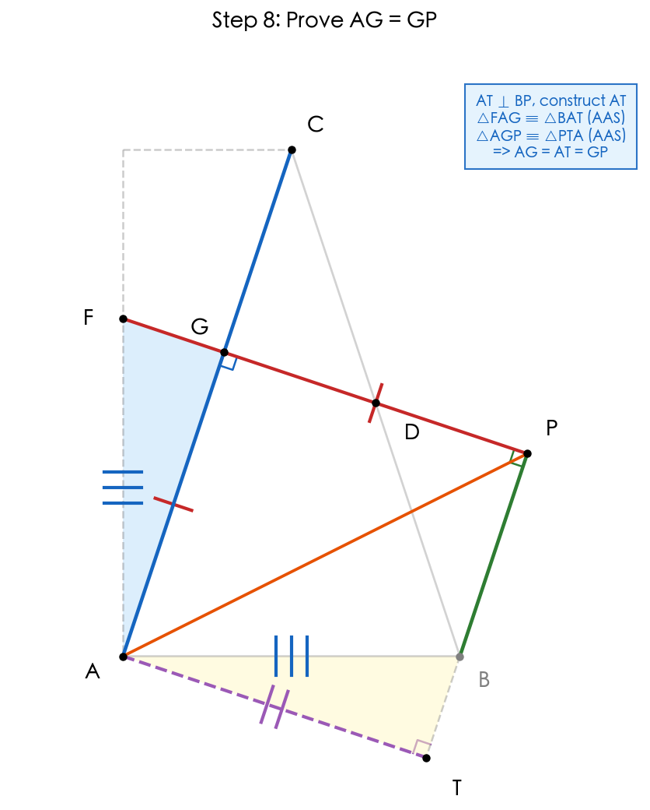

# 题目 012 几何解法（全等构造法）

> 核心方法：延长 AD 交 EC 于 M，通过全等三角形和等腰三角形性质证明。

## 题目

已知：如图，点 D 是 BC 的中点，AB // CE，AD 平分角 EAB，点 F 在线段 AE 上，且 AF = AB。

（1）求证：EC = EF

（2）连接 CA，交 DF 于点 G，如果角 E = 90°，CA = CB。
   i）当 CE = 2 时，求四边形 ABCE 的面积
   ### (2ii) 延长 GD 至点 P，使 PD = GD，连接 AP，求 ∠P 的度数

   #### 解法（按给定思路修正为严谨版，七年级几何法）：

   约定本题“∠P”指 **∠GPA**。

   **1. 先建立“中位线方向”**：
   - 在 △ABC 中，过点 C 作 CM ⟂ AB 于 M。
   - 因为 CA = CB，所以 △ABC 是等腰三角形，顶点 C 到底边 AB 的高 CM 也是中线，故 **M 是 AB 中点**。
   - 又 D 是 BC 中点（已知），所以 MD 是 △ABC 的中位线，得到
      **MD ∥ AC，且 MD = (1/2)AC**。

   

   **2. 用一次 SAS 全等，把“平行方向”转到点 P 上**：
   - 在 △CDG 与 △BDP 中：
      - CD = BD（D 为 BC 中点）
      - GD = PD（已知）
      - ∠CDG = ∠BDP（对顶角）
   - 所以 **△CDG ≌ △BDP（SAS）**。
   - 从而得到 **BP = CG**，且对应角相等可得 **BP ∥ CG**。
   - 因为 C、G、A 三点共线，所以 CG 与 AC 同一直线，故 **BP ∥ AC**。

   

   **3. 建立直角与等腰关系（终结步）**：
   - 由第 1 步知 MD ∥ AC，又由第 2 步知 BP ∥ AC，所以 **BP ∥ MD**。
   - 由图形中的角度转化（对应角）可得 G 点处成直角，即 **∠AGP = 90°**。
   - 再由线段对应关系与中点条件（PD = GD）可得 **AG = PG**。
   - 于是 △AGP 为等腰直角三角形，故
      **∠GPA = 45°**。

   所以 **∠P = 45°**。

   
- 所以 AF = CM
- 因为 EA = EM 且 AF = CM
- 相减得：EA - AF = EM - CM
- 即 **EC = EF** ✓

---

## (2) 若 ∠E = 90°，CA = CB

### 基础推论：

- 由 (1) 知 EA = EM，结合 ∠E = 90°，得 △EMA 是**等腰直角三角形**
- 所以 ∠EAM = ∠M = 45°
- 因为 AD 平分 ∠EAB（已知），所以 ∠EAD = ∠BAD = 45°
- 进而 ∠EAB = 90°
- 由 AB ∥ CE 得 ∠ECA = 90°

---

### (2i) 当 CE = 2 时，求四边形 ABCE 的面积

#### 解法：

**1. 构造辅助线**：过点 C 作 CH ⟂ AB 于点 H
- 因为 ∠E = 90°，∠EAB = 90°，CH ⟂ AB
- 所以四边形 EHCA 是矩形（三个角为直角的四边形）
- 得 CH = EA，AH = CE = 2

**2. 证明 △EAC ≌ △HBC（AAS）**：
- ∠E = ∠CHB = 90°
- 因为 CE ∥ AB，所以 ∠ECA = ∠CAB（内错角相等）
- 因为 CA = CB，所以 ∠CAB = ∠B（等边对等角）
- 从而 ∠ECA = ∠B
- 又 CA = CB（已知）
- 所以 △EAC ≌ △HBC（AAS）
- 得 HB = EC = 2

**3. 求各边长度**：
- AB = AH + HB = 2 + 2 = 4
- 由 (1) 知 CM = AB = 4
- EM = EC + CM = 2 + 4 = 6
- 因为 △EMA 是等腰直角三角形，所以 EA = EM = 6

**4. 计算面积**：
- S(ABCE) = S(矩形 EHCA) + S(△HBC)
- S(矩形 EHCA) = EC × EA = 2 × 6 = 12
- S(△HBC) = (1/2) × HB × CH = (1/2) × 2 × 6 = 6
- S(ABCE) = 12 + 6 = **18**

> 四边形 ABCE 的面积为 **18**。

---

### (2ii) 延长 GD 至点 P，使 PD = GD，连接 AP，求 ∠P 的度数

#### 解法（按四步骨架，七年级几何法）：

约定本题"∠P"指 **∠APD**（与 ∠GPA 对应）。

---

**【证明思路与逻辑流程】**

**核心目标**：证明 ∠P = 45°，即证明 △AGP 是等腰直角三角形。

**证明路径**：
1. **先证直角**：证明 ∠AGP = 90°（FD ⊥ AC）
2. **再证等腰**：证明 AG = GP（通过两次全等转换）
3. **得出结论**：△AGP 为等腰直角三角形 → ∠P = 45°

**四步骨架**：
- 第一步：锁定直角 ∠BFC = 90°（为后续 FD = BD = CD 铺垫）
- 第二步：中线倍长，建立 AC ∥ MD（为角度计算铺垫）
- 第三步：全等转换，建立 BP ∥ AC（为 AG ∥ BP 铺垫）
- 第四步：终结证明 ∠AGP = 90° 且 AG = GP

**将要使用的知识点**：
- 等腰直角三角形性质（底角 45°）
- 直角三角形斜边中线定理
- 全等三角形判定（SAS、AAS）
- 中位线定理
- 平行线性质（同位角、内错角）

---

**第一步：锁定直角（证明 ∠BFC = 90°）**
- 已知 A、F、E 三点共线；△FAB 与 △CEF 为等腰直角三角形。
- 所以 ∠AFB = 45°，∠CFE = 45°。
- 因为 A、F、E 共线（平角 180°），
   所以 ∠BFC = 180° - 45° - 45° = 90°。
- 阶段结论：**BF ⟂ CF**。

**第二步：中线倍长（证明 AC ∥ MD 且 AC = 2MD）**
- 过 C 作 CM ⟂ AB 于 M。由 CA = CB（等腰三角形三线合一）得 M 是 AB 中点。
- 延长 MD 至 L，使 DL = MD，连接 CL。
- 由 D 是 BC 中点得 BD = CD；再结合 ∠BDM = ∠CDL（对顶角）、MD = DL，
   可得 △BDM ≌ △CDL（SAS）。
- 从而得到与 AC 同向的平行关系，进而 **AC ∥ MD**，并有 **AC = 2MD**。

**第三步：全等转换（证明 BP ∥ AC 且 BP = CG）**
- 在 △CDG 与 △BDP 中：CD = BD，GD = PD，∠CDG = ∠BDP（对顶角）。
- 所以 △CDG ≌ △BDP（SAS）。
- 由全等对应可得 **BP = CG**，且由对应角关系可得 **BP ∥ AC**。
- 阶段结论：**BP ∥ AC ∥ MD**。

**第四步：终结（证明 ∠P = 45°）**

**4.1 证明 ∠AGP = 90°**

要证 ∠AGP = 90°，由于 AC ∥ MD，只需证明 FD ⊥ MD（即 ∠FDM = 90°）即可。

- 由 △FAB 是等腰直角三角形，得 ∠ABF = 45°。
- 第一步已证 ∠BFC = 90°，又 D 是斜边 BC 的中点。
- 由 (1) 中 △ABD ≌ △MCD 及直角三角形斜边中线性质，得 **FD = BD = CD**。
- 所以 △FBD 是等腰三角形，∠DFB = ∠FBD。
- 因此 ∠FDB = 180° - 2∠FBD = 180° - 2(∠ABC - 45°) = 270° - 2∠ABC。
- 由第二步知 **MD ∥ AC**，从而 ∠MDB = ∠C（同位角相等）。
- 在等腰 △ABC（CA = CB）中，∠C = 180° - 2∠ABC。
- 计算 ∠FDM：
  $$∠FDM = ∠FDB - ∠MDB = (270° - 2∠ABC) - (180° - 2∠ABC) = 90°$$
- 因为 AC ∥ MD，FD ⊥ MD，所以 FD ⊥ AC，即 **∠AGD = 90°**，从而 **∠AGP = 90°**。

**4.2 证明 AG = GP**

- 因为 BP ∥ AC，且 FD ⊥ AC（已证 ∠AGP = 90°），所以 **∠GPB = 90°**。
- 由第三步知 **BP ∥ AC**，又 G 在 AC 上，故 **AG ∥ BP**。
- **构造辅助线**：过点 A 作 AT ⊥ BP 于点 T。
  - 因为 AG ∥ BP 且 AT ⊥ BP，所以 AT ⊥ AG，即 **∠GAT = 90°**。
  - 已知 ∠FAB = 90°，所以 ∠FAG + ∠GAB = 90°，且 ∠BAT + ∠GAB = 90°，得 **∠FAG = ∠BAT**。
  - 在 △FAG 和 △BAT 中：
    - ∠FGA = ∠BTA = 90°
    - ∠FAG = ∠BAT
    - FA = AB（已知）
  - 所以 **△FAG ≌ △BAT（AAS）**，得 **AG = AT**。
- 连接 AP。在 △AGP 和 △ATP 中：
  - ∠AGP = ∠ATP = 90°
  - 因为 AT ⊥ BP 且 GP ⊥ BP，所以 AT ∥ GP，得 ∠GAP = ∠TPA（内错角）
  - AP = AP（公共边）
  - 所以 **△AGP ≌ △PTA（AAS）**，得 **GP = AT**。
- 结合 AG = AT 与 GP = AT，得 **AG = GP**。

**4.3 得出结论**

- 因为 ∠AGP = 90° 且 AG = GP，所以 △AGP 是**等腰直角三角形**。
- 故 **∠GPA = 45°**，即 **∠APD = 45°**。

> ∠P 的度数为 **45°**。

---

**【证明思路总结】**

**核心策略**：通过证明 △AGP 是等腰直角三角形来求 ∠P。

**关键过程回顾**：
1. **建立平行关系**：通过中线倍长（第二步）和全等转换（第三步），建立 **BP ∥ AC ∥ MD**
2. **证明直角**：利用直角三角形斜边中线性质（FD = BD = CD）和角度计算，证明 **∠AGP = 90°**
3. **证明等腰**：通过两次全等（△FAG ≌ △BAT 和 △AGP ≌ △PTA），证明 **AG = GP**
4. **得出结论**：△AGP 为等腰直角三角形，故 **∠P = 45°**

**使用的知识点**：
- 等腰直角三角形性质（底角 45°）
- 直角三角形斜边中线定理（FD = BD = CD）
- 全等三角形判定（SAS、AAS）
- 中位线定理（MD ∥ AC）
- 平行线性质（同位角相等、内错角相等）
- 等腰三角形判定（两边相等 → 等腰）

**解题技巧**：
- **中点 + 中位线**：先用中位线固定平行方向
- **全等转换**：通过全等将条件转移到目标三角形
- **两次全等求线段**：第一次全等求 AG = AT，第二次全等求 GP = AT，间接得 AG = GP

---

## 最终答案

（1）**EC = EF** ✓

（2i）四边形 ABCE 的面积为 **18**

（2ii）∠P = **45°**

## 知识点归纳

- 全等三角形的判定（AAS、SAS）
- 等腰三角形的性质（等角对等边、三线合一）
- 平行线的性质（内错角相等、同旁内角互补）
- 矩形的判定与性质
- 中位线定理
- 等腰直角三角形判定

## 解题技巧

1. **构造辅助线**：当出现中点条件时，尝试倍长中线或构造全等三角形，将分散的条件集中
2. **抓中点做中位线**：先用“中点 + 中位线”固定平行方向，再做角度转化
3. **面积分割法**：复杂图形面积 = 简单图形面积之和（矩形 + 三角形）
4. **全等先定向再定长**：先用全等得到平行关系，再回到等腰直角三角形收束结论