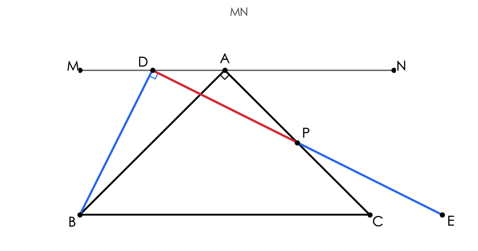
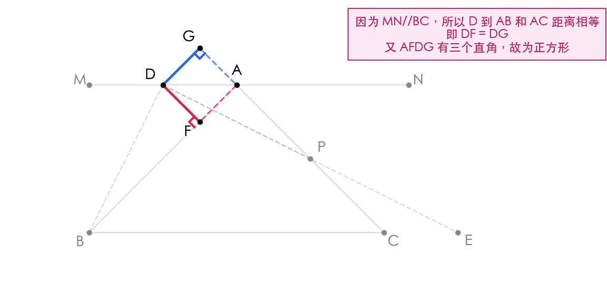
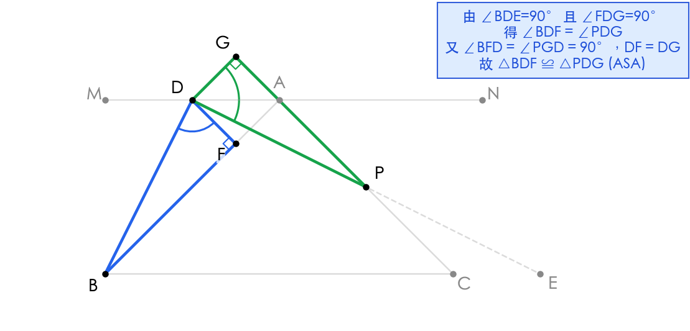
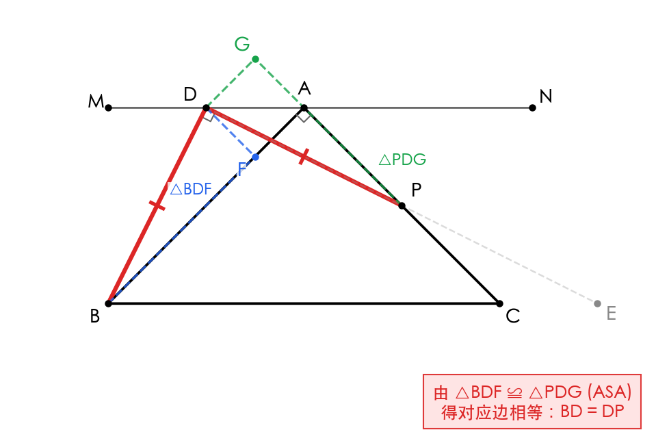
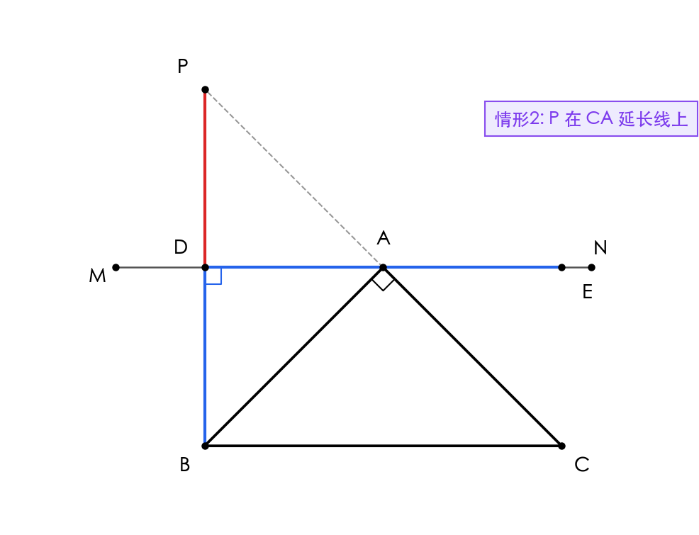
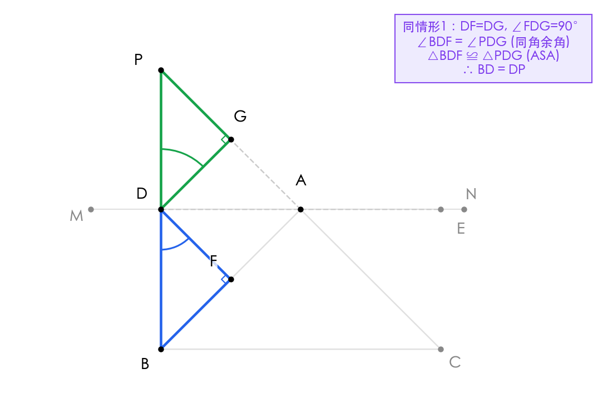
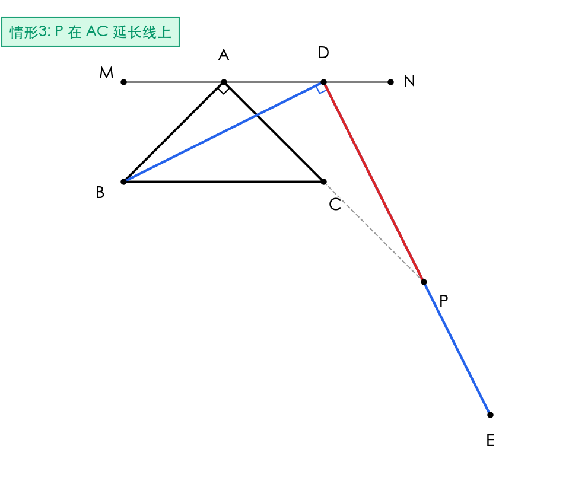
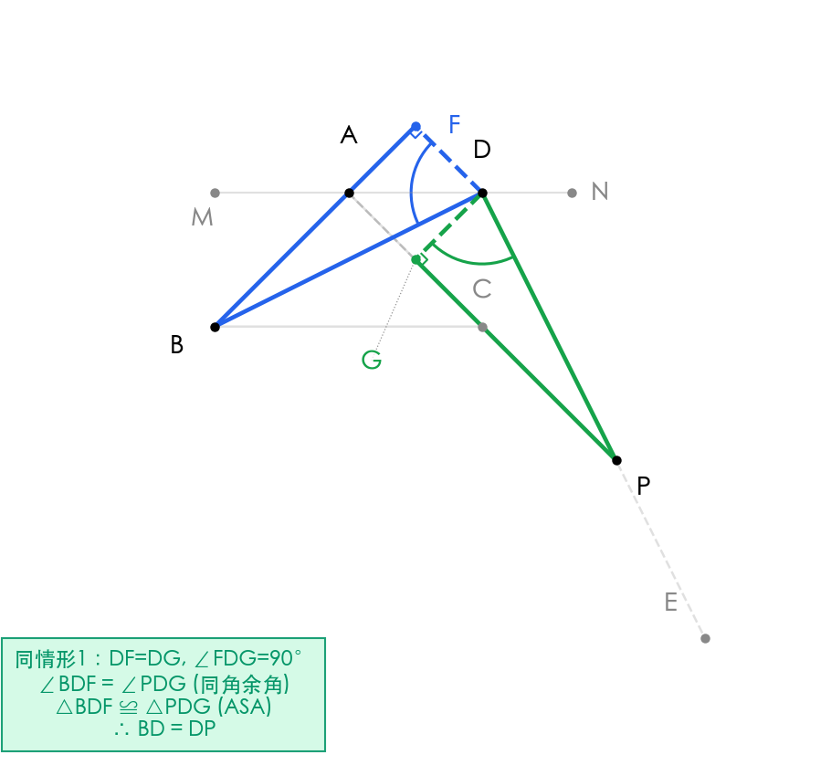

# 题目 013：等腰直角三角形中 BD = DP 的证明

> 模板使用指南：
> - 复制本文件为 `math/NNN/NNN_solution.md` 后填充。
> - 所有 `{{...}}` 与 `TODO:` 为待填充占位，提交前必须全部替换。
> - 公式 MUST 用纯文本（如 `(1/2)`、`S△ABC`、`²`），禁止 LaTeX 定界符。
> - 与同目录 `NNN.html` 内容必须逐字一致。

## 题目

> 在等腰直角三角形 △ABC 中，∠BAC = 90°，AB = AC。直线 MN 过点 A 且 MN // BC。点 D 在直线 MN 上（不与点 A 重合），DB 与 AC 交于点 P，且 ∠BDE = 90°。
>
> **求证：BD = DP**

## 解题思路

本题的核心思路是**构造全等三角形**。通过过点 D 作 AB 和 AC 的垂线，利用 MN // BC 的性质得到 D 到两边距离相等，从而构造出正方形 AFDG。再结合已知直角 ∠BDE = 90°，通过 ASA（角边角）判定两个三角形全等，最终得到对应边相等。

关键知识点：
- 平行线间的距离相等
- 正方形的判定与性质
- 全等三角形的 ASA 判定

## 解题步骤

### 步骤 1：作辅助线，构造正方形 AFDG

如图所示，过点 D 作 DF ⊥ AB 于点 F，作 DG ⊥ AC 于点 G。

因为 MN // BC，且 △ABC 是等腰直角三角形，∠BAC = 90°，所以 ∠BAM = ∠ABC = 45°，∠CAN = ∠ACB = 45°。即 MN 是 ∠BAC 的外角平分线方向，因此点 D 到 AB 和 AC 的距离相等：

DF = DG

又因为 DF ⊥ AB，DG ⊥ AC，且 AB ⊥ AC，所以四边形 AFDG 是矩形。结合 DF = DG 可知 AFDG 是**正方形**，从而：

DF = DG, ∠FDG = 90°

### 步骤 2：证明角度相等关系

由已知条件 ∠BDE = 90° 和正方形性质 ∠FDG = 90°，可得：

∠BDF + ∠FDP = ∠PDG + ∠FDP = 90°

因此 **∠BDF = ∠PDG**（同角的余角相等）。

又由辅助线作法可知：
- ∠BFD = 90°（DF ⊥ AB）
- ∠PGD = 90°（DG ⊥ AC）
- DF = DG（已证）

### 步骤 3：利用 ASA 证明全等，得出结论

在 △BDF 和 △PDG 中：

| 条件 | △BDF | △PDG |
|------|-------|-------|
| 角 | ∠BFD = 90° | ∠PGD = 90° |
| 边 | DF = DG（公共） | DF = DG（公共） |
| 角 | ∠BDF = ∠PDG（已证） | ∠PDG = ∠BDF（已证） |

根据 **ASA（角边角）** 判定定理：

△BDF ≅ △PDG

由全等三角形对应边相等，得：

**BD = DP**

### 步骤 4：情形2——点 P 在 CA 延长线上（配置图）

当点 P 在 CA 的延长线上时，同样过点 D 作 DF ⊥ AB 于点 F，作 DG ⊥ AC 于点 G。

因为 MN // BC，且 △ABC 是等腰直角三角形，∠BAC = 90°，所以 ∠BAM = ∠ABC = 45°，∠CAN = ∠ACB = 45°。点 D 到 AB 和 AC 的距离相等：

DF = DG

又因为 DF ⊥ AB，DG ⊥ AC，且 AB ⊥ AC，所以四边形 AFDG 是矩形。结合 DF = DG 可知 AFDG 是**正方形**，从而：

DF = DG, ∠FDG = 90°

### 步骤 5：情形2——ASA 全等证明

由已知条件 ∠BDE = 90° 和正方形性质 ∠FDG = 90°，可得：

∠BDF + ∠FDP = ∠PDG + ∠FDP = 90°

因此 **∠BDF = ∠PDG**（同角的余角相等）。

又由辅助线作法可知：
- ∠BFD = 90°（DF ⊥ AB）
- ∠PGD = 90°（DG ⊥ AC）
- DF = DG（已证正方形性质）

在 △BDF 和 △PDG 中：

| 条件 | △BDF | △PDG |
|------|-------|-------|
| 角 | ∠BFD = 90° | ∠PGD = 90° |
| 边 | DF = DG | DF = DG |
| 角 | ∠BDF = ∠PDG | ∠BDF = ∠PDG |

根据 **ASA（角边角）** 判定定理：

△BDF ≅ △PDG

由全等三角形对应边相等，得：

**BD = DP**

### 步骤 6：情形3——点 P 在 AC 延长线上（配置图）

当点 P 在 AC 的延长线上时，同样过点 D 作 DF ⊥ AB 于点 F，作 DG ⊥ AC 于点 G。

同理可证 DF = DG，且 AFDG 为正方形，从而 DF = DG 且 ∠FDG = 90°。

### 步骤 7：情形3——ASA 全等证明

由 ∠BDE = 90° 和 ∠FDG = 90°，得 ∠BDF = ∠PDG。

又 ∠BFD = ∠PGD = 90°，DF = DG，故：

△BDF ≅ △PDG (ASA)

因此：

**BD = DP**

## 最终答案

> **BD = DP**（在三种情形下均成立：P 在 AC 边上、P 在 CA 延长线上、P 在 AC 延长线上）

## 知识点归纳

- 等腰直角三角形的性质（两锐角均为 45°）
- 平行线的性质（平行线间距离处处相等）
- 正方形的判定（邻边相等的矩形是正方形）
- 全等三角形的 ASA 判定
- 同角（或等角）的余角相等
- 分类讨论思想：三种情形下的统一证明方法

## 解题技巧

1. **"见垂直想正方形"**：当一点到两条互相垂直的线段距离相等时，常可构成正方形，这是连接已知条件和结论的重要桥梁。
2. **"有直角找互余关系"**：题目中出现多个直角（∠BDE = 90°、∠FDG = 90°）时，往往可以通过同角的余角相等来建立角度之间的联系。
3. **"截长补短 / 垂线法"**：涉及线段相等证明时，过某点向两边作垂线是常用辅助手段，可将分散的条件集中到一个图形中处理。
