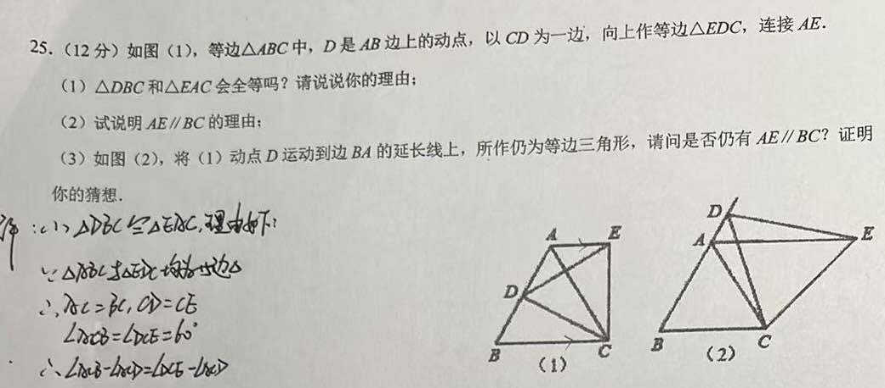
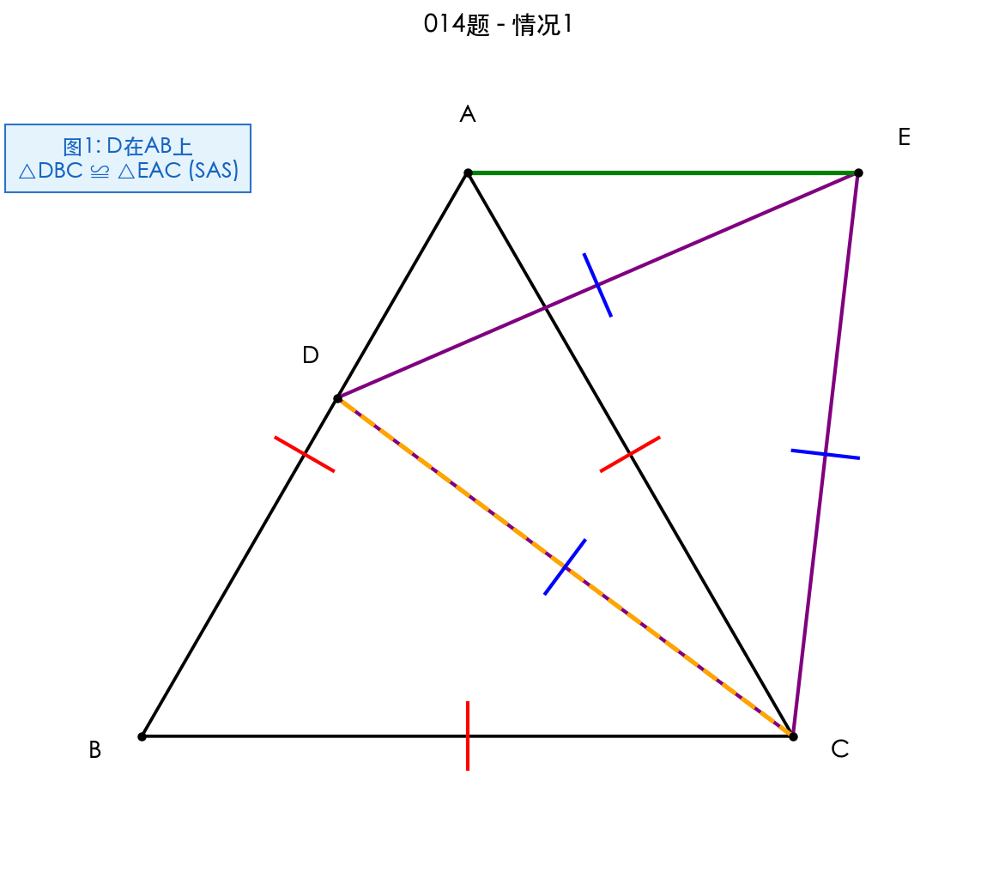
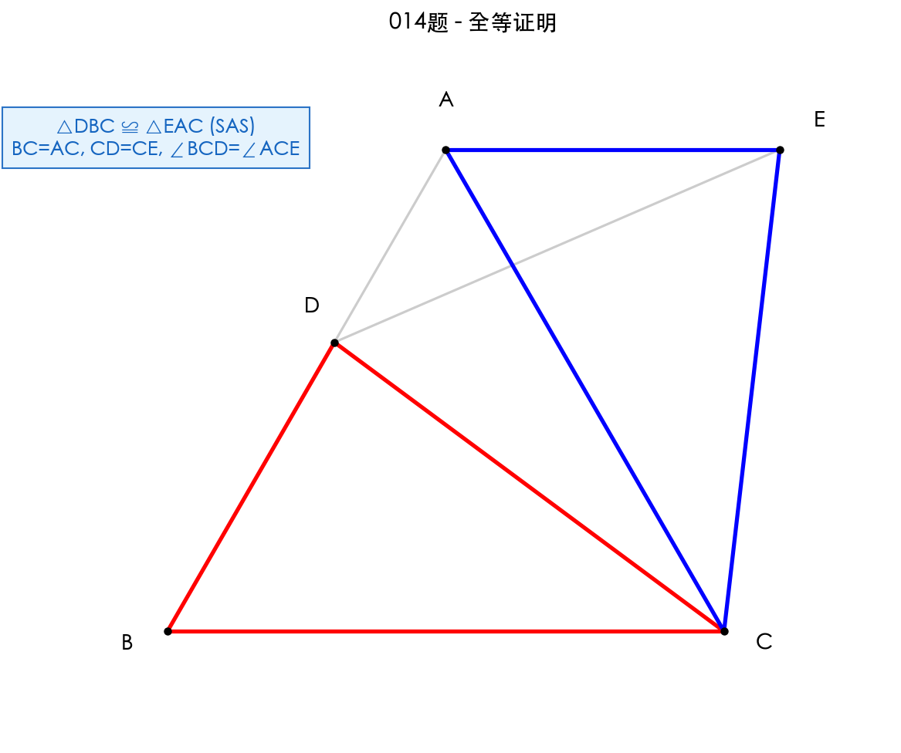
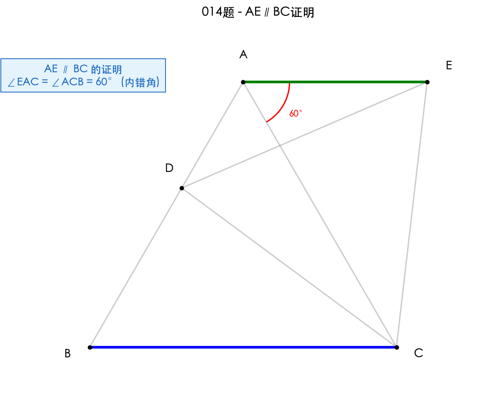
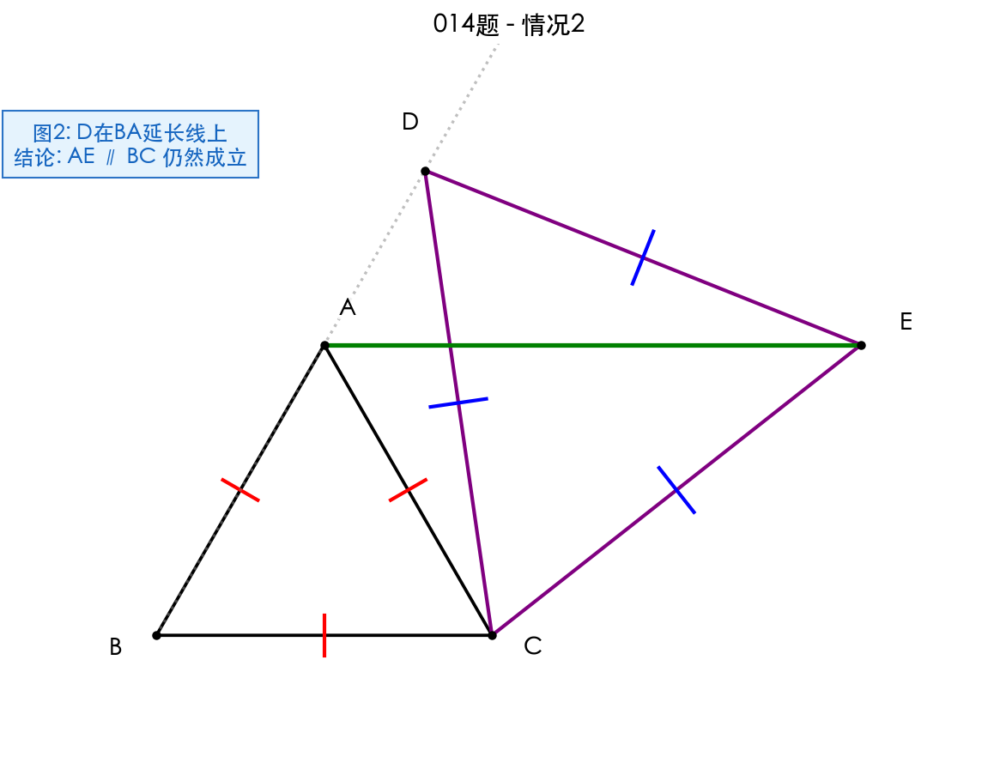

# 题目 014：等边三角形中的全等证明与平行证明

> 如图(1)，等边△ABC中，D是AB边上的动点，以CD为一边，向上作等边△EDC，连接AE。

## 解题思路

本题考查等边三角形的性质、全等三角形的判定与证明、平行线的判定。

核心思路：
1. 利用等边三角形的性质（三边相等、三角都是60°）寻找全等条件
2. 通过SAS判定△DBC≌△EAC
3. 利用全等三角形的对应角相等证明平行

## 解题步骤

### 步骤 1：问题(1) - 证明△DBC≌△EAC

**已知条件：**
- △ABC是等边三角形，AB=BC=CA，∠ABC=∠BCA=∠CAB=60°
- △EDC是等边三角形，ED=DC=CE，∠EDC=∠DCE=∠CED=60°
- D是AB边上的动点

**结论：** △DBC ≌ △EAC

**证明：**

在△DBC和△EAC中：

1. **BC = AC**（因为△ABC是等边三角形）

2. **CD = CE**（因为△EDC是等边三角形）

3. **∠BCD = ∠ACE**
   
   证明：
   - ∠BCA = 60°（等边三角形内角）
   - ∠DCE = 60°（等边三角形内角）
   - ∠BCD = ∠BCA - ∠DCA = 60° - ∠DCA
   - ∠ACE = ∠DCE - ∠DCA = 60° - ∠DCA
   - 因此 ∠BCD = ∠ACE

由SAS判定，**△DBC ≌ △EAC**

### 步骤 2：问题(2) - 证明AE∥BC

**结论：** AE ∥ BC

**证明：**

由(1)知 △DBC ≌ △EAC

所以 ∠EAC = ∠DBC（全等三角形对应角相等）

因为 ∠DBC = ∠ABC = 60°（D在AB上）

所以 ∠EAC = 60°

又因为 ∠ACB = 60°（等边三角形内角）

所以 ∠EAC = ∠ACB = 60°

由于∠EAC和∠ACB是内错角，且相等

因此 **AE ∥ BC**（内错角相等，两直线平行）

### 步骤 3：问题(3) - D在BA延长线上的情况

**问题：** 当D运动到边BA的延长线上时，是否仍有AE∥BC？

**结论：仍然成立**

**证明：**

**第一步：证明△DBC ≌ △EAC**

在△DBC和△EAC中：

1. **BC = AC**（等边△ABC的边）

2. **CD = CE**（等边△EDC的边）

3. **∠BCD = ∠ACE**
   
   证明：
   - ∠BCA = 60°，∠DCE = 60°
   - ∠BCD = ∠BCA + ∠ACD = 60° + ∠ACD
   - ∠ACE = ∠DCE + ∠ACD = 60° + ∠ACD
   - 因此 ∠BCD = ∠ACE

由SAS判定，△DBC ≌ △EAC

**第二步：证明AE∥BC**

由全等知 ∠EAC = ∠DBC

因为D在BA延长线上，所以∠DBC = 180° - ∠ABC = 180° - 60° = 120°

所以 ∠EAC = 120°

观察∠EAC和∠ACB：
- ∠EAC = 120°
- ∠ACB = 60°
- ∠EAC + ∠ACB = 180°

由于∠EAC和∠ACB是同旁内角，且互补

因此 **AE ∥ BC**（同旁内角互补，两直线平行）

## 最终答案

> **(1) △DBC ≌ △EAC，证明见上（SAS）。**
> 
> **(2) AE ∥ BC，证明见上（内错角相等）。**
> 
> **(3) 当D在BA延长线上时，AE ∥ BC 仍然成立（同旁内角互补）。**

## 知识点归纳

- 等边三角形的性质（三边相等、三角都是60°）
- 全等三角形的判定（SAS）
- 全等三角形的性质（对应角相等）
- 平行线的判定（内错角相等、同旁内角互补）
- 角度的和差计算

## 解题技巧

1. **寻找全等条件**：利用等边三角形的边相等和角相等，快速找到全等三角形的对应边和对应角。

2. **角度转化**：通过角度的和差关系（如∠BCD = ∠BCA - ∠DCA = ∠DCE - ∠DCA = ∠ACE）证明角相等。

3. **分类讨论**：动点D的位置变化（在边上vs在延长线上）会影响角度关系，但全等关系始终成立。

4. **平行判定的灵活性**：D点位置不同，平行判定的依据也不同（内错角相等 vs 同旁内角互补），需要根据具体情况选择。

5. **模型识别**：本题属于"共顶点等边三角形"模型，两个等边三角形共用一个顶点C，旋转60°可相互转化。
