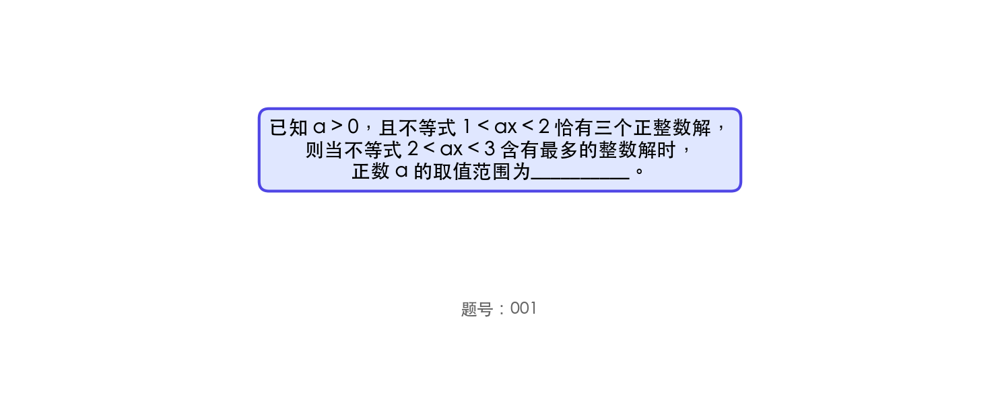
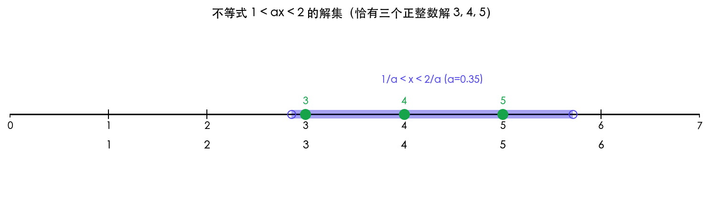
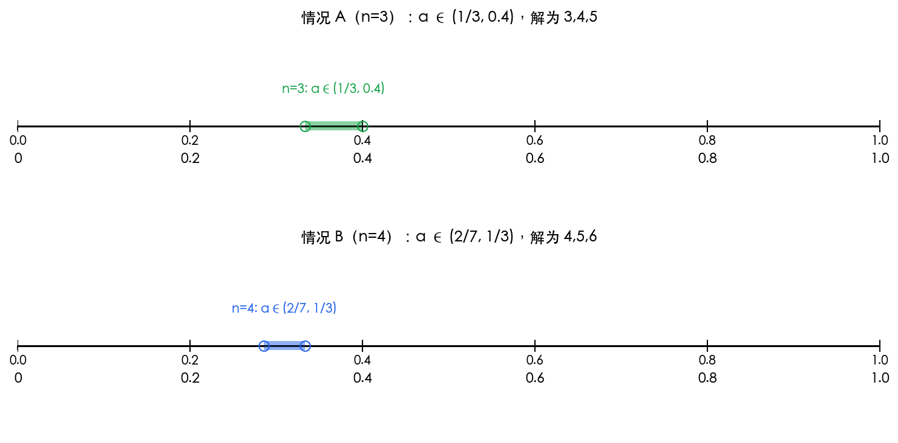
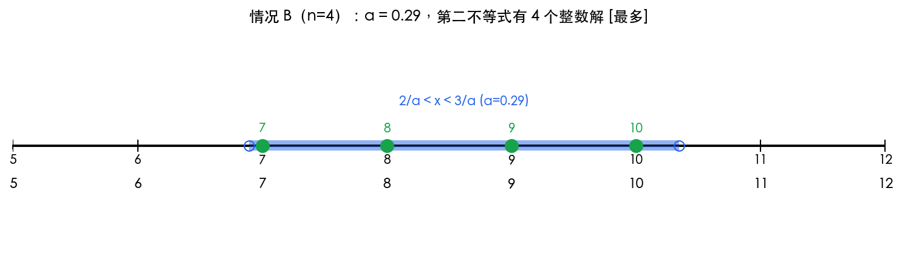

# 题目 001：不等式整数解问题

## 题目



已知 a > 0，且不等式 1 < ax < 2 恰有三个正整数解，则当不等式 2 < ax < 3 含有最多的整数解时，正数 a 的取值范围为__________。

## 解题思路

本题核心是利用不等式的整数解个数来确定参数 a 的取值范围。关键步骤：
1. 将不等式转化为关于 x 的区间形式
2. 根据"恰有三个正整数解"确定 a 的初步范围
3. 分析第二个不等式的整数解个数随 a 的变化规律
4. 找出使整数解最多的 a 的取值范围

## 解题步骤

### 步骤 1：分析第一个不等式 1 < ax < 2



由 a > 0，不等式可化为：

1/a < x < 2/a

设该不等式恰有三个正整数解，记为 n, n+1, n+2（n 为正整数）。

**为什么三个解必须是连续的？** 因为不等式的解集是一个连续区间 (1/a, 2/a)，而正整数在数轴上是等距排列的。一个连续区间不可能跳过中间的整数——例如，区间 (2.3, 5.7) 包含的正整数是 3, 4, 5，它们是连续的：

```
 2.3 │ 3   4   5 │ 5.7
─────┼───────●───┼────
      ↑ 区间起点  ↑ 区间终点
```

如果有人声称解是 3, 5, 7（不连续），那中间的 4 和 6 必然也在区间内，解集就变成 3, 4, 5, 6, 7，不止三个了。所以恰好三个正整数解，它们必然是三个连续整数 n, n+1, n+2。


则需要满足：
- n-1 ≤ 1/a < n（保证 n 是最小的正整数解）
- n+2 < 2/a ≤ n+3（保证 n+2 是最大的正整数解，且 n+3 不是解）

由 1/a < n 得：a > 1/n
由 n+2 < 2/a 得：a < 2/(n+2)

所以需要：1/n < a < 2/(n+2)

### 步骤 2：确定 n 的值（分类讨论）



检验不同的 n 值，找出满足条件 1/n < a < 2/(n+2) 的 n：

| n | 1/n | 2/(n+2) | 1/n < 2/(n+2)？ | a 的范围 |
|---|-----|---------|-----------------|---------|
| 1 | 1 | 2/3 ≈ 0.67 | ❌ 1 > 0.67 | 无解 |
| 2 | 1/2 = 0.5 | 2/4 = 0.5 | ❌ 区间为空 | 无解 |
| **3** | **1/3 ≈ 0.33** | **2/5 = 0.4** | **✅** | **1/3 < a < 0.4** |
| **4** | **1/4 = 0.25** | **2/6 ≈ 0.33** | **✅** | **2/7 < a < 1/3** |

可以看出 **两种情况** 都满足"恰有三个正整数解"：

- **情况 A（n=3）**：三个正整数解为 3, 4, 5，a ∈ (1/3, 2/5)
  - 需要 2 ≤ 1/a < 3 → 1/3 < a ≤ 1/2
  - 需要 5 < 2/a ≤ 6 → 1/3 ≤ a < 0.4
  - 交集：1/3 < a < 0.4

- **情况 B（n=4）**：三个正整数解为 4, 5, 6，a ∈ (2/7, 1/3)
  - 需要 3 ≤ 1/a < 4 → 1/4 < a ≤ 1/3
  - 需要 6 < 2/a ≤ 7 → 2/7 ≤ a < 1/3
  - 交集：2/7 < a < 1/3

### 步骤 3：分析第二个不等式 2 < ax < 3



由 a > 0，不等式可化为：

2/a < x < 3/a

区间长度为：3/a - 2/a = 1/a

现在分别对 **情况 A** 和 **情况 B** 分析整数解个数。

---

**情况 A（n=3，a ∈ (1/3, 0.4)）：**

- 2/a 的范围是 (5, 6)
- 3/a 的范围是 (7.5, 9)

整数解个数随 a 的变化：
- 当 a ∈ (1/3, 3/8) 时：2/a < 6 且 3/a > 8 → 整数解为 **6, 7, 8（3个）**
- 当 a ∈ [3/8, 0.4) 时：3/a ≤ 8 → 整数解为 6, 7（2个）

---

**情况 B（n=4，a ∈ (2/7, 1/3)）：**

- 2/a 的范围是 (6, 7)
- 3/a 的范围是 (9, 10.5)

整数解个数随 a 的变化：
- 当 a ∈ (2/7, 0.3) 时：2/a < 7 且 3/a > 10 → 整数解为 **7, 8, 9, 10（4个）** ← 最多！
- 当 a ∈ [0.3, 1/3) 时：3/a ≤ 10 → 整数解为 7, 8, 9（3个）

### 步骤 4：确定整数解最多的情况

比较两种情况：

| 情况 | a 的范围 | 第二不等式最多整数解 | 对应 a 的子区间 |
|------|---------|-------------------|---------------|
| A（n=3） | (1/3, 0.4) | 3个（6,7,8） | (1/3, 3/8) |
| **B（n=4）** | **(2/7, 1/3)** | **4个（7,8,9,10）** | **(2/7, 0.3)** |

情况 B 中不等式 2 < ax < 3 最多有 **4 个**整数解，多于情况 A 的 3 个。

要使整数解最多（4个），需要同时满足：
- 2/a < 7，即 a > 2/7
- 10 < 3/a，即 a < 3/10

同时还要满足第一不等式的约束（属于情况 B 范围），即 a ∈ (2/7, 1/3)。

合并得最终范围：

> **2/7 < a < 3/10**

验证：取 a = 0.29（∈ (2/7, 0.3)）：
- 第一不等式：1/a ≈ 3.45，2/a ≈ 6.90 → x ∈ (3.45, 6.90) → 整数解 4, 5, 6 ✓
- 第二不等式：2/a ≈ 6.90，3/a ≈ 10.34 → x ∈ (6.90, 10.34) → 整数解 **7, 8, 9, 10**（4个）✓

## 最终答案

> **2/7 < a < 3/10**

## 知识点归纳

- 一元一次不等式的解法
- 不等式整数解的计数方法
- 参数范围的确定技巧
- 区间端点分析
- 分类讨论思想

## 解题技巧

1. **转化法**：将含参数的不等式转化为关于 x 的区间形式，便于分析整数解
2. **端点分析法**：通过分析区间端点的位置来确定整数解的个数
3. **范围交集法**：多个条件限制时，取各范围的交集得到最终答案
4. **分类讨论**：当有多组可能的 n 值时，需要分别讨论再比较
