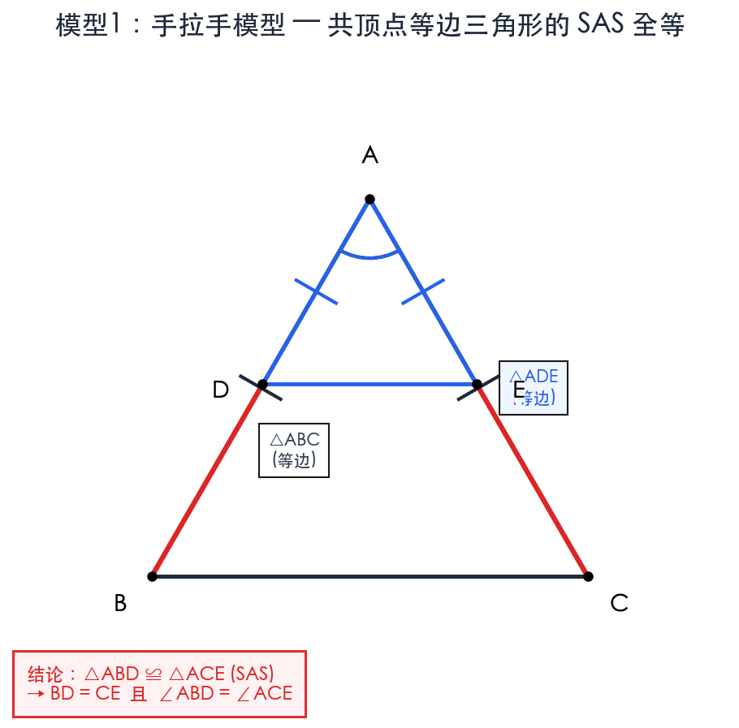
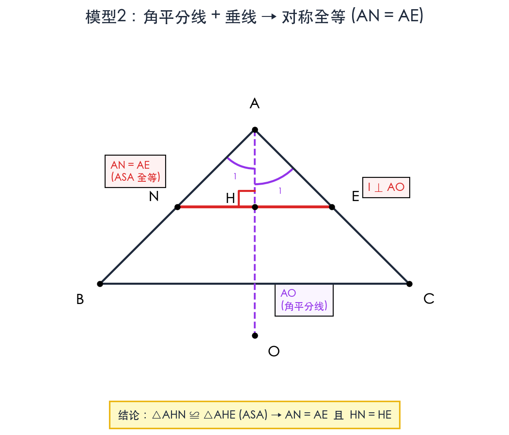
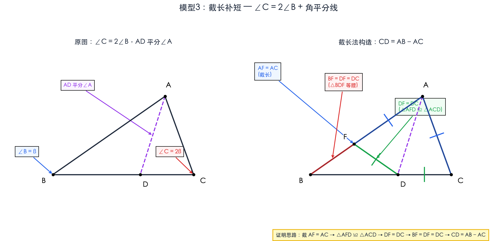
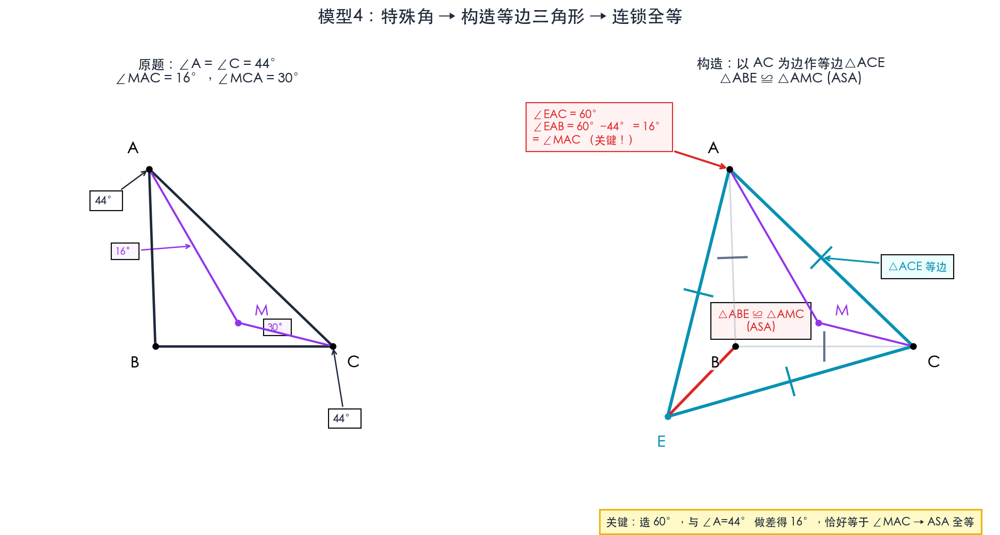
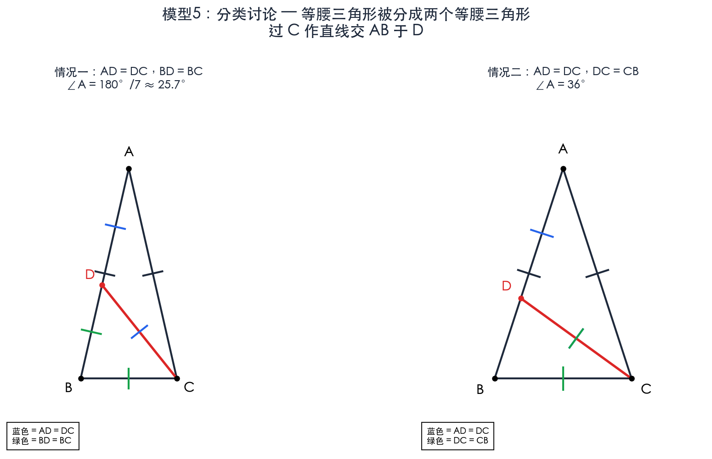
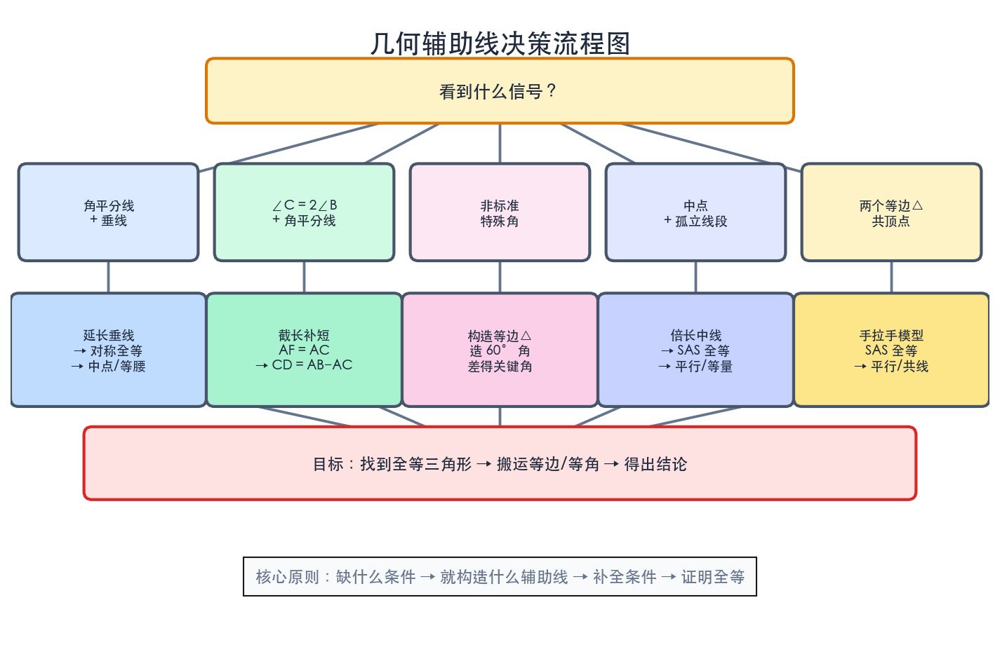

# 几何题全面复习报告

> 基于 math/001 至 math/014 全部题目的系统分析
> 目标：找出解题规律、梳理知识点、发现短板、彻底掌握

---

## 一、题目全景概览

| 题号 | 核心考点 | 核心方法 | 难度 |
|:---|:---|:---|:---|
| 001 | 角平分线对称性 + 中位线 + 面积比 | ASA全等 → 中位线 → 相似面积比 | ⭐⭐⭐ |
| 002 | 等腰三角形 + 钝角条件 + 不等式 | 角度设未知数 → 不等式求范围 | ⭐⭐ |
| 003 | 等腰三角形判定 + 分类讨论 | 三种等腰情况分别计数 | ⭐⭐ |
| 004 | 角度定值 + 构造等边三角形 | 构造等边△ → SSS全等 → ASA全等 → 等腰 | ⭐⭐⭐⭐ |
| 005 | 线段和差证明 + 旋转构造 | 等边△构造 → SAS全等 → 旋转变换 → SSS | ⭐⭐⭐⭐⭐ |
| 006 | 等腰三角形分割 + 分类讨论 | 分类等腰子三角形 → 方程求解 | ⭐⭐⭐ |
| 007 | 含36°三角形分割 + 穷举 | 系统枚举所有等腰组合 → 验证 | ⭐⭐⭐⭐ |
| 008 | 手拉手模型 + 三点共线 + 截长 | SAS全等 → 共线判定 → 截长构造等边△ | ⭐⭐⭐⭐ |
| 009 | 全等三角形旋转滑动 + 分类 | SAS全等 → 旋转36° → 两种情况讨论 | ⭐⭐⭐⭐⭐ |
| 010 | ∠C=2∠B + 角平分线 + 垂线 | 对称性 → 截长补短 → 投影法 | ⭐⭐⭐⭐ |
| 011 | 同010 + 倍长中线 | 对称性 → 截长补短 → 倍长中线 | ⭐⭐⭐⭐⭐ |
| 012 | 平行线 + 中点 + 角平分线 + 面积 | SAS全等 → 等腰△ → 矩形 → 面积 | ⭐⭐⭐⭐⭐ |
| 013 | 等腰直角△ + 正方形构造 + ASA | 垂线→正方形→同角余角→ASA→分类 | ⭐⭐⭐ |
| 014 | 手拉手模型 + 动点 + 平行判定 | SAS全等 → 内错角/同旁内角 → 平行 | ⭐⭐⭐ |

---

## 二、五大核心解题模型（必须烂熟于心）

### 模型1：手拉手模型（双等边/等腰共顶点）

**出现题目**：008, 014（还有 004, 005, 009 的变体）

**模型特征**：
- 两个等腰（或等边）三角形共用一个顶点
- 顶角相等（或都是 60°）

**标准操作**：
```
△ABC 和 △ADE 都是等边三角形，共顶点 A
→ ∠BAD = ∠CAE（都 = 60° - ∠DAC 或 60° + ∠DAC）
→ △ABD ≌ △ACE（SAS: AB=AC, ∠BAD=∠CAE, AD=AE）
→ 对应边相等、对应角相等
```

**核心结论**：
- 全等三角形的一对对应边夹角 = 等边三角形的顶角（60°）
- 当 D 在线段上时，对应角用于证平行（内错角相等）
- 当 D 在延长线上时，对应角用于证平行（同旁内角互补）



**记忆口诀**：共顶点、等顶角 → SAS全等 → 旋转视角

---

### 模型2：角平分线 + 垂线 → 对称全等（等腰构造）

**出现题目**：001, 010, 011, 013

**模型特征**：
- 已知角平分线
- 从角的一边上某点向角平分线作垂线

**标准操作**：
```
AO 平分 ∠BAC，过某点 H 作 l ⊥ AO
→ 设 l 交 AB 于 N，交 AC 于 E
→ △AHN ≌ △AHE（ASA: ∠HAN=∠HAE, AH公共, ∠AHN=∠AHE=90°）
→ AN = AE（对称）
```

**变体（001）**：从角顶点向角平分线作垂线 → 延长交对边 → 构造等腰三角形
```
从A向∠C的平分线作垂线AM → 延长AM交BC于P
→ △AMC ≌ △PMC（ASA）
→ M 是 AP 中点，AC = PC
```

**记忆口诀**：角平分线遇到垂线，立马想对称，必出全等、必出等腰、必出中点。



---

### 模型3：∠C = 2∠B + 角平分线 → 截长补短

**出现题目**：010, 011

**模型特征**：
- 三角形中 ∠C = 2∠B
- ∠A 的平分线交 BC 于 D

**标准操作（截长法）**：
```
在 AB 上截取 AF = AC，连接 DF
→ △AFD ≌ △ACD（SAS: AF=AC, ∠FAD=∠CAD, AD公共）
→ DF = DC，∠AFD = ∠ACD = 2∠B
→ ∠BDF = ∠AFD - ∠B = 2∠B - ∠B = ∠B（外角定理）
→ △BDF 等腰，BF = DF = DC
→ AB = AF + FB = AC + CD
即 CD = AB - AC
```



**记忆口诀**：二倍角配平分线，截长补短证 CD = AB - AC。

---

### 模型4：特殊角 → 构造等边三角形 → 连锁全等

**出现题目**：004, 005

**模型特征**：
- 题目给出一些特殊角（如 44°, 16°, 30° 或 70°, 40°, 20°）
- 需要通过构造等边三角形来"生产"60°角，与已知角做差得到关键角

**004 的标准操作**：
```
以 AC 为边作等边△ACE（在 B 同侧）
→ ∠EAC = 60°
→ ∠EAB = 60° - 44° = 16° = ∠MAC（关键！）
→ △ABE ≌ △CBE（SSS）→ ∠AEB = 30°
→ △ABE ≌ △AMC（ASA）→ AB = AM
→ △ABM 等腰 → 求出 ∠BMC
```

**005 的标准操作**：
```
在 BP 延长线上取 PN = PA
→ ∠APN = 60°，PA = PN → △APN 等边
→ AN = PA，∠NAP = 60°
→ ∠NAC = 30° = ∠PAC → △NAC ≌ △PAC（SAS）
→ 旋转 → 平行 → 等腰 → 等量代换
```



**记忆口诀**：看到一堆特殊角（非 30°/45°/60°），构造等边三角形造 60°，做差得关键角。

---

### 模型5：分类讨论——等腰三角形的多种可能

**出现题目**：003, 006, 007, 009, 013

**分类框架**：
1. **等腰三角形的三个边**：哪两边相等？（PA=PB? PA=AB? PB=AB?）
2. **等腰三角形的分割**：分割后的两个小三角形各是哪两边相等？
3. **点的位置**：P 在边上？在延长线上？

**006 的分类逻辑**：
```
过C作直线交AB于D，将△ABC分成两个等腰三角形。
设∠A = x，底角 = (180°-x)/2

情况一：△ACD中 AD=DC（∠A=∠DCA=x），△BCD中 BD=BC（∠BDC=∠BCD=2x）
→ 7x = 180° → x = 180°/7

情况二：△ACD中 AD=DC（∠A=∠DCA=x），△BCD中 DC=CB（∠CDB=∠B=2x）
→ 5x = 180° → x = 36°
```

**007 的分类逻辑**：
```
含36°三角形被分割成两个等腰三角形
→ 分情况：cevian从36°角顶点出发 vs 从其他顶点出发
→ 每个小三角形又有多种等腰可能
→ 穷举所有组合，排除重复
→ 得到5种可能
```



**记忆口诀**：等腰有多种，哪两边相等？——逐一列出，方程求解，验证合理性。

---

## 三、高频解题技巧 Top 10

### 1. 构造辅助线（最核心能力）

| 技巧 | 使用场景 | 题目 |
|:---|:---|:---|
| 构造等边三角形 | 有特殊角度，需要"制造"60° | 004, 005 |
| 截长补短 | ∠C=2∠B + 角平分线 | 010, 011 |
| 倍长中线 | 中点 + 需要构造全等 | 011, 012 |
| 过点作垂线 | 需要利用对称/距离相等 | 001, 010, 013 |
| 延长线段 | 角平分线 + 垂线 | 001, 005 |

### 2. 全等三角形判定（使用频率：14/14）

- **SAS**（边角边）：最常用，出现于 001, 004, 005, 008, 009, 010, 011, 012, 014
- **ASA**（角边角）：出现于 001, 004, 010, 011, 013
- **SSS**（边边边）：出现于 004, 005
- **AAS**（角角边）：出现于 012

### 3. 角度推导技巧

- **同角的余角相等**：013, 004
- **外角定理**：010, 011, 004
- **三角形内角和 180°**：每一题
- **等角对等边 / 等边对等角**：004, 005, 006, 012

### 4. 平行线判定与性质

- **内错角相等 → 平行**：008, 014
- **同旁内角互补 → 平行**：014
- **同位角相等 → 平行**：012

### 5. 特殊三角形性质

- **等腰三角形三线合一**：012
- **等边三角形三角 60°**：004, 005, 008, 014
- **等腰直角三角形两锐角 45°**：013, 012
- **30°-60°-90° 三角形边长比**：008

### 6. 中位线定理

- 001：MN 是 △APQ 的中位线 → MN = (1/2)PQ → 相似比为 1:2
- 012：MD 是 △ABC 的中位线 → MD ∥ AC
- 010/011：M 是 BC 中点 → 投影性质

### 7. 旋转思想

- 005：将 △CAN 绕 C 旋转 40° 到 △CBM
- 008/014：手拉手模型本质是旋转 60°
- 009：DA 绕 D 旋转 36° 得 DG

### 8. 对称性利用

- 001：角平分线 + 垂线 → 对称 → 全等
- 010/011：角平分线 + 垂线 → AN = AE
- 013：等腰直角三角形 → 正方形对称

### 9. 等量代换

- 001：S△AMN/S△ABC = (S△AMN/S△APQ) × (S△APQ/S△ABC)
- 005：PC = NC = NB = PN + PB = PA + PB
- 011：BN + CE = (AB - AN) + (AN - AC) = AB - AC = CD

### 10. 方程思想

- 002：b/a = 180°/a - 2，求范围
- 006：列出角度方程（7x = 180°, 5x = 180°）
- 007：通过等腰条件建立方程组

---

## 四、知识点体系图

```
七年级几何核心知识
│
├─ 三角形基础
│   ├─ 内角和 = 180°（每道题必用）
│   ├─ 外角 = 两不相邻内角之和（004, 010, 011）
│   └─ 三边关系
│
├─ 特殊三角形
│   ├─ 等腰三角形
│   │   ├─ 等角对等边，等边对等角
│   │   ├─ 三线合一（顶角平分线 = 底边中线 = 底边高）
│   │   └─ 分类讨论：哪两边相等？
│   ├─ 等边三角形
│   │   ├─ 三边相等，三角 = 60°
│   │   └─ 构造技巧：需要60°时就造等边三角形
│   ├─ 等腰直角三角形
│   │   └─ 两锐角 = 45°，两腰相等
│   └─ 含30°的直角三角形（边比 1:√3:2）
│
├─ 全等三角形（核心工具）
│   ├─ SAS（边角边）—— 最常用
│   ├─ ASA（角边角）—— 角平分线+垂线场景
│   ├─ SSS（边边边）—— 等边三角形场景
│   └─ AAS（角角边）—— 备用
│
├─ 平行线
│   ├─ 内错角相等 → 两直线平行
│   ├─ 同位角相等 → 两直线平行
│   └─ 同旁内角互补 → 两直线平行
│
├─ 角平分线
│   ├─ 角平分线上的点到两边距离相等
│   ├─ 角平分线 + 垂线 → 对称/等腰三角形
│   └─ 角平分线 + ∠C=2∠B → 截长补短模型
│
├─ 中点与中位线
│   ├─ 中位线 ∥ 第三边，且 = 第三边的一半
│   ├─ 倍长中线 → 构造全等
│   └─ 斜边中线 = 斜边的一半（直角三角形）
│
├─ 面积
│   ├─ 相似三角形面积比 = 相似比的平方
│   ├─ 同高三角形面积比 = 底边比
│   └─ 复杂图形 = 简单图形之和
│
└─ 数学思想
    ├─ 分类讨论（等腰可能性、点的位置）
    ├─ 方程思想（设未知数列方程）
    ├─ 转化思想（将不熟悉的转化为熟悉的）
    └─ 模型识别（手拉手、截长补短等）
```

---

## 五、题目共性分析

### 共性1：全等三角形是"通用货币"

14 道题中，**每一道**都用到了全等三角形。全等是七年级几何证明的"硬通货"——通过全等，可以把**边相等**、**角相等**从已知条件"搬运"到需要的位置。

**关键能力**：能在复杂图形中**看出**哪两个三角形全等。这需要：
1. 标出所有已知的等边、等角
2. 从结论倒推需要哪两个三角形全等
3. 检查是否缺少条件，缺什么就构造什么

### 共性2：辅助线是"临门一脚"

很多题卡住的原因不是不知道全等判定，而是**不知道画哪条辅助线**。

**辅助线构造的信号**：
| 信号 | 应画的辅助线 | 来源 |
|:---|:---|:---|
| 角平分线 + 垂线 | 延长垂线交对边 | 001 |
| 非标准特殊角（44°, 16°, 30°） | 构造等边三角形 | 004 |
| 角平分线 + ∠C=2∠B | 在长边上截短（截长补短） | 010, 011 |
| 中点 + 远离的线段 | 倍长中线 | 011, 012 |
| 需要证 PA+PB=PC | 延长短边，构造等边三角形 | 005 |
| 两个等边三角形共顶点 | 直接找 SAS 全等（手拉手） | 008, 014 |
| 点 D 到两垂直线的距离相等 | 补全为正方形 | 013 |



### 共性3：角度推导是"地基"

每道题的前几步都是**计算角度**。角度推导不出错，后面的全等/相似才能顺。

**角度推导的常用工具链**：
```
三角形内角和 180°
  → 等腰三角形底角相等
    → 角平分线 = 一半
      → 外角定理
        → 平角 = 180°（邻补角）
          → 同角余角相等
```

### 共性4：分类讨论思维

多个题目需要分类讨论（003, 006, 007, 009, 013），类型包括：
- **等腰三角形的腰是哪两边？**（003, 006, 007, 009）
- **点在边上还是延长线上？**（013, 014）
- **cevian 从哪个顶点出发？**（007）
- **钝角/锐角/直角的边界？**（002）

---

## 六、你的短板诊断与对策

### 短板1：辅助线构造能力不足

**表现**：004, 005, 010, 011, 012 这些题不会做，核心卡在"不知道画哪条辅助线"。

**根因**：没有建立"信号 → 辅助线"的条件反射。

**对策**：
1. 背熟上面 §三 的"辅助线构造信号表"
2. 做新题时先问自己三个问题：
   - 有没有角平分线？（→ 想对称）
   - 有没有中点？（→ 想倍长中线或中位线）
   - 有没有特殊角？（→ 想造等边三角形）
3. 重点练习 010/011 的截长补短（这是七年级最高频的辅助线）

### 短板2：连锁全等推导不熟练

**表现**：004（需要3次全等）, 005（需要4次全等）这种多步全等题目吃力。

**根因**：习惯了"一次全等搞定"，对于需要**全等A→得到条件→全等B→得到条件→全等C**的连锁模式缺乏经验。

**对策**：
1. 做题时明确写出"通过第一次全等得到了什么条件"
2. 每次全等后，立即把这个全等产生的**所有**等边/等角标注在图上
3. 重点复习 004 和 005 的完整思路链

### 短板3：分类讨论时有遗漏

**表现**：003, 006, 007, 009 这类需要穷举的题目。

**根因**：没有掌握系统化的分类枚举方法。

**对策**：
1. 分类讨论第一原则：**先定分类标准，再逐一展开**
   - "等腰三角形"的分类标准 = 哪两边相等（C(3,2)=3种可能）
   - "点在线上"的分类标准 = 在边上 vs 在延长线上（2种）
2. 每个分支独立求解
3. 最后检查是否有重合/退化情况
4. 重点练习 006 和 007 的分类逻辑

### 短板4：复杂图形的角度推导

**表现**：009（需要绕多个点进行角度推导）, 004（角度关系隐蔽）。

**根因**：角度推导时容易"迷路"，不知道该从哪个三角形开始。

**对策**：
1. 先在图上标出**所有直接可算的角度**（三角形内角和、平角等）
2. 再标出**等腰三角形的底角**
3. 利用"角平分线 = 一半"和"外角定理"进一步推导
4. 最终目标是找到**包含目标角或目标边的三角形**
5. 如果直接算不出，回去看是不是漏了构造辅助线

### 短板5：模型识别不够快

**表现**：008 明确说了"手拉手模型"，但如果不提醒可能认不出来；014 本质上也是手拉手。

**根因**：还没有形成"看图形→识别模型→套用解法"的思维模式。

**对策**：
1. 记住两个最高频模型的特征：
   - **手拉手**：两个等边/等腰三角形共顶点 → SAS全等
   - **角平分线+垂线**：AO平分∠A + l⊥AO → AN=AE
2. 做新题时，先扫描是否有已知模型

---

## 六、学习路径建议

### 第一周：打基础（全等 + 角度）
1. 重新做 013（最简单，含分类讨论）
2. 重新做 014（手拉手入门）
3. 重新做 001（角平分线对称 + 中位线 + 面积）

### 第二周：攻辅助线
4. 重新做 010（截长补短入门）
5. 重新做 011（截长补短 + 倍长中线）
6. 重新做 004（构造等边三角形）

### 第三周：攻难题
7. 重新做 008（手拉手综合）
8. 重新做 005（构造 + 旋转 + 连锁全等 最难题）
9. 重新做 012（综合题：全等 + 面积 + 角度）

### 第四周：攻分类
10. 重新做 006（分类讨论入门）
11. 重新做 007（穷举所有可能）
12. 重新做 009（分类 + 旋转 + 全等）
13. 重新做 003（空间想象 + 分类）
14. 重新做 002（不等式 + 边界分析）

---

## 七、关键公式与结论速查

| 结论 | 使用场景 |
|:---|:---|
| ∠BAD = ∠CAE = 60° - ∠DAC | 两个等边三角形共顶点（手拉手） |
| AN = AE（当 l ⊥ AO 且 AO 平分 ∠A） | 角平分线 + 垂线模型 |
| CD = AB - AC（当 ∠C=2∠B 且 AD 平分 ∠A） | 二倍角 + 角平分线模型 |
| MN = (1/2)BC，MN ∥ BC | 中位线定理 |
| S₁/S₂ = k²（相似比平方） | 相似三角形面积比 |
| S₁/S₂ = a/b（同高时） | 同高三角形面积比 |
| DF = DB = DC → ∠BFC = 90° | 直角三角形斜边中线性质 |
| 等腰三角形底角 = (180° - 顶角) / 2 | 等腰三角形角度计算 |
| 外角 = 两不相邻内角之和 | 角度推导 |
| 同角（等角）的余角相等 | 有90°角的场景 |

---

## 八、终极建议

你的14道不会做的题，其实可以归结为**5个核心模型**的变体：

1. **手拉手模型**（008, 014）→ SAS全等，结论用于平行/共线
2. **角平分线+垂线对称模型**（001, 010, 011）→ ASA全等 → AN=AE
3. **截长补短模型**（010, 011）→ SAS全等 → 等腰 → 等量代换
4. **构造等边三角形模型**（004, 005）→ 造60° → 连锁全等
5. **分类讨论模型**（003, 006, 007, 009, 013）

掌握这5个模型 = 掌握14道题的核心。

**每当你看到一道新几何题，按这个顺序思考**：
1. 标出所有已知角、等边（1分钟）
2. 计算所有可直接算出的角（2分钟）
3. 识别是否有已知模型（1分钟）
4. 如果没有 → 看信号，决定画什么辅助线（2分钟）
5. 从结论倒推：需要证哪两个三角形全等？（2分钟）
6. 逐条件验证，缺什么补什么（3分钟）

总时间控制在10分钟以内。如果10分钟还做不出来，说明有隐藏的辅助线技巧没掌握，这时候再查笔记或问模型。
